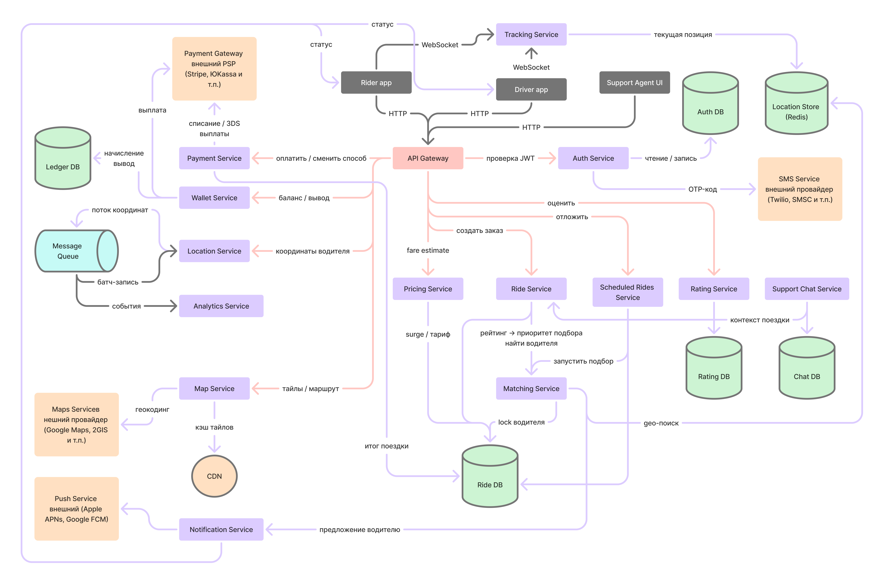
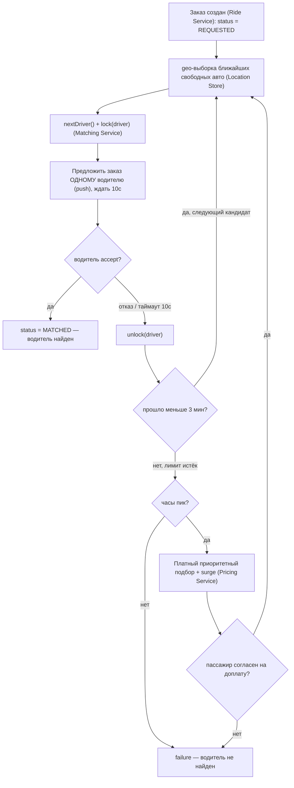
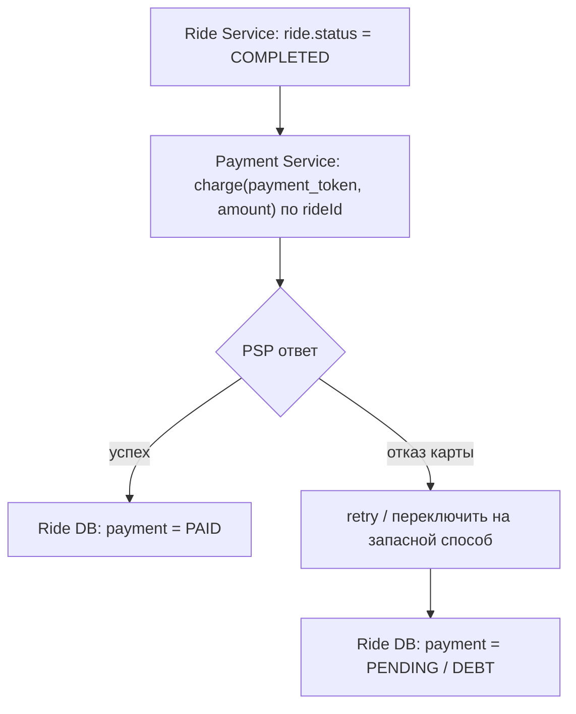
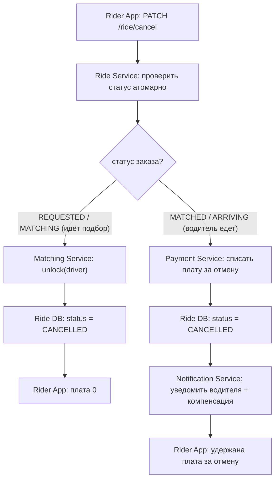

# ДЗ 1. Анализ референсной архитектуры — решение

> Условие: [../Задание.md](../Задание.md) · Чек-лист: [../Чеклист.md](../Чеклист.md)
> Схемы складывайте в [diagrams/](diagrams/).

## Выбранная архитектура

**Сервис такси (Uber / Яндекс Go)** — ride-sharing-платформа, которая в реальном
времени соединяет пассажиров и ближайших доступных водителей: регистрация и
авторизация, карта города с отслеживанием авто, расчёт стоимости, обычный и
отложенный заказ, подбор водителя, отмена поездки, оплата (с возможностью смены
способа), вывод денег водителям, взаимные оценки и чат с поддержкой.

### Контекст системы

Аутентифицирует пользователя, показывает карту города и
свободные авто, принимает запрос на поездку (сейчас или к заданному времени), по
геолокации подбирает ближайшего водителя, удерживает консистентность подбора
(один водитель — один заказ), допускает отмену заказа, сопровождает поездку с
трекингом авто на карте, проводит оплату и начисляет/выплачивает деньги водителю,
собирает взаимные оценки и даёт канал поддержки.

**Акторы:**

| Актор | Зачем обращается |
|---|-----|
| Пассажир (Rider) | Регистрация, карта и свободные авто, расчёт цены, заказ (в т.ч. отложенный), отмена поездки, трекинг авто, оплата и её смена, оценка поездки/водителя, чат с поддержкой |
| Водитель (Driver) | Регистрация, приём/отклонение заказов, ведение поездки, оценка пассажира, просмотр баланса и вывод денег, поддержка |
| Агент поддержки (Support) | Обработка обращений в чате, доступ к контексту поездки |
| Внешние системы | SMS/OTP-провайдер, PSP/банки, Maps-провайдер, push-сервисы (APNs/FCM) |

**Ключевые сценарии использования:**

1. Регистрация и авторизация (OTP по SMS, выдача токенов).
2. Карта города и отслеживание авто на карте в реальном времени.
3. Расчёт предварительной стоимости поездки.
4. Создание заказа и подбор водителя: водитель принимает / отклоняет, при
   неудаче за 3 мин в часы пик начинается платный подбор.
5. Отложенный (запланированный) заказ к заданному времени.
6. Ведение поездки по статусам (`arriving/waiting/ongoing/droppedoff`).
7. Отмена поездки пассажиром (с платой за отмену или без).
8. Оплата поездки и смена способа оплаты.
9. Вывод денег водителю из кошелька.
10. Оценка поездки/водителя пассажиром и оценка пассажира водителем.
11. Чат с поддержкой по поездке.

**Масштаб (порядковые оценки, цифры ориентировочные):**

| Метрика | Оценка| Комментарий|
|---|---|---|
| Активные пользователи (MAU) | ~30–40 млн| пассажиры|
| Активные пользователи (DAU) | ~8–10 млн| ≈25% MAU, основа для user-facing RPS |
| Водители (всего / активны в пик) | ~1–1.5 млн / ~0.6–0.8 млн| онлайн одновременно в час пик|
| Поездки в сутки | ~6–7 млн| ≈ 75 заказов/с в среднем|
| Обновления локаций | ≈150K RPS (≈0.7 млн активных авто × апдейт раз в ~5 с), может быть с адаптивными интервалами ниже | главный драйвер архитектуры|
| Подбор водителя | < 3 мин иначе failure, а в часы пик платный подбор| нефункциональное требование|
| Consistency of matching | строго| только один водитель на заказе|
| Доступность | высокая вне самого матчинга| highly available outside of matching |

---

## 1. Компоненты

### Внутренние

| #  | Компонент | Тип | Зона ответственности| State |
|-|---|--|----|-|
| 1  | Rider / Driver / Support App | Клиент | UI, отправка геолокации (адаптивный интервал), приём push, WS-трекинг.| client-state |
| 2  | API Gateway | Балансировщик | Маршрутизация, TLS, проверка JWT, rate limiting, защита от всплесков.| stateless |
| 3  | Auth Service | Сервис | Регистрация и авторизация (OTP по SMS), выдача/refresh JWT, профили. stateless |
| 4  | Pricing Service | Сервис | Предварительная стоимость (fare-estimate), surge-коэффициент.| stateless |
| 5  | Ride Service | Сервис | Жизненный цикл заказа: создание, статусы, отмена, завершение, триггер оплаты.| stateless |
| 6  | Matching Service | Сервис | Подбор: geo-выборка, lock(driver), предложение одному водителю, таймаут, повтор. | stateful |
| 7  | Scheduled Rides Service | Сервис + планировщик | Отложенные заказы: хранение runAt, запуск подбора заранее к времени T.| stateless |
| 8  | Location Service | Сервис (ingest) | Приём потока координат водителей, батч-запись.| stateless |
| 9  | Location Store (Redis) | БД (in-memory) | Хранение и быстрый geo-поиск активных авто. Redis geohashing.| stateful |
| 10 | Tracking Service | Сервис (WS) | Отслеживание авто на карте.| stateful |
| 11 | Map Service | Сервис + CDN | Тайлы карты (через CDN), геокодинг/маршруты через провайдера.| stateless |
| 12 | Payment Service | Сервис | Оплата поездки, плата за отмену, смена способа оплаты, 3DS.| stateless |
| 13 | Wallet Service | Сервис | Кошелёк водителя, начисления (ledger), вывод денег, лимиты/антифрод.| stateful |
| 14 | Rating Service | Сервис | Взаимные оценки водителя и пассажира, агрегация рейтингов, антинакрутка.| stateful |
| 15 | Notification Service | Сервис (async) | Push водителю (предложение) и пассажиру (статусы).| stateless |
| 16 | Support Chat Service | Сервис (realtime) | Чат с поддержкой по поездке, маршрутизация на агентов/бота, история.| stateful |
| 17 | Message Queue | Очередь | Буфер пиков локаций, шина событий, источник для аналитики.| stateful |
| 18 | Analytics Service | Pipeline | Сбор метрик и RPS-статистики из потока событий.| stateful |
| 19 | Auth DB | БД | Хранение пользователей, токенов, OTP-challenge.| stateful |
| 20 | Ride DB | БД | Хранение заказов, статусов, fare. Geo-sharded + replicas.| stateful |
| 21 | Ledger DB | БД | Проводки кошелька водителя (double-entry).| stateful |
| 22 | Chat DB | БД | История диалогов поддержки.| stateful |
| 23 | Rating DB | БД | Оценки поездок, агрегированные рейтинги.| stateful |
| 24 | CDN | Инфра | Кэш тайлов карты.| stateless |

### Внешние

| Компонент | Зона ответственности |
|---|-----|
| SMS Service | Доставка OTP-кодов при авторизации. |
| Payment Gateway | Списание с карты / СБП, 3DS, выплаты водителям. |
| Maps Service | Геокодинг и построение маршрутов. |
| Push Service | Push-уведомления на устройства (APNs / FCM). |

**Проверки по чек-листу:**

- **Нет god-service:** деньги разделены на Payment Service (приём оплаты от пассажира) и Wallet Service (выплаты водителю) это разные контрагенты, лимиты и регуляторика. Tracking Service (WS-read) отделён от Location Service (ingest, write), у них противоположные профили нагрузки.

- **Нет избыточного дробления:** Scheduled Rides Service вынесен из Ride Service, так как имеет отдельную логику планировщика. Map Service вынесен, так как это в основном статика на CDN. Pricing Service можно было бы держать частью Ride Service, но вынесен из-за другого паттерна вызова (частые запросы fare-estimate без создания заказа).

- **Stateless/stateful разделены:** масштабируемые копированием сервисы (API Gateway, Auth, Pricing, Ride, Scheduled Rides, Location, Map, Payment, Notification) отделены от хранилищ (Location Store, Wallet Service, Rating Service, Support Chat Service, Message Queue, Analytics Service) и stateful-логики (Matching Service блокировки, Tracking Service WS-соединения).

---

## 2. Потоки данных

### Сценарий A. Регистрация и авторизация (OTP)

1. Клиент отправляет `POST /auth/otp/request {phone}` на API Gateway.
2. Auth Service сохраняет OTP-challenge с TTL в Auth DB и отправляет код через SMS Service.
3. Клиент отправляет `POST /auth/otp/verify {phone, code}`.
4. Auth Service верифицирует challenge, создаёт или обновляет пользователя в Auth DB, возвращает access JWT + refresh token.
5. Последующие запросы используют refresh token для получения нового access без повторного OTP.

Работает синхронно: сбой SMS Service → fallback на запасной канал или повтор. Брутфорс кода ограничивается rate limiting на Gateway и TTL challenge.

---

### Сценарий B. Карта города и отслеживание авто

1. Rider App запрашивает тайлы карты, отдаются с CDN, промах → Map Service запрашивает у Maps Service и кэширует.
2. Rider App открывает WebSocket-подписку на Tracking Service по зоне или rideId.
3. Tracking Service каждые 1–2 секунды читает позиции из Location Store и пушит координаты клиенту.

Тайлы: статика на CDN. Трекинг: realtime push по WebSocket. Сбой: разрыв WS → авто-reconnect с экспоненциальным backoff. Недоступен Location Store → карта рисуется, позиции авто замирают (деградация, не отказ).

---

### Сценарий C. Расчёт предварительной стоимости

1. Rider App отправляет `POST /ride/fare-estimate {pickup, destination}`.
2. Pricing Service рассчитывает расстояние, время и surge-коэффициент.
3. Сохраняет Fare в Ride DB, возвращает клиенту цену, ETA и fareId.

Работает синхронно: Сбой → ошибка пользователю, повтор по кнопке (идемпотентно по fareId).

---

### Сценарий D. Обновление локаций водителей (~150K RPS)

1. Driver App с адаптивным интервалом (чаще в движении, реже на стоянке) отправляет `POST /location/update {lat, lon}`.
2. Location Service принимает координаты и публикует событие в Message Queue.
3. Consumer батч-читает из очереди и пишет в Location Store.

Работает асинхронно: очередь сглаживает пики. Сбой Location Store → деградирует точность подбора, но заказы и оплата продолжают работать (graceful degradation).

---

### Сценарий E. Заказ и подбор водителя

Создание заказа работает синхронно, сам подбор асинхронно.

Один запрос за раз и только одному водителю гарантирует consistency of matching. Если за 3 минуты водитель не найден в обычное время будет явный failure (есть возможность перезапустить поиск), в часы пик предлагается платный приоритетный подбор с surge. При согласии пассажира поиск продолжается, это удерживает пользователя вместо глухого отказа и балансирует спрос/предложение ценой.

---

### Сценарий F. Выполнение поездки (смена статусов)

1. Driver App отправляет смену статуса: `arriving → waiting → ongoing → droppedoff`.
2. Ride Service обновляет статус в Ride DB и асинхронно уведомляет пассажира через Notification Service.
3. По статусу `droppedoff` Ride Service триггерит оплату в Payment Service (если не наличные).

Смена статусов работает синхронно, уведомления асинхронно. Сбой: потеря связи водителя → последний статус остаётся в Ride DB, клиент ретраит. Завершение и оплата идемпотентны по rideId.

---

### Сценарий G. Отложенный заказ

1. Rider App отправляет `POST /ride/schedule {pickup, dest, time T}`.
2. Scheduled Rides Service сохраняет заказ в Ride DB со статусом `SCHEDULED` и полем `runAt = T`.
3. Фоновый планировщик опрашивает заказы с `runAt <= now + lead` и заранее запускает подбор через Matching Service.
4. При успехе статус проставляется как `MATCHED`, пассажир получает уведомление. При неудаче, к дедлайну расширение радиуса или явный failure.

Хранение происходит синхронно, запуск отложенный. Сбой: не нашли водителя к дедлайну → расширение радиуса/повтор, иначе явный failure с предложением ближайшего времени.

---

### Сценарий H. Оплата и смена способа оплаты

**Смена способа оплаты:**

1. Rider App отправляет `POST /payment/methods {card / СБП / wallet}`.
2. Payment Service токенизирует способ через Payment Gateway (3DS верификация).
3. Токен сохраняется, способ становится активным.

**Списание по завершении поездки:**

Смена способа работает синхронно (с 3DS у PSP). Списание по событию завершения. Сбой: отказ карты → retry или переключение на запасной способ, статус DEBT. Идемпотентность по rideId исключает двойное списание.

---

### Сценарий I. Вывод денег водителю

1. После каждой поездки Wallet Service начисляет сумму в Ledger DB (double-entry проводка).
2. Driver App запрашивает баланс: Wallet Service агрегирует проводки из Ledger DB.
3. Driver App отправляет `POST /wallet/payout {amount, реквизиты}`.
4. Wallet Service делает `hold(amount)` в Ledger DB (идемпотентно по payoutId) и отправляет перевод через Payment Gateway.
5. Успех → `commit` проводки. Сбой → `release hold`, средства остаются на балансе.

Начисления работают асинхронно (событие COMPLETED → ledger). Вывод синхронно с двухфазным hold → commit/release. Лимиты и антифрод проверяются до перевода.

---

### Сценарий J. Чат с поддержкой

1. Пользователь открывает чат по rideId: Support Chat Service создаёт тред в Chat DB и подтягивает контекст поездки из Ride Service.
2. Сообщения передаются по WebSocket и сохраняются в Chat DB.
3. Типовой вопрос → авто-ответ бота. Нестандартный → назначение агенту из очереди по приоритету.

Realtime (WS). Сбой: нет свободных агентов → очередь + SLA-эскалация. Разрыв WS → история сохранена в Chat DB, переподключение без потери контекста.

---

### Сценарий K. Отмена поездки пассажиром

Работает синхронно для пользователя. Гонка «cancel vs accept» решается атомарным переходом статуса в Ride DB (выигрывает первый), второй получает корректный отказ. Зависший `lock(driver)` снимается по TTL.

---

### Сценарий L. Оценка поездки (взаимный рейтинг)

1. После статуса `COMPLETED` обеим сторонам предлагается оценка.
2. Пассажир и водитель независимо отправляют `POST /rating {rideId, score 1-5}`.
3. Rating Service сохраняет оценки в Rating DB (идемпотентно по rideId + author) и асинхронно пересчитывает средний рейтинг.
4. Обновлённый рейтинг передаётся в Matching Service и влияет на приоритет подбора.

Постановка оценки работает синхронно, пересчёт агрегата асинхронно. Чужие оценки не видно до выставления своей. Низкий рейтинг → хуже подбор и триггер проверок. Сбой Rating Service → некритично, оценку можно поставить позже.

## 3. Проблемы и решения

| Компонент / решение | Какую проблему решает                                                                                            | Что сломалось бы без него                                                                                   | Trade-offs                                                                            |
|---|------------------------------------------------------------------------------------------------------------------|-------------------------------------------------------------------------------------------------------------|---------------------------------------------------------------------------------------|
| **Location Store = Redis geohashing** | 150K RPS записи + быстрый geo-поиск                                                                              | Реляционная БД не держит запись и медленно ищет по радиусу                                                  | In-memory: риск потери при сбое узла (данные эфемерны)                                |
| **Batch-вставка + Message Queue** | Сглаживание пиков потока координат                                                                               | Прямые синхронные апдейты могут положить стор                                                               | Доп. задержка (eventual freshness)                                                    |
| **Адаптивные интервалы (на клиенте)** | Снижение самого объёма трафика локаций                                                                           | Постоянные 150K RPS даже от стоящих авто                                                                    | Координаты стоящих авто менее свежие                                                  |
| **Matching Service: lock(driver) + один запрос за раз** | Consistency of matching                                                                                          | Один водитель на двух заказах                                                                               | Последовательность → выше latency, нужны TTL-блокировки                               |
| **Таймаут подбора 3 мин → failure / платный подбор в пик** | Управляемая деградация: вместо отказа в часы пик, платный приоритетный подбор. Это балансирует спрос/предложение | Бесконечное ищем водителя, потеря пользователя при дефиците авто                                            | Платный подбор может восприниматься как навязывание, нужна прозрачная цена и согласие |
| **Tracking Service (WS) отдельно от Location Service** | Сотни тысяч realtime-подписок без влияния на запись координат                                                    | Чтение трекинга конкурировало бы с 150K RPS записи                                                          | Доп. слой WS-gateway, sticky-соединения                                               |
| **CDN для тайлов карты** | Раздача статики карты близко к пользователю                                                                      | Каждый тайл бил бы по Map Service / Maps Service                                                            | Инвалидация кэша, стоимость CDN                                                       |
| **Auth Service с JWT + refresh** | Stateless-проверка на Gateway без похода в БД на каждый запрос                                                   | Каждый запрос дёргал бы Auth DB                                                                             | Отзыв токена сложнее (нужен blacklist / короткий TTL)                                 |
| **Scheduled Rides Service: подбор заранее (lead time)** | Гарантировать авто к времени T                                                                                   | Заказ к утру не нашёл бы водителя в момент T, или у пользователя не будет возможности заказть в нужное время | Сложность: всплеск отложенных заказов в час пик                                       |
| **Payment Service ≠ Wallet Service (разделение)** | Разные контрагенты / регуляторика / антифрод                                                                     | Смешание списаний и выплат                                                                                  | Два интеграционных контура с Payment Gateway                                          |
| **Ledger DB (double-entry) + hold/commit** | Корректность баланса и идемпотентность вывода                                                                    | Двойные выплаты, расхождение баланса                                                                        | Сложнее модель данных, нужна сверка                                                   |
| **Отмена через атомарный переход статуса** | Корректное снятие блокировки водителя                                                                            | Двойное состояние заказа, «зависший» заблокированный водитель                                               | Нужны компенсации / плата за отмену и их сверка                                       |
| **Rating Service вне критического пути** | Взаимные оценки без влияния на завершение поездки и оплату                                                       | Сбой Rating Service ронял бы основной сценарий                                                              | Оценка может прийти с задержкой, нужна антинакрутка                                   |
| **Идемпотентность по rideId / payoutId** | Защита от двойного списания / выплаты при retry                                                                  | Дубли платежей на ретраях сети                                                                              | Хранение ключей идемпотентности                                                       |
| **Geo-sharding + read replicas** | Шардирование Ride DB по географии + чтение с реплик                                                              | Один кластер не выдержит глобальную нагрузку                                                                | Кросс-шардовые запросы на границах, лаг реплик                                        |
| **Stateless-сервисы за API Gateway** | Горизонтальное масштабирование под пик                                                                           | Вертикальный потолок узла                                                                                   | Нагрузка переносится на хранилища                                                     |
| **Message Queue как буфер** | Поглощение всплесков, развязка сервисов                                                                          | Всплеск ронял бы downstream                                                                                 | Eventual consistency, дубли → идемпотентность                                         |

Масштабирование видно в: Location Store (Redis), geo-sharding + реплики Ride DB, CDN тайлов, stateless-сервисы за API Gateway. 

Надёжностьв: Message Queue как буфер, graceful degradation вне Matching Service, явный failure вместо зависания, Ledger DB с hold/commit.

---

## 4. Вопросы к авторам архитектуры

1. Границы гео-шардов. Как Matching Service и Tracking Service работают на стыке шардов / городов, когда ближайший водитель рядом, но в соседнем шарде? Делается ли кросс-шардовый geo-поиск и как это влияет на latency < 3 мин?
2. Зависшие блокировки. Что снимает lock(driver), если Matching Service упал между lock и wait(10s)? Есть ли TTL / lease, чтобы водитель не «завис»?
3. Согласованность Ride DB при репликах. Гарантируется ли read-your-writes, что пассажир не увидит устаревший статус, читая с отстающей реплики сразу после смены статуса?
4. Масштаб Tracking Service. Сотни тысяч одновременных WebSocket-подписок на позиции авто, как шардируется WS-слой, как часто реально шлются апдейты и как это не конкурирует с 150K RPS записи Location Service?
5. Финансовая консистентность. Как гарантируется отсутствие двойного списания (Payment Service) и двойной выплаты (Wallet Service) при сетевых ретраях и сбоях Payment Gateway? Где находится «источник правды» по балансу водителя и как идёт сверка с банком?
6. Платный подбор в часы пик. Как детектируются «часы пик» (по какой метрике и на каком гео-уровне: город / район / гекс) и почему именно 3 минуты? Как рассчитывается доплата за приоритетный подбор, и не получится ли, что в дефицит авто платный поиск тоже не находит машину, что тогда с доплатой (возврат)?