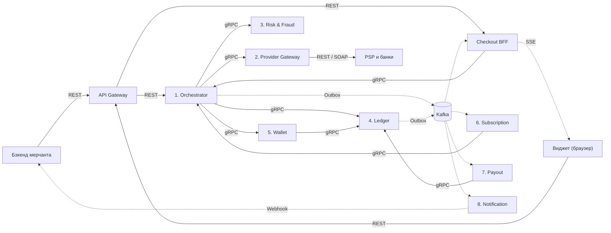
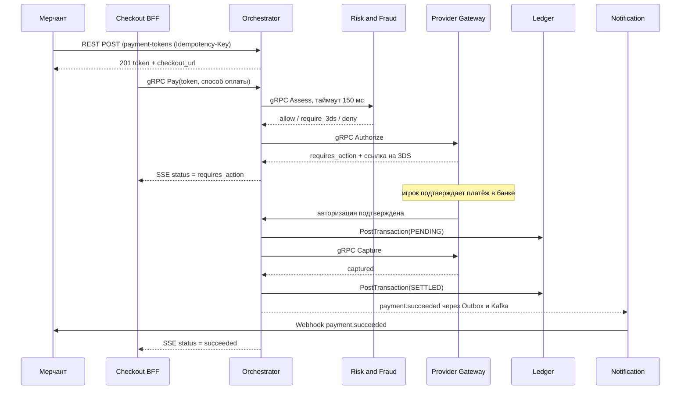
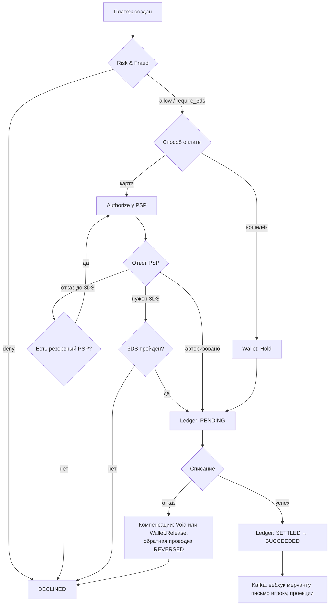

# ДЗ 2. Проектирование взаимодействия сервисов — решение

> Условие: [../Задание.md](../Задание.md) · Таблица протоколов: [../Таблица протоколов.md](../Таблица%20протоколов.md)
> Схемы складывайте в [diagrams/](diagrams/).

## Выбранная система

Платёжный сервис Xsolla Paystation, посредник между игровой компанией и сотнями
способов оплаты по всему миру. Разработчик игры не подключает их сам, не
разбирается с 3DS, налогами, мошенничеством и оспариваниями: он интегрирует
Paystation и получает один программный интерфейс. Система соответствует строке
«Платёжный сервис / кошелёк» из задания.

Архитектура спроектирована по публично наблюдаемому поведению продукта
(создание платежа по токену, виджет оплаты, вебхуки мерчанту, подписки, кошелёк
игрока, выплаты), а не по внутреннему устройству компании.

Система принимает от бэкенда игры запрос на оплату, показывает игроку виджет с
доступными именно ему способами оплаты, проводит деньги через провайдера, при
необходимости уводит игрока на подтверждение в банк, разносит сумму по счетам
(доля мерчанта, комиссия Xsolla, налог, резерв под оспаривания), сообщает игре
об успехе, ведёт регулярные списания по подпискам и выплачивает накопленное
мерчанту.

### Термины

| Термин | Расшифровка |
|---|---|
| Мерчант | Компания-разработчик игры, клиент Xsolla. Её бэкенд создаёт платёж и выдаёт игроку товар |
| PSP | Payment Service Provider: эквайер, банк, оператор локального способа оплаты. Их у Xsolla сотни |
| 3DS | 3-D Secure: подтверждение платежа банком игрока кодом из СМС или пушем. Уводит игрока на страницу банка |
| Авторизация | Банк «замораживает» сумму на карте, но ещё не списывает |
| Списание (capture) | Фактическое снятие ранее замороженной суммы |
| Отмена авторизации (void) | Снятие заморозки без списания, компенсация к авторизации |
| Рефанд | Возврат: Xsolla сама возвращает деньги игроку по запросу мерчанта |
| Чарджбек | Оспаривание: игрок пожаловался в свой банк, банк принудительно забрал деньги обратно |
| Payout | Выплата: перевод накопленных денег мерчанту за вычетом комиссии |
| Dunning | Серия повторных попыток списать подписку, если на карте не было денег |
| MIT | Merchant Initiated Transaction: списание по подписке, когда игрока нет у экрана и подтвердить 3DS некому |
| Soft / hard decline | Мягкий отказ («недостаточно средств») временный, повторять можно. Жёсткий («карта закрыта») окончательный, за повторы по нему штрафуют |
| Card testing | Перебор краденых карт мелкими платежами, чтобы проверить, какие из них живы |
| KYC | Know Your Customer: обязательная проверка документов контрагента перед выплатой |
| PCI DSS | Payment Card Industry Data Security Standard: стандарт безопасности карточных данных. Определяет, кто вправе видеть у себя номер карты |
| Минорные единицы | Деньги в целых центах: `1050` это 10.50 EUR. Числа с плавающей точкой в деньгах запрещены |

### Ключевые сценарии

Покупка картой (основной поток), покупка с баланса кошелька, пополнение
кошелька, подтверждение через 3DS, отказ PSP с каскадом на резервного,
подписка с регулярными списаниями и dunning, рефанд, чарджбек, выплата
мерчанту.

### Масштаб

Цифры порядковые, ориентировочные.

| Метрика | Оценка | Комментарий |
|---|---|---|
| Мерчанты | ~1.5–2 тыс. | у каждого свои настройки и свой набор способов оплаты |
| Игроки за год | сотни млн | глобально, 200+ стран |
| Способы оплаты / валюты | ~700 / ~130 | главный драйвер сложности Provider Gateway |
| Платежей в сутки | ~2–3 млн | ≈ 30 TPS в среднем |
| Пик (релиз игры, распродажа) | ×10–20 к среднему | ~300–600 TPS создания платежей |
| Открытий виджета | ×3 к числу платежей | ~100 RPS средний, до ~2K RPS в пик |
| Одновременных SSE-соединений | ~12–30 тыс., в пик ~250–600 тыс. | по формуле Литтла: 100 RPS × 120–300 с, в пик 2000 RPS × те же 120–300 с. Главный драйвер числа инстансов Checkout BFF |
| Событий в Kafka | ~30 млн/сутки | один платёж рождает 10–15 событий |
| Доступность приёма платежа | ≥ 99.95% | прямая потеря денег мерчанта и Xsolla |
| Консистентность по деньгам | строгая | баланс сходится всегда |
| Консистентность отчётов | eventual | лаг проекций в секунды-минуты приемлем |

Бюджеты задержки по критичным рёбрам:

| Ребро | Бюджет |
|---|---|
| Виджет → витрина способов оплаты | p95 ≤ 300 мс, медленнее падает конверсия |
| Виджет → «Оплатить» → ответ | p95 ≤ 1.5 с, включая авторизацию у PSP |
| Orchestrator → Risk & Fraud | p99 ≤ 100 мс, таймаут 150 мс |
| Orchestrator → Ledger | p99 ≤ 50 мс |
| Событие успеха → вебхук у мерчанта | p95 ≤ 5 с |
| Смена статуса → виджет по SSE | ≤ 1 с |

---

## 1. Декомпозиция

Восемь доменных сервисов:

| # | Сервис | Зона ответственности | State |
|---|---|---|---|
| 1 | Payment Orchestrator | Мозг платежа: ведёт его по шагам и откатывает компенсациями при сбое. Хранит состояние саги, отвечает на вопрос «где платёж сейчас» | stateful |
| 2 | Provider Gateway | Прячет зоопарк PSP за одним внутренним контрактом. Выбор провайдера и каскад при отказе, 3DS, приём вебхуков от PSP | stateless |
| 3 | Risk & Fraud | По каждой транзакции решает: пропустить, потребовать 3DS или отклонить. Правила, скоринг, лимиты, списки, защита от card testing | stateful |
| 4 | Ledger | Двойная запись (double-entry). Единственный источник правды по суммам, включая баланс кошелька: доля мерчанта, комиссия, налоги, резервы под чарджбеки | stateful, append-only |
| 5 | Wallet | Продуктовая обвязка счёта игрока: заморозка средств (hold) с TTL, лимиты, правила пополнения и списания. Своей суммы не хранит, деньги лежат проводками в Ledger на счёте `player:{id}` | stateful (holds и лимиты) |
| 6 | Subscription | Тарифные планы, планировщик регулярных списаний, dunning, приостановка, отмена, возобновление | stateful |
| 7 | Payout | Считает сумму к выплате за вычетом комиссии и резервов, проверяет KYC и лимиты, отправляет деньги через банк, сверяет результат | stateful |
| 8 | Notification | Доставка вебхуков мерчанту с подписью, повторами по backoff и DLQ (Dead-Letter Queue). Плюс письма и пуши игроку | stateful |

Edge-слой и инфраструктура, в счёт восьми не идут:

| Компонент | Роль |
|---|---|
| API Gateway | Единая точка входа: TLS, проверка ключей мерчанта, Rate Limiter, маршрутизация. Через него идут и REST-запросы, и SSE-поток к виджету |
| Checkout BFF (Backend For Frontend) | Адаптер под один клиент, своей бизнес-логики и своих денег нет. По токену собирает витрину способов оплаты для конкретного игрока, принимает его выбор, держит SSE-поток (Server-Sent Events) со статусом. Версионируется вместе с виджетом |
| Kafka | Шина событий и долгоживущий журнал для проекций и аудита |
| RabbitMQ внутри Notification | Планировщик отложенных повторов вебхуков. Не общая шина, другие сервисы о нём не знают |
| Merchant Config | Настройки мерчанта: способы оплаты, комиссии, адрес вебхука, ключи, брендинг. Меняется редко, читается постоянно, живёт в кэше у потребителей |
| Redis | Кольцевой буфер последних событий по каждой сессии виджета с TTL на длину сессии, чтобы досылать пропущенное при переподключении |

### Почему декомпозиция такая

Нет god-service:

- Деньги разведены по трём ответственностям. Ledger отвечает за корректность проводок, Wallet за продуктовое поведение счёта игрока, Payout за выплату наружу. У них разные контрагенты, разная регуляторика и разные требования к доступности: Ledger обязан быть живым в каждом платеже, Payout может лежать полдня, и никто не заметит.
- Двоевластия по балансу нет. Сумма на счёте игрока живёт только в проводках Ledger. Wallet не хранит параллельного числа, которое могло бы разойтись с книгой: он владеет заморозками и лимитами, а «сколько денег» спрашивает у Ledger.
- Provider Gateway отделён от оркестратора. Оркестратор знает, что должно произойти, шлюз знает, как именно у конкретного провайдера. Добавление нового способа оплаты не трогает логику платежа.
- Risk & Fraud не растворён в оркестраторе: правила и модели меняются ежедневно, отдельно от релизов платёжного ядра.
- Notification вынесен, потому что доставка вебхука живёт часами, а платёж секунды. Смешав их, оркестратор пришлось бы заставить хранить долгоживущие ретраи и падать вместе с недоступным мерчантом.

Нет избыточного дробления:

- Merchant Config не стал сервисом: своей бизнес-логики нет, только чтение редко меняющихся настроек.
- Витрина способов оплаты не стала отдельным сервисом: это единственная задача Checkout BFF, отдельный сервис добавил бы сетевой прыжок в самое чувствительное к задержке место.
- Рефанды и чарджбеки не стали сервисом: это те же саги в оркестраторе, с другими шагами и обратным знаком проводок.
- Приём и отправка вебхуков разведены осознанно: входящие от PSP принимает Provider Gateway, это часть протокола провайдера, а исходящие мерчанту шлёт Notification, это уведомление с ретраями.

Checkout BFF не входит в восьмёрку, потому что у него нет собственной
предметной области: он ничего не решает про деньги и не владеет состоянием,
кроме открытых соединений. При появлении второго клиента, например мобильного
SDK, рядом появится второй BFF, а доменных сервисов останется восемь.

---

## 2. Протоколы

Выбор сделан отдельно для каждого ребра, а не «один протокол на всю систему».

| # | Ребро | Протокол | Почему |
|---|---|---|---|
| 1 | Бэкенд мерчанта → API Gateway | REST поверх HTTPS | Публичный интерфейс для тысяч внешних команд на разных языках. Главное требование: интегрируется за час по документации, отлаживается через curl. gRPC потребовал бы от чужой команды тулинга и генерации кода |
| 2 | Виджет → Checkout BFF | REST | Клиент ровно один, и BFF уже собирает ему готовый ответ одной ручкой. Главный плюс GraphQL, гибкая выборка под разные клиенты, здесь не нужен, а минусы остались бы: сложность сервера и трудное кэширование |
| 3 | Checkout BFF → виджет | SSE | Поток строго односторонний, клиенту отвечать нечем. WebSocket дал бы вторую половину дуплекса, которой мы не пользуемся, ценой дорогого масштабирования. У SSE авто-переподключение из коробки. Опрос отвергнут: при сотнях тысяч сессий это сотни тысяч холостых запросов в секунду |
| 4 | Между сервисами Xsolla | gRPC | Внутренняя сеть, свои команды, строгий контракт в `.proto`, автогенерация клиентов, бинарный Protobuf вместо JSON. На горячем пути бюджет задержки уже съеден банком и антифродом. Строгая типизация важна там, где ошибка в поле означает ошибку в деньгах |
| 5 | События между сервисами | Kafka | Нужен неизменяемый упорядоченный журнал: на нём стоят Event Sourcing и CQRS-проекции. Kafka хранит события заданный срок независимо от прочтения, поэтому новый потребитель может переиграть историю с нуля. RabbitMQ удаляет сообщение после подтверждения, истории не остаётся |
| 5а | Отложенные повторы вебхуков | RabbitMQ с delayed-exchange внутри Notification | Единственное место, где Kafka не подходит: у неё нет отложенной доставки. Пауза в 24 часа на retry-топике заставила бы потребителя удерживать партицию всё это время, иначе он заблокирует хвост очереди. RabbitMQ умеет это одним заголовком `x-delay`. Цена: второй брокер в эксплуатации |
| 6 | Notification → бэкенд мерчанта | Webhook (HTTP POST) с подписью | Мерчант в чужом периметре и подписаться на нашу Kafka не может. Обратный вызов на его адрес это единственный способ разбудить чужую систему. At-least-once плюс повторы по backoff |
| 7 | Provider Gateway → PSP | Тем, что даёт провайдер (REST, реже SOAP) | Протокол диктует внешняя сторона. Разнородность прячется в адаптерах, наружу шлюз отдаёт один внутренний gRPC-контракт |
| 8 | PSP → Provider Gateway | Webhook (HTTP POST) | Банковский перевод и наличные терминалы подтверждаются минутами и часами, держать соединение всё это время невозможно |

Логика микса: наружу REST, потому что интеграцию делает чужая команда и цена
входа важнее производительности; внутрь gRPC, потому что обе стороны наши и
важнее скорость со строгостью контракта; событиям Kafka, потому что получателей
заранее не знаем и хотим переигрывать историю; живому статусу SSE, потому что
поток односторонний, а соединений десятки тысяч.

---

## 3. Схема взаимодействия

Общая схема. Сплошная стрелка это синхронный вызов, пунктир асинхронный.



Основной поток, покупка картой с 3DS:



Сага платежа с компенсациями:



### SSE-слой

Checkout BFF формально не stateless: пока платёж идёт, на конкретном инстансе
висит открытое соединение конкретного игрока. Отсюда две задачи.

Как событие из Kafka находит нужный инстанс. Игрок подключён к одному инстансу,
а событие прилетит на случайный. Поэтому каждый инстанс читает топик статусов в
своей собственной consumer group, то есть получает все события, и отдаёт наружу
только те, по которым у него есть живое соединение. Дублировать трафик здесь
дёшево: событий о смене статуса на порядок меньше, чем платежей.

Как досылать пропущенное при обрыве. Последние события каждой сессии лежат в
Redis кольцевым буфером. Браузер при переподключении присылает заголовок
`Last-Event-ID`, инстанс поднимает буфер по токену платежа и досылает хвост.
Ключ буфера это токен платежа, поэтому переподключение на другой инстанс
работает так же, и липкие сессии не нужны.

### Два решения в саге

Каскад работает только до 3DS. Резервный провайдер это новая авторизация у
другого эквайера, а значит и новое подтверждение в банке: игрока пришлось бы
второй раз гнать за кодом из СМС, и на этом шаге он обычно уходит. Поэтому
после пройденного 3DS отказ на финальной авторизации сразу даёт `DECLINED`.

Проводка `PENDING` идёт до списания. Если сначала снять деньги, а потом писать
в книгу, то падение Ledger между этими шагами оставит деньги, списанные с
игрока и не существующие ни в одной записи: вернуть их нельзя, потому что
рефанд тоже нужно записать проводкой. Поэтому порядок обратный: фиксируем
намерение, двигаем деньги, подтверждаем. При любом падении после `PENDING`
есть запись, от которой можно оттолкнуться, а зависшие платежи видны как
ненулевой остаток на транзитных счетах.

Компенсации по шагам: заморозка в кошельке снимается через `Wallet.Release`,
авторизация на карте через `Void`, уже списанные деньги через `Refund`. Сама
проводка не откатывается, бухгалтерскую запись удалять нельзя: компенсация
здесь это обратная проводка `REVERSED` к ранее записанной `PENDING`.

### Подписка и чарджбек

Регулярное списание отличается от основного потока двумя вещами: инициатор это
планировщик, а не игрок, и отказ карты здесь не финал, а начало серии повторов.
Списание идёт как MIT, без 3DS, потому что игрока нет у экрана. При мягком
отказе Subscription повторяет попытку через 1, 3 и 7 дней и шлёт игроку письмо
«обновите карту». При жёстком отказе повторять бессмысленно и вредно, за это
штрафуют платёжные системы, поэтому подписка сразу переводится в `past_due`.

Чарджбек единственный поток, который приходит извне и уменьшает деньги мерчанта
уже после успешного платежа. Provider Gateway принимает вебхук от PSP
идемпотентно по `provider_transaction_id`, оркестратор пишет обратную проводку
(`merchant:123` −798, `tax:vat_de` −160, `xsolla:fee` −42, `psp:acquirer_stripe`
+1000, снова ноль), Risk & Fraud помечает игрока и карту, Notification уводит
мерчанту вебхук со сроком на документы. Если по мерчанту удерживался резерв,
списание идёт сначала с него. Резерв нужен именно потому, что чарджбек приходит
через недели после платежа, когда деньги мерчанту уже выплачены. Рефанд устроен
так же, но проще: инициатива наша, спора и штрафа нет.

---

## 4. API-контракты

### 4.1. Создание платежа: мерчант → Xsolla (REST)

```http
POST /merchant/v1/payment-tokens
Authorization: Bearer <merchant_api_key>
Idempotency-Key: 5f2c1a90-3e4b-4d21-9f77-0a1b2c3d4e5f

{
  "external_id": "order-88213",
  "purchase": { "item_sku": "gems_1000", "quantity": 1, "amount": 1000, "currency": "EUR" },
  "user": { "id": "player-4471", "email": "player@example.com", "country": "DE" },
  "settings": { "return_url": "https://game.example/payment/done", "ui": { "locale": "de_DE" } }
}
```

```http
201 Created
{
  "token": "eyJhbGciOi...",
  "checkout_url": "https://secure.xsolla.example/paystation?token=eyJhbGciOi...",
  "payment_id": "pay_01HQ8Z3M",
  "expires_at": "2026-08-16T12:35:00Z"
}
```

| Аспект | Решение |
|---|---|
| `amount` | В минорных единицах: `1000` это 10.00 EUR. Числа с плавающей точкой запрещены |
| `Idempotency-Key` | Обязателен. Повтор с тем же ключом и тем же телом возвращает исходный ответ. Тот же ключ с другим телом даёт `409 Conflict`. Ключи хранятся 24 часа |
| Ошибки | `400` невалидное тело, `401` плохой ключ, `409` конфликт идемпотентности, `422` способ оплаты недоступен в стране игрока, `429` превышен лимит частоты |

### 4.2. Оплата в виджете и поток статусов (REST + SSE)

```http
GET /checkout/v1/sessions/{token}
→ 200 OK
{
  "payment_id": "pay_01HQ8Z3M",
  "amount": 1000, "currency": "EUR", "display_amount": "10,00 €",
  "payment_methods": [
    { "id": "card", "title": "Bankkarte", "saved_cards": [ { "id": "pm_92f", "last4": "4242" } ] },
    { "id": "paypal", "title": "PayPal" },
    { "id": "xsolla_wallet", "title": "Guthaben", "balance": 350, "sufficient": false }
  ]
}
```

```http
POST /checkout/v1/sessions/{token}/pay
{ "payment_method_id": "card", "saved_card_id": "pm_92f" }

→ 202 Accepted
{ "payment_id": "pay_01HQ8Z3M", "status": "requires_action",
  "action": { "type": "redirect_3ds", "url": "https://acs.bank.example/..." } }
```

```http
GET /checkout/v1/sessions/{token}/events
Accept: text/event-stream

event: status
id: 2
data: {"payment_id":"pay_01HQ8Z3M","status":"requires_action"}

event: status
id: 3
data: {"payment_id":"pay_01HQ8Z3M","status":"succeeded","redirect_url":"https://game.example/payment/done"}
```

| Аспект | Решение |
|---|---|
| Ответ `202` | Платёж принят в обработку, но ещё не завершён, финальный статус придёт по SSE |
| Поле `id` | При обрыве браузер переподключается с `Last-Event-ID`, и мы досылаем пропущенное из буфера сессии в Redis |
| Таймаут потока | 15 минут, потом виджет показывает «проверьте статус позже». Платёж живёт дальше, вебхук мерчанту уйдёт в любом случае |
| Реквизиты карты | Через наши сервисы не проходят. Номер вводится в поле, отрисованное скриптом провайдера, и уходит с браузера сразу к PSP, обратно приходит токен |
| PCI DSS | Из-за этого в зону аудита попадает только Provider Gateway. Каждый сервис, через который шёл бы номер карты, пришлось бы сертифицировать заново при каждом релизе |

### 4.3. Вебхук мерчанту: Xsolla → игра (HTTP POST с подписью)

Именно по этому вызову игра выдаёт игроку товар.

```http
POST https://game.example/xsolla/webhook
X-Xsolla-Event-Id: evt_01HQ8Z44
X-Xsolla-Signature: sha256=9c1f...
X-Xsolla-Delivery-Attempt: 1

{
  "event_id": "evt_01HQ8Z44",
  "event_type": "payment.succeeded",
  "occurred_at": "2026-08-16T12:31:07Z",
  "data": {
    "payment_id": "pay_01HQ8Z3M",
    "external_id": "order-88213",
    "user": { "id": "player-4471" },
    "purchase": { "item_sku": "gems_1000", "quantity": 1 },
    "amount": 1000, "currency": "EUR", "payment_method": "card"
  }
}
```

| Аспект | Решение |
|---|---|
| Типы событий | `payment.succeeded`, `payment.failed`, `refund.completed`, `chargeback.received`, `subscription.renewed`, `subscription.cancelled` |
| Подпись | HMAC-SHA256 от сырого тела на секрете мерчанта. Мерчант обязан её проверять, иначе кто угодно подделает «платёж прошёл» и получит товар бесплатно |
| Гарантия | At-least-once: дубли возможны, потери нет. Мерчант дедуплицирует по `event_id` |
| Что ждём | HTTP `2xx` за ≤ 5 секунд. Любой другой ответ или таймаут считается неудачей |
| Повторы | Backoff 1 мин, 5 мин, 30 мин, 2 ч, 6 ч, 24 ч через отложенную доставку в RabbitMQ. После 6 попыток событие уходит в DLQ и в кабинет мерчанта с кнопкой ручного повтора |
| Порядок | Не гарантируется, и ломает его механизм повторов, а не шина: события одного платежа лежат в одной партиции Kafka по ключу `payment_id`, но застрявший в повторе `payment.succeeded` доедет позже, чем следующий за ним `refund.completed`. Мерчант раскладывает события по `occurred_at` |

### 4.4. Проводка в Ledger: внутренний контракт (gRPC)

```protobuf
syntax = "proto3";
package xsolla.ledger.v1;

service Ledger {
  // Записать сбалансированную проводку. Идемпотентно по idempotency_key.
  rpc PostTransaction(PostTransactionRequest) returns (PostTransactionResponse);

  // ДЛЯ ПОКАЗА. Из проекции, отстаёт на секунды, ответ несёт as_of.
  // Принимать по нему решения о деньгах запрещено.
  rpc GetBalance(GetBalanceRequest) returns (GetBalanceResponse);

  // ДЛЯ РЕШЕНИЙ О ДЕНЬГАХ. Считается на стороне записи под блокировкой счёта.
  // Обязателен для Payout и для списания с кошелька.
  rpc GetSettledBalance(GetBalanceRequest) returns (GetBalanceResponse);
}

message Money {
  int64  minor_units = 1;  // 1050 это 10.50, только целые, никаких float
  string currency    = 2;  // ISO 4217
}

message Entry {
  // Источник: "psp:acquirer_stripe" для карты, "player:4471" для кошелька.
  // Транзит на стадии PENDING: "suspense:payment:{payment_id}".
  // Конечные счета: "merchant:123", "xsolla:fee", "tax:vat_de",
  //                 "reserve:chargeback:123".
  string account_id = 1;
  Money  amount     = 2;   // отрицательное откуда, положительное куда
}

enum TransactionType { PAYMENT = 0; REFUND = 1; CHARGEBACK = 2; PAYOUT = 3; WALLET_TOPUP = 4; }

enum TransactionStage {
  PENDING  = 0;  // намерение: авторизация есть, сумма на транзитном счёте
  SETTLED  = 1;  // деньги получены, транзит закрыт, сумма разнесена
  REVERSED = 2;  // обратная проводка к ранее записанной PENDING
}

message PostTransactionRequest {
  string           idempotency_key = 1;  // "pay_01HQ8Z3M:payment:settled"
  string           reference_id    = 2;  // payment_id, связь с сагой
  TransactionType  type            = 3;
  TransactionStage stage           = 4;
  repeated Entry   entries         = 5;  // сумма всех amount по валюте равна 0
  string           reverses_id     = 6;  // только при stage = REVERSED
}

message PostTransactionResponse {
  string transaction_id = 1;
  bool   was_duplicate  = 2;
}
```

Платёж 10.00 EUR из Германии, НДС 19% включён в цену, комиссия Xsolla 5% от
суммы без налога. Один платёж это две проводки, по одной на стадию.

Стадия `PENDING`, до движения денег. Разносить по конечным счетам ещё нельзя:
деньги только авторизованы, мерчанту пока ничего не причитается. Вся сумма
кладётся на транзитный счёт платежа (`suspense`).

| Счёт | Центы | Смысл |
|---|---|---|
| `psp:acquirer_stripe` | −1000 | авторизация подтверждена, сумма заморожена на карте |
| `suspense:payment:pay_01HQ8Z3M` | +1000 | транзит, владелец ещё не определён |
| Итого | 0 | инвариант двойной записи соблюдён и здесь |

Стадия `SETTLED`, после успешного `Capture`:

| Счёт | Центы | Смысл |
|---|---|---|
| `suspense:payment:pay_01HQ8Z3M` | −1000 | транзит закрыт |
| `tax:vat_de` | +160 | НДС Германии к перечислению |
| `xsolla:fee` | +42 | комиссия Xsolla |
| `merchant:123` | +798 | доля мерчанта, доступна к выплате |
| Итого | 0 | |

Такая пара даёт бесплатный инструмент контроля: сумма всех транзитных счетов
должна стремиться к нулю, а всё, что зависло дольше суток, это застрявшие между
авторизацией и списанием платежи. Компенсация `REVERSED` отменяет ровно
проводку `PENDING` и до конечных счетов провал платежа не доходит. У мерчантов с
повышенным риском часть доли удерживается: вместо `merchant:123` +798 пишутся
`merchant:123` +758 и `reserve:chargeback:123` +40, резерв разблокируется через
180 дней.

| Аспект | Решение |
|---|---|
| Почему gRPC | Внутренняя сеть, обе стороны наши. Ошибка в типе поля здесь означает ошибку в деньгах. Бюджет p99 ≤ 50 мс |
| Идемпотентность | По `idempotency_key`. Повтор возвращает исходный `transaction_id` и `was_duplicate = true`. Стадия входит в ключ, поэтому `PENDING` и `SETTLED` одного платежа это две разные записи, а не конфликт |
| Инвариант | Сервер отклоняет запрос с `INVALID_ARGUMENT`, если сумма `entries` по любой валюте не равна нулю |
| Только дозапись | Проводку нельзя изменить или удалить, можно только добавить обратную |
| Два метода баланса | Правило «решения о деньгах не принимаются по проекции» вынесено в контракт, а не оставлено устной договорённостью: ошибиться можно только осознанно, вызвав не тот метод |

---

## 5. Асинхронность

Правило: синхронно то, без ответа чего нельзя сделать следующий шаг и что видит
игрок прямо сейчас. Асинхронно всё остальное.

| Синхронное взаимодействие | Почему нельзя иначе |
|---|---|
| Мерчант → создание платежа | Игре надо прямо сейчас открыть игроку виджет по ссылке |
| Виджет → витрина способов оплаты | Игрок смотрит на экран и ждёт, медленнее 300 мс падает конверсия |
| Виджет → «Оплатить» | Нужно сразу вернуть либо ссылку на 3DS, либо «принято». Асинхронный ответ здесь означает чёрный экран |
| Orchestrator → Risk & Fraud | Решение блокирует следующий шаг: авторизовать или сначала потребовать 3DS |
| Orchestrator → Provider Gateway | Обращение к деньгам, нужен однозначный результат до перехода к проводке |
| Orchestrator → Ledger | Платёж не считается успешным, пока деньги не разнесены по счетам |

| Асинхронное взаимодействие | Почему |
|---|---|
| Вебхук мерчанту | Мерчант в чужом периметре и может лежать. Синхронная отправка привязала бы наш платёж к доступности чужого сервера. Через Kafka и Notification платёж завершается независимо, а доставка живёт своей жизнью с повторами до 24 часов |
| Уведомление виджета по SSE | Финальный статус приходит через минуты, держать HTTP-запрос открытым столько невозможно |
| Ответы PSP по асинхронным способам | Банковский перевод подтверждается часами, провайдер сам стучится к нам вебхуком |
| Обновление проекций | История, отчёты и дашборды строятся из потока событий, лаг в секунды приемлем |
| Регулярные списания по подпискам | Инициирует планировщик, никто не ждёт ответа. Позволяет размазать пик первого числа месяца |
| Выплаты мерчантам | Батчами по расписанию, задержка в часы допустима |
| Данные в антифрод для дообучения | На критическом пути не нужны, нужны для качества моделей |
| Письма и пуши игроку | Чек может прийти через минуту, это никого не блокирует |

Что это даёт: платёж не зависит от доступности мерчанта, Kafka принимает
всплеск релиза игры, а новых потребителей можно добавлять без изменения ядра.
Цена: eventual consistency, из-за которой отчёт мерчанта отстаёт на
секунды-минуты и это надо явно писать в документации, плюс возможность дублей,
которая требует идемпотентности у каждого потребителя.

---

## 6. Паттерны

Saga с оркестрацией. Платёж затрагивает пять сервисов и внешний банк, обычной
транзакции с откатом здесь нет: снять деньги с карты и записать проводку одной
атомарной операцией невозможно. Каждый шаг получает заранее описанную
компенсацию, состояние саги хранится в оркестраторе, поэтому после падения
процесс продолжается с прерванного шага. Оркестрация выбрана вместо хореографии
потому, что у платежа жёсткая последовательность шагов и нетривиальные
компенсации: размазав их по восьми сервисам, на вопрос поддержки «где сейчас
платёж» пришлось бы отвечать, собирая логи по всей системе. Хореография уместна
после успеха: вебхук, письмо, проекции и дообучение антифрода не связаны между
собой и просто реагируют на `payment.succeeded`.

Transactional Outbox. Оркестратор должен одновременно записать «платёж успешен»
в свою базу и опубликовать событие в Kafka, а это два разных хранилища без общей
транзакции. Событие пишется в таблицу `outbox` той же транзакцией, что и
изменение состояния, отдельный процесс читает таблицу и публикует. Упали до
публикации, опубликуем после подъёма. Упали после публикации, событие уйдёт
дважды, и это допустимо, потому что система идемпотентна на каждом уровне:

| Уровень | Ключ | Что защищает |
|---|---|---|
| Мерчант → создание платежа | `Idempotency-Key` | Повтор при обрыве сети не создаёт второй платёж |
| Orchestrator → Ledger | `payment_id` + операция + стадия | Повторная проводка не удваивает деньги |
| Вебхуки от PSP | `provider_transaction_id` | Провайдер, приславший подтверждение дважды, не приводит к двойному списанию |
| Потребители Kafka | `event_id` | At-least-once означает дубли, их надо гасить |
| Вебхук мерчанту | `event_id` | Мерчант не выдаёт товар дважды |

Без этого при первом же сетевом сбое игрок платит два раза, а в платёжной
системе это не баг, а инцидент с возвратом денег и разбирательством.

Event Sourcing только в Ledger. По деньгам нужен полный аудит: откуда взялись
12 000 EUR на балансе мерчанта, что происходило со счётом три месяца назад, чем
отвечать банку при разборе оспаривания. Ledger хранит не текущий баланс, а
неизменяемую последовательность проводок, баланс это свёртка событий от
последнего snapshot. В Wallet событийного хранения нет намеренно: денег он не
хранит, а заморозка живёт минуты, журнал на три месяца назад ей не нужен.
Применять Event Sourcing там, где он не нужен, это типовая ошибка внедрения.

CQRS. Модель, оптимальная для записи проводки, плоха для чтения: чтобы показать
оборот за квартал, пришлось бы суммировать миллионы записей на каждый запрос,
а чтений на порядки больше записей. Сторона записи это реляционная база с
транзакциями и только дозаписью, сторона чтения это проекции из потока Kafka:
агрегаты в колоночной базе для отчётов, актуальный баланс в быстром key-value.
Понадобился новый разрез, поднимаем нового потребителя, он переигрывает журнал
и строит свою витрину, не трогая сторону записи. Плата в том, что проекция
отстаёт на секунды, поэтому решения о деньгах принимаются только через
`GetSettledBalance`.

| Паттерн | Что сломалось бы без него | Trade-off |
|---|---|---|
| Saga с оркестрацией | Деньги списаны, но товар не выдан, замороженные средства зависают навсегда | Оркестратор это узкое место и точка отказа, компенсации надо писать и тестировать отдельно |
| Хореография после успеха | Сбой рассылки писем ронял бы платёж | Труднее увидеть общую картину, кто на что подписан |
| Transactional Outbox | Мерчант не узнаёт об оплате и не выдаёт товар | Дополнительная таблица и процесс-relay, события возможны дважды |
| Идемпотентность везде | Двойные списания и двойная выдача товара | Хранение ключей с TTL, дисциплина на каждой ручке |
| Event Sourcing в Ledger | Нечем ответить банку при оспаривании и налоговой при проверке | Объём данных, snapshot-механика, тяжёлая миграция схемы событий |
| CQRS | Агрегация по миллионам проводок на каждый отчёт | Лаг проекций, решения о деньгах нельзя принимать по стороне чтения |
| Provider Gateway как слой адаптеров | Логика платежа обрастала бы ветками под каждого провайдера | Ещё один сетевой прыжок, адаптеры надо поддерживать |
| Kafka как единая шина | Всплеск релиза игры ронял бы потребителей | Eventual consistency, отложенных повторов Kafka не умеет |

---

## 7. Отказоустойчивость

Внешние провайдеры отваливаются регулярно, это нормальный режим работы, а не
авария.

| Механизм | Где | Что даёт |
|---|---|---|
| Circuit Breaker | На каждый PSP отдельно | Провайдер стабильно отказывает, перестаём в него стучаться и сразу каскадим, не тратя бюджет ожидания игрока |
| Каскад провайдеров | Provider Gateway, только до 3DS | Отказ одного эквайера не равен отказу платежа. После пройденного 3DS каскад запрещён, он потребовал бы второго подтверждения в банке |
| Retry с backoff | Вебхуки, проводки, вызовы банка при выплатах | Переживаем короткие сбои, не добивая упавшего. Обязательно вместе с идемпотентностью |
| Timeout | Каждый внешний и межсервисный вызов | Антифрод 150 мс, авторизация у PSP 15 с. Без явных таймаутов зависший провайдер держит наши потоки |
| Bulkhead | Пулы соединений к PSP изолированы | Один медленный провайдер не выедает пул на всех |
| Rate Limiter | API Gateway по ключу мерчанта, checkout по IP и сессии | Защита от лавины запросов и от card testing |
| DLQ | Notification | Недоставленные вебхуки не теряются и не крутятся вечно |

Управляемая деградация:

| Что упало | Как деградируем |
|---|---|
| Risk & Fraud | Запасная политика: принудительный 3DS на все платежи. Конверсия просядет, но мошенничество не пройдёт |
| Wallet | Оплата с баланса скрывается из витрины, остальные способы работают. Игрок видит меньше вариантов, а не ошибку |
| Notification | Платежи проводятся, события копятся в Kafka. Сервис поднимется и разошлёт всё |
| Проекции | Отчёты показывают устаревшие данные с пометкой времени, приём платежей не затронут |
| Payout | Выплаты откладываются, деньги мерчанта в безопасности в Ledger |
| Ledger | Единственный компонент без деградации. Новые платежи останавливаются до проводки `PENDING`, когда деньги ещё не двигались. Дошедшие до `PENDING` довисят до подъёма, `SETTLED` идемпотентен |

Расстановка отражает главный приоритет платёжной системы: лучше не принять
платёж, чем принять и потерять его след.
