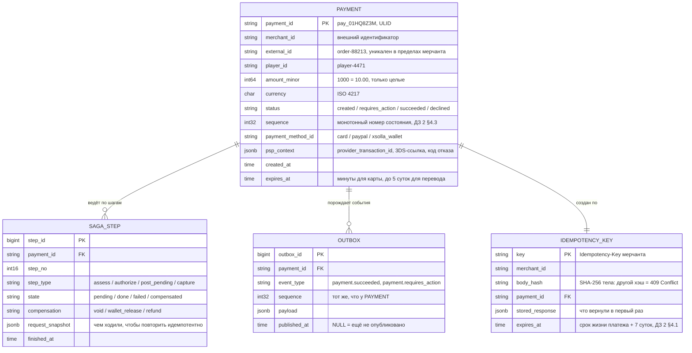
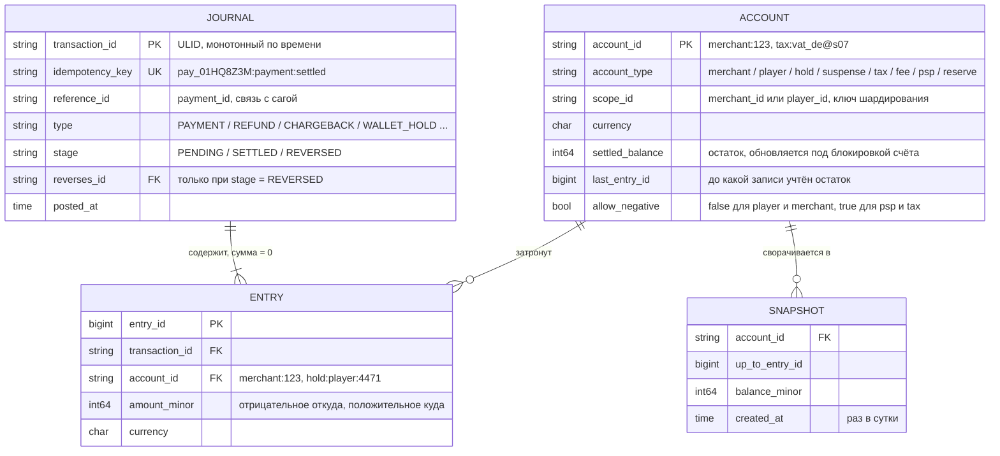
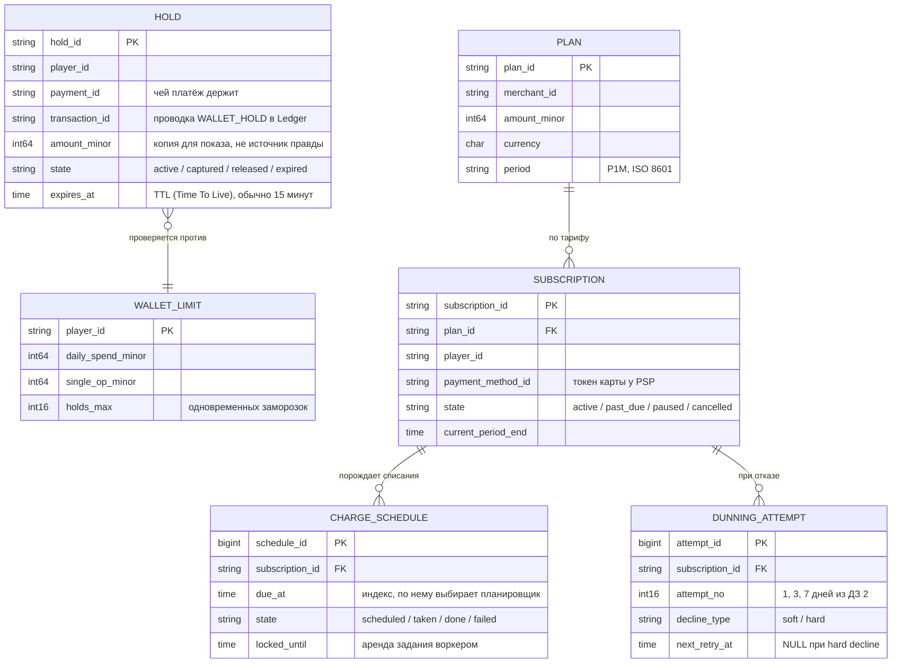
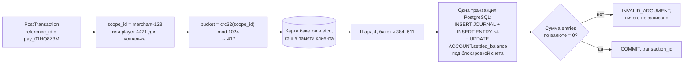
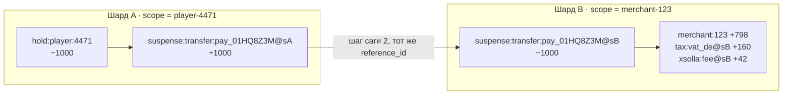

# ДЗ 3. Проектирование хранения данных — решение

> Условие: [../Задание.md](../Задание.md)
> Шаблоны: [сравнение БД](../Таблица%20сравнения%20БД%20с%20критериями%20выбора.md) ·
> [кэширование](../Чек-лист%20стратегий%20кэширования.md) ·
> [шардирование](../Шаблон%20схемы%20шардирования.md). Схемы — в [diagrams/](diagrams/).

> Выполняется для системы, выбранной в ДЗ 2: платёжный сервис Xsolla Paystation.
> Декомпозиция, протоколы и паттерны — в [hw_02/solution/README.md](../../hw_02/solution/README.md).

## Исходные данные

Хранение проектируется под объём, поэтому сначала цифры. В ДЗ 2 масштаб оценён
как 2–3 млн **платежей** в сутки, в условии ДЗ 4 задано 5 млн **транзакций**
(1 млн DAU (Daily Active Users) × 5). Противоречия нет: платёж это покупка в
игре, транзакция любая денежная операция, и покупок среди них меньше половины.

| Операция | В сутки | Проводок в Ledger |
|---|---|---|
| Покупки в игре, основной поток ДЗ 2 | ~2.6 млн | 2: `PENDING` + `SETTLED` |
| Списания по подпискам (MIT, Merchant Initiated Transaction) | ~1.5 млн | 2 |
| Пополнения кошелька | ~0.4 млн | 2 |
| Оплаты с баланса кошелька, часть покупок | ~0.35 млн | +1: вторая нога перевода между шардами, §3.1 |
| Рефанды | ~0.15 млн | 1 |
| Чарджбеки и выплаты мерчантам | ~10 тыс. | 1 |
| **Итого** | **~5 млн транзакций** | **~10 млн проводок, ~30 млн записей** |

Записей в проводке в среднем три: две на `PENDING`, четыре на `SETTLED`.
Событий в Kafka ~30 млн в сутки, как и в ДЗ 2 (10–15 на платёж). В среднем это
~58 транзакций и ~350 событий в секунду. Пиков два: регулярный ×4 из условия
ДЗ 4 (~230 TPS, дни зарплат) и редкий ×10–20 из ДЗ 2 (релиз игры). Мощность
считаем по ×4, запас по шардам и автомасштабированию закладываем под ×10.

## Уточнения к ДЗ 2

Пять мест, где этот документ дополняет предыдущий. Собраны в одну таблицу,
чтобы читались как осознанные уточнения, а не как незамеченные расхождения.

| Место в ДЗ 2 | Как было | Как читать теперь |
|---|---|---|
| §1, Provider Gateway помечен `stateless` | Не хранит состояния | Состояния платежа не хранит, им владеет оркестратор. Но без inbox принятых вебхуков нечем обеспечить идемпотентность по `provider_transaction_id`, заявленную в ДЗ 2 §6. Точнее: stateless по бизнес-логике, с техническим inbox на 30 суток |
| §2, строка про Kafka | «Новый потребитель может переиграть историю с нуля» | С нуля проекция строится из журнала Ledger и его архива, это источник правды. Kafka хранит `ledger.entries` 90 суток: хватает переподнять отставшую проекцию, но не построить новую с нуля. Преимущество перед RabbitMQ остаётся, меняется горизонт |
| §1, строка Redis | «Два применения в SSE-слое» | Для взаимодействия сервисов нужны два. Хранение добавляет кэши и счётчики (§4), но правило общее: Redis нигде не источник правды по деньгам, и его отказ деградирует систему ровно так, как описано в ДЗ 2 §7 |
| §1, список инфраструктуры | API Gateway, Checkout BFF, Kafka, RabbitMQ, Merchant Config, Redis | Добавляются ClickHouse (сторона чтения CQRS (Command Query Responsibility Segregation), в ДЗ 2 §6 названа «колоночной базой»), OpenSearch для поиска и объектное хранилище для документов. Во взаимодействии сервисов они не участвуют, поэтому в ДЗ 2 их не было |
| §4.5, списание с кошелька | Одна проводка `SETTLED`: `hold:player` −1000, разноска по `tax` / `fee` / `merchant` | Деньги игрока и деньги мерчанта лежат в разных шардах (§3.1), поэтому списание это две проводки через транзитный счёт перевода, связанные `reference_id`. Механизм тот же, что у саги в ДЗ 2, гарантии те же |

---

## 1. Модель данных

Принцип database per service: у каждого сервиса своя схема, чужие таблицы никто
не читает, только gRPC и события. Связи между сервисами живут по
идентификаторам `payment_id`, `merchant_id`, `player_id`, внешних ключей между
схемами нет: они сделали бы невозможным раздельное шардирование.

### 1.1. Payment Orchestrator

Состояние саги и ответ на вопрос «где платёж сейчас».

`SAGA_STEP` нужен для восстановления: после падения оркестратор поднимает
незавершённые шаги и продолжает с прерванного, а `request_snapshot` позволяет
повторить внешний вызов тем же телом и тем же ключом идемпотентности.
Идентификаторы ULID (Universally Unique Lexicographically Sortable Identifier)
монотонны по времени, поэтому на 5 млн вставок в сутки индекс растёт с конца, а
не расщепляется по случайным страницам.

### 1.2. Ledger

Единственный источник правды по деньгам, append-only, Event Sourcing из ДЗ 2 §6.

| Решение | Почему |
|---|---|
| `settled_balance` в `ACCOUNT` | `GetSettledBalance` из контракта ДЗ 2 должен уложиться в p99 ≤ 50 мс под блокировкой счёта, свёртка миллионов записей на каждый вызов в бюджет не влезает. Это тот самый «последний snapshot» из ДЗ 2 §6, только двигается он на каждой проводке в той же транзакции, а `last_entry_id` говорит, до какой записи досчитан. Источник правды остаётся журнал: остаток пересчитывается из него и сверяется, расхождение это баг. `SNAPSHOT` с суточным шагом отвечает на другой вопрос: каким был остаток на дату |
| У роли приложения только `INSERT` и `SELECT` на `JOURNAL` и `ENTRY` | Ошибка исправляется обратной проводкой, а не редактированием. Запрет на уровне прав, а не договорённости, иначе аудит превращается в фикцию |
| `allow_negative` | Счета игрока и мерчанта в минус не уходят, внешние `psp:*` и `tax:*` обязаны: с них деньги приходят. По этому флагу сервер проверяет `check_account` в `PostTransactionChecked` из ДЗ 2 §4.4 |
| Outbox без отдельной таблицы | Журнал уже append-only и упорядочен по ULID, поэтому relay в Kafka читает `JOURNAL` от последнего опубликованного `transaction_id`. Ребро Ledger → Kafka из схемы ДЗ 2 §3 обходится без второй таблицы |

### 1.3. Wallet и Subscription

`HOLD.amount_minor` — единственное место, где сумма продублирована вне Ledger.
ДЗ 2 §1 говорит, что Wallet «своей суммы не хранит», и это соблюдено в том
смысле, в котором сказано: Wallet не источник правды по сумме. Решение «хватает
ли денег» принимается по остатку `player:{id}` в Ledger под блокировкой
(ДЗ 2 §4.5), копия нужна только витрине. Расхождение копии с проводкой это
сигнал в сверку, а не спор о балансе.

### 1.4. Остальные сервисы

| Сервис | Ключевые сущности | Особенность модели | Рост |
|---|---|---|---|
| Provider Gateway | `psp_transaction` (наш id ↔ `provider_transaction_id`), `psp_inbox` (принятые вебхуки), `psp_route`, `psp_health` | Inbox с TTL 30 суток даёт дедупликацию вебхуков PSP. Номер карты сюда не попадает: он уходит с браузера к PSP, обратно приходит токен (ДЗ 2 §4.2) | ~7 млн строк в сутки |
| Risk & Fraud | `rule` с версиями, `list_entry` (токены карт, игроки, устройства, IP), `velocity_counter`, `decision` | Три профиля данных: горячие короткоживущие счётчики, редко меняющиеся правила, холодные признаки для дообучения. Поэтому и хранилищ три (§2) | `decision` ~5 млн, признаки ~50 млн в сутки |
| Payout | `payout_batch`, `payout_item`, `kyc_status`, `bank_transfer`, `reconciliation_report` | Документы KYC (Know Your Customer) в объектном хранилище, в базе ссылка и статус | ~2 тыс. батчей в сутки |
| Notification | `merchant_endpoint` (адрес и секрет подписи), `delivery`, `delivery_attempt`, `dlq_item` | `delivery_attempt` самая быстрорастущая таблица системы, до 6 попыток на событие. Партиционирование по суткам, партиции старше 30 суток отцепляются целиком | ~10 млн `delivery`, до 15 млн попыток в сутки |
| Merchant Config | `merchant`, `payment_method_setting`, `fee_schedule`, `webhook_setting`, `api_key` | Пишется несколько раз в день на всю систему, читается на каждом платеже: живёт в кэше (§4) | ~2 тыс. мерчантов, единицы МБ |
| API Gateway | Своей БД нет | Счётчики Rate Limiter в Redis, скользящее окно по ключу мерчанта, IP и сессии. Живут секунды, при потере лимиты на минуту мягче, и это дешевле персистентности | ~500 тыс. ключей в пик |
| Checkout BFF | Своей БД нет | Только буфер событий сессии и Pub/Sub в Redis (ДЗ 2 §SSE-слой). Своя база означала бы свою предметную область и девятый сервис | ~600 тыс. сессий в пик |

---

## 2. Выбор БД

Реляционная база берётся там, где выполняются три условия сразу: транзакция
затрагивает несколько строк, инвариант обязан держаться в момент записи, и
объём укладывается в шардируемый OLTP (Online Transaction Processing). Это ровно
про деньги: проводка, сага, заморозка. Где хотя бы одно условие не выполняется,
берётся другое семейство, и таких мест больше половины.

| Сервис / данные | Форма данных | Ключевые запросы | БД | Почему именно она |
|---|---|---|---|---|
| **Ledger**, журнал и записи | Жёсткая схема, инвариант «сумма = 0», append-only | Вставка проводки под блокировкой счёта, остаток по счёту, выборка по `reference_id` | **PostgreSQL**, шардированный (§3) | Проводка это многострочная транзакция с инвариантом, который проверяется в момент записи. ACID (Atomicity, Consistency, Isolation, Durability) здесь не пожелание: без него баланс расходится |
| **Ledger**, отчёты и обороты | Агрегаты по миллиардам строк | Оборот мерчанта за квартал, сумма транзитных счетов старше суток | **ClickHouse** | Сторона чтения CQRS из ДЗ 2 §6. Суммировать миллиарды `ENTRY` в PostgreSQL на каждый отчёт нельзя, в колоночной базе это секунды. Наполняется проекцией из Kafka |
| **Ledger**, баланс для показа | Ключ → число | `GetBalance` в кабинете и витрине | **Redis** | Метод «для показа» из контракта ДЗ 2 должен стоить микросекунды и отставать не страшно. `GetSettledBalance` считается в PostgreSQL, разделение зафиксировано в контракте, чтобы решение о деньгах нельзя было случайно принять по кэшу |
| **Payment Orchestrator** | Состояние саги, Outbox | По `payment_id`, незавершённые шаги, неопубликованный Outbox | **PostgreSQL**, шардированный | Outbox пишется той же транзакцией, что и смена состояния (ДЗ 2 §6). Одно это требование отсекает все хранилища без многострочных транзакций |
| **Wallet** | Заморозки с TTL, лимиты | По `player_id`, выборка протухших заморозок | **PostgreSQL** | Redis с TTL здесь соблазнителен и неверен: истёкший ключ исчезает молча, а нам на истечение нужно **сделать** обратную проводку в Ledger. Событие важнее удаления |
| **Subscription** | Расписание списаний | `WHERE due_at < now() AND state = 'scheduled'` | **PostgreSQL**, партиции по суткам | Очередь заданий с отменой, переносом и поиском по времени, брокер этого не умеет (§5). `SELECT FOR UPDATE SKIP LOCKED` раздаёт задания воркерам без отдельной инфраструктуры |
| **Risk & Fraud**, счётчики | Ключ → счётчик с окном | Инкремент и чтение за p99 ≤ 100 мс | **Redis** | Тысячи инкрементов в секунду с TTL на окно. В PostgreSQL это была бы самая горячая таблица системы ради данных, которые живут десять минут и не жалко потерять |
| **Risk & Fraud**, правила и списки | Версионируемые правила | Чтение набора при старте и по событию | **PostgreSQL** + память процесса | Мегабайты, меняются руками аналитика, нужна история версий и откат. Читаются из памяти, база только источник |
| **Risk & Fraud**, признаки для моделей | Широкие строки, только дозапись | Выгрузки за период | **ClickHouse** | 50 млн строк в сутки, читаются батчами раз в сутки |
| **Provider Gateway** | Inbox вебхуков, маршруты | По `provider_transaction_id` | **PostgreSQL** + **Redis** под Circuit Breaker | Потерянный inbox это двойное списание, поэтому не Redis. Состояние размыкателя, наоборот, эфемерно и общее для всех инстансов |
| **Notification** | Журнал доставок | По `event_id`, по мерчанту за период | **PostgreSQL**, партиции по суткам + **RabbitMQ** | 15 млн попыток в сутки живут 30 суток: партиция отцепляется целиком, а не удаляется построчно. RabbitMQ только под отложенные повторы (ДЗ 2 §2) |
| **Payout** | Батчи, KYC, переводы | По мерчанту и периоду | **PostgreSQL** + **объектное хранилище** | Данных мало, целостность важна. Сканы документов в базе это дорогой холодный объём, регуляторика требует хранить их годами |
| **Merchant Config** | Настройки мерчанта | По `merchant_id` на каждом платеже | **PostgreSQL** + **Redis** и память процесса у потребителей | «Пишем раз в день, читаем 5 млн раз» это определение кэша. База нужна как источник правды и история изменений |
| **Поиск по платежам** для поддержки | Полнотекст и фасеты | «Платежи игрока по email за март с суммой больше 50 EUR и статусом declined» | **OpenSearch** | В OLTP такой запрос это перебор по всем шардам. Единственное место, где нужен инвертированный индекс: поддержка ищет по произвольной комбинации атрибутов |
| **Checkout BFF**, **API Gateway** | Буфер сессии, каналы, счётчики | По токену платежа, по ключу лимита | **Redis** | Данные живут минуты и восстановимы: буфер из Kafka и `GET /status`, лимиты просто начинаются заново |

Семь семейств: реляционное, key-value, колоночное, поисковое, объектное и два
брокера. Каждое пришло из конкретного профиля запросов.

### Что отвергнуто и почему

| Кандидат | Где напрашивался | Почему нет |
|---|---|---|
| **NewSQL**: CockroachDB, YugabyteDB, Spanner | Ledger: ACID и горизонтальное масштабирование без ручного шардирования | Распределённый консенсус добавляет к каждой записи сетевой раунд между зонами, десятки миллисекунд при бюджете p99 ≤ 50 мс на всю проводку. И гарантия не нужна: проводка целиком укладывается в один шард (§3), распределённой транзакции в системе нет. Кандидат на пересмотр, если появятся межшардовые проводки, которые нельзя свести к саге |
| **Cassandra / ScyllaDB** | Ledger: огромный объём записи, append-only, гео-распределение | Нет транзакции на несколько строк. Инвариант «сумма записей равна нулю» проверять нечем, кроме приложения, а приложение падает между двумя записями. Для книги учёта это дисквалификация при любом объёме |
| **MongoDB** | Orchestrator: сага как документ с гибкой схемой | Гибкость не нужна, шаги саги фиксированы. Транзакции есть, но это ещё одна СУБД в эксплуатации ради задачи, которую PostgreSQL решает штатно |
| **Kafka как хранилище Ledger** | «Event Sourcing — это же журнал» | Не умеет проверить инвариант в момент записи и не отвечает на вопрос «остаток счёта» без внешней проекции. Kafka транспорт к проекциям, источник правды в PostgreSQL |

---

## 3. Шардирование

Шардируются два сервиса: Ledger и Payment Orchestrator. Остальные нет, и это
осознанный ответ.

| Сервис | Почему не шардируем |
|---|---|
| Wallet | Заморозки живут минуты, активных строк десятки тысяч. Одна нода с репликами |
| Subscription | ~45 млн активных подписок (1.5 млн списаний в сутки при месячном периоде), расписание партиционируется по суткам. Партиционирование это не шардирование, одна нода справляется |
| Notification | 15 млн попыток в сутки, но живут 30 суток и партиции отцепляются. Объём под контролем без шардов |
| Risk & Fraud | Горячее в Redis, холодное в ClickHouse, оба масштабируются сами. Реляционная часть мегабайты |
| Payout, Merchant Config, Provider Gateway | Единицы гигабайт |

### 3.1. Ledger

**Нужно ли.** 30 млн `ENTRY` в сутки по ~120 байт это 3.6 ГБ, с журналом и
индексами ~7 ГБ в сутки, ~2.5 ТБ за год и **~7.5 ТБ за три года**. Данные
полностью горячие: проводка трёхлетней давности нужна при разборе оспаривания,
архивировать её нельзя. Но упирается одна нода не в диск, а в блокировки:
каждая проводка блокирует счёт, счета крупных мерчантов горячие. Шардирование
нужно.

**Выбор ключа.**

| Кандидат | Равномерность | Локальность | Hotspot | Вывод |
|---|---|---|---|---|
| `transaction_id` | Идеальная | Никакой: остаток счёта собирается со всех шардов | Нет | Не подходит: ломается `GetSettledBalance`, самый частый запрос |
| `account_id` | Хорошая | Остаток в одном шарде, но проводка трогает 2–4 счёта в разных | Нет | Не подходит: каждая проводка становится распределённой транзакцией |
| `merchant_id` | Средняя: топ-20 мерчантов дают заметную долю оборота | Все счета мерчанта в одном шарде | Крупный мерчант | Близко, но кошелёк игрока сюда не укладывается |
| **`scope_id`**: `merchant_id` для денег мерчанта, `player_id` для кошелька | Хорошая: игроков сотни миллионов, перекос мерчантов размывается | И проводка, и остаток в одном шарде | Управляемый | **Выбран** |

**Стратегия.** Consistent hashing через виртуальные бакеты:
`bucket = crc32(scope_id) mod 1024`, карта «бакет → шард» лежит в etcd и
кэшируется в памяти клиентов. 1024 бакета на 8 шардов на старте: девятый шард
забирает ~1/9 бакетов, а не перекладывает всё, как сделал бы `hash % N`.

Один сетевой прыжок и одна локальная транзакция: карта бакетов в памяти
клиента, все счета проводки по построению в одном шарде. Именно это укладывает
Ledger в бюджет p99 ≤ 50 мс из ДЗ 2.

**Инвариант: все записи одной проводки лежат в одном шарде.** Из него следует,
что распределённых транзакций в Ledger нет, и именно поэтому в §2 отвергнут
NewSQL. Держится инвариант двумя приёмами.

1. **Системные счета нарезаны по шардам.** `xsolla:fee`, `tax:vat_de`,
   `psp:acquirer_stripe` по смыслу глобальны и превратили бы один шард в точку
   схождения всей записи системы. Вместо этого у каждого шарда своя секция,
   `tax:vat_de@s07`, а сумма для отчёта в налоговую это свёртка `tax:vat_de@*` в
   ClickHouse. Побочный выигрыш: исчезает самый горячий конкурентный счёт.
2. **Перевод между шардами идёт сагой через транзит, а не двухфазным
   коммитом.** Единственный случай: списание покупки с баланса кошелька.
   Деньги игрока в шарде `hash(player_id)`, деньги мерчанта в шарде
   `hash(merchant_id)`.

Заморозка из ДЗ 2 §4.5 уже перевела деньги на `hold:player:4471`. Списание это
две проводки, каждая сбалансирована внутри своего шарда, связаны общим
`reference_id`. Не прошла вторая — первая разворачивается `REVERSED`, деньги
возвращаются на заморозку. Контроль тот же, что у транзитных счетов платежей в
ДЗ 2: сумма всех `suspense:transfer:*` стремится к нулю, зависшее дольше суток
попадает в отчёт расхождений.

**Итоговая схема.**

| Параметр | Значение |
|---|---|
| Ключ | `scope_id`: `merchant_id` или `player_id` |
| Стратегия | Consistent hashing, 1024 виртуальных бакета |
| Шардов на старте | 8, по ~1 ТБ на три года на шард |
| Топология шарда | Primary + синхронная реплика + асинхронная под чтение проекций |
| Ребалансировка | Перенос бакета логической репликацией: догон, переключение записи. Запись по бакету блокируется на секунды, простоя нет |
| Cross-shard запросы | Только отчёты, и они идут в ClickHouse |
| Вторичные индексы | Локальные на шард: `idempotency_key`, `reference_id`, `(account_id, entry_id)`. Глобальный не нужен: `scope_id` приходит с каждым запросом, вызывающий знает, чей платёж |
| Главный риск | Крупный мерчант перерастает шард. Лечится мониторингом доли шарда по записи: мерчант выше 15 % выносится в выделенный бакет. Карта бакетов это directory, а не арифметика, поэтому такой перенос ей не противоречит |

### 3.2. Payment Orchestrator

| Параметр | Значение |
|---|---|
| Ключ | `payment_id`, hash |
| Почему не `merchant_id` | Тот же перекос по крупным мерчантам без выигрыша: оркестратору нужен один платёж по `payment_id`, «все платежи мерчанта» ему не нужны |
| Стратегия | Consistent hashing, 1024 бакета, 4 шарда на старте |
| Локальность | Платёж, его шаги саги и его Outbox в одном шарде, транзакция «состояние + событие» локальна. Ради этого Outbox и существует |
| Cross-shard | «Все платежи мерчанта за период» уходят в OpenSearch и ClickHouse, в OLTP таких запросов нет |
| Вторичные индексы | Локальные. Глобальный один: `merchant_id + external_id → payment_id` в отдельной directory-таблице, потому что мерчант приходит с ключом, которого нет в шардировании |

---

## 4. Кэширование

Правило отбора: кэшируем то, что часто читают, редко меняют и **по чему не
принимают решений о деньгах**. Третье условие отсекает половину кандидатов.
Уровня три: CDN (Content Delivery Network) для статики виджета, память процесса
для горячего и мелкого, Redis для общего между инстансами.

| Что кэшируем | Уровень | Стратегия | TTL | Инвалидация | Зачем |
|---|---|---|---|---|---|
| Статика виджета: скрипты, стили, локали, логотипы способов оплаты | CDN | Read-through по версии сборки | Год, путь версионирован | Новый путь при релизе, инвалидация не нужна | Виджет открывают ~8 млн раз в сутки, до 2 тыс. RPS в пик (ДЗ 2 §Масштаб). Отдавать килобайты статики со своих инстансов это платить за трафик и задержку там, где она бьёт по конверсии |
| Настройки мерчанта | Память процесса + Redis | Cache-aside, два яруса | 60 с в памяти, 15 мин в Redis | По событию `merchant.config.updated`, сброс обоих ярусов | Читается на каждом платеже, 5 млн раз в сутки. Без кэша Merchant Config становится компонентом, от которого зависит приём платежей |
| Витрина способов оплаты: мерчант + страна + валюта + сумма | Redis | Cache-aside | 5 мин | По событию обновления настроек | Бюджет p95 ≤ 300 мс из ДЗ 2. Витрина собирается из настроек, здоровья PSP и правил риска, а открытий виджета втрое больше, чем платежей |
| Баланс кошелька **для показа** | Redis | Проекция из `ledger.entries` | 5 с | По событию для этого счёта | Отдаётся `GetBalance`. Решение «хватает ли денег» по нему запрещено контрактом ДЗ 2 §4.4, для этого есть `GetSettledBalance` |
| Ответ по `Idempotency-Key` | Redis перед `IDEMPOTENCY_KEY` в PostgreSQL | Cache-aside | Срок жизни платежа + 7 суток | Не нужна, ответ неизменяем | Повтор при обрыве сети возвращает исходный ответ, не заходя в шард оркестратора. Промах не страшен: источник в базе (§1.1) |
| Списки антифрода | Память процесса | Фоновое обновление | 30 с | По событию `risk.list.updated` | Бюджет p99 ≤ 100 мс, поход в базу на каждую оценку в него не влезает |
| Счётчики скорости антифрода и лимитов | Redis | Инкремент на месте | Окно правила: 10 мин, 1 ч, 24 ч | Истечение окна | Это не кэш, а само хранилище, но оно в памяти и его потеря допустима: ДЗ 2 §7, запасная политика «3DS всем» |
| Буфер событий сессии виджета | Redis | Write-through при отправке в SSE | Длина сессии, ~30 мин | По закрытию платежа | Досылка пропущенного по `Last-Event-ID` из ДЗ 2 §SSE-слой |
| Здоровье PSP и состояние Circuit Breaker | Redis | Write-through | 10 с | По событию отказа | Каскад должен видеть общую картину по всем инстансам Provider Gateway, а не по своему |

Что не кэшируем, и почему это тоже решение:

| Данные | Почему нет |
|---|---|
| `GetSettledBalance` | Любое устаревание это двойная трата. Метод по контракту считается на стороне записи под блокировкой, кэш здесь нарушил бы инвариант ДЗ 2 §4.5 |
| Состояние саги | Читает один оркестратор один раз и сразу меняет. Кэш дал бы гонку и ни одного выигранного запроса |
| Статус платежа для `GET /merchant/v1/payments/{id}` | Ручка существует на случай расхождения у мерчанта. Отдать в этот момент кэш значит отдать ту самую картину, из-за которой он пришёл |

Проблемы, которые надо закрыть:

| Проблема | Решение |
|---|---|
| Cache stampede на витрине | Блокировка на перестроение по ключу, `SET NX` на 5 с, плюс раннее обновление в фоне при возрасте больше 80 % TTL. Иначе релиз крупной игры первым всплеском снесёт Merchant Config |
| Cold start | Настройки мерчантов и списки антифрода грузятся в память при старте, до открытия трафика, под readiness-пробой. Пустой кэш у свежего инстанса это всплеск к базе ровно в момент деплоя |
| Расхождение кэша и источника | Допускается везде, кроме денег. Для настроек мерчанта окно ≤ 60 с записано в документации: изменил комиссию, применится в течение минуты |
| Вытеснение | `allkeys-lru` (Least Recently Used) на кэшах, где промах это поход в источник. Отдельный инстанс Redis без вытеснения под то, чего в источнике нет: счётчики антифрода и буферы SSE. Их потеря допустима, но не должна случаться из-за соседней витрины, вытеснившей их из памяти |

---

## 5. Очереди

Брокеров два, и в ДЗ 2 §2 объяснено, почему не один. Здесь про то, как
разложены данные.

### 5.1. Kafka

| Топик | Ключ | Партиций | Хранение | Потребители | Почему так |
|---|---|---|---|---|---|
| `payment.events` | `payment_id` | 64 | 7 суток | Notification, Subscription, антифрод, проекции | Ключ даёт порядок событий одного платежа. 64 партиции при ~350 событий/с в среднем и ~3.5 тыс./с в пик оставляют запас и позволяют до 64 потребителей в группе |
| `payment.status` | `payment_id` | 32 | 24 ч | Только Checkout BFF, одна группа на кластер (ДЗ 2 §SSE-слой) | BFF нужны 3–4 статуса из 10–15 событий платежа, незачем гонять через него остальное. Сутки, потому что сессия виджета живёт минуты |
| `ledger.entries` | `scope_id` | 32 | 90 суток + архив в объектное хранилище | Проекции ClickHouse, баланс для показа в Redis | Ключ совпадает с ключом шардирования, порядок проводок по счёту сохраняется. Полная перестройка проекции идёт из журнала и архива, Kafka хранит оперативный хвост |
| `risk.features` | `player_id` | 16 | 30 суток | ClickHouse | Обучение читает батчами раз в сутки, отставание не критично |
| `merchant.config.updated` | `merchant_id` | 4 | Compacted | Все, у кого кэш настроек | Важно последнее состояние, а не история. Новый инстанс вычитывает топик целиком вместо похода в базу |
| `payout.events` | `merchant_id` | 8 | 30 суток | Notification, отчётность | Объём мал, порядок по мерчанту важен |

Общее: `acks=all`, `min.insync.replicas=2`, `replication.factor=3`,
идемпотентный продюсер. Без подтверждения от реплик отказ лидера терял бы
событие, а с ним и вебхук мерчанту.

### 5.2. RabbitMQ

Живёт внутри Notification, другие сервисы о нём не знают. Один exchange с
плагином задержки, `x-delay` по лесенке из ДЗ 2 §4.3: 1 мин, 5 мин, 30 мин, 2 ч,
6 ч, 24 ч. После шестой попытки сообщение уходит в DLQ (Dead-Letter Queue), а
запись `dlq_item` подсвечивается в кабинете мерчанта. Почему не Kafka, разобрано
в ДЗ 2 §2: нет доставки по таймеру на уровне брокера, лесенка retry-топиков
удерживает партицию сутки либо блокирует её хвост.

### 5.3. Redis Pub/Sub

Разноска статусов на инстанс BFF с живым соединением (ДЗ 2 §SSE-слой). Это не
очередь: нет ни персистентности, ни подтверждений, at-most-once. Уместно ровно
потому, что потеря сообщения не теряет платёж: есть буфер досылки и
`GET /checkout/v1/sessions/{token}/status`.

### 5.4. Где очередь сознательно не применена

| Задача | Чем сделано | Почему не брокер |
|---|---|---|
| Расписание списаний по подпискам | Таблица `CHARGE_SCHEDULE` + `SELECT FOR UPDATE SKIP LOCKED` | Задание на конкретную дату надо уметь отменить, перенести и найти. Сообщение, положенное в брокер на 15 марта, не отменить: подписку закрыли, а списание уже в пути |
| Публикация событий из сервиса | Transactional Outbox в PostgreSQL | Запись в базу и отправка в брокер это два хранилища без общей транзакции (ДЗ 2 §6). Прямая публикация из кода теряет события при падении между шагами |

---

## 6. CAP trade-offs

CAP (Consistency, Availability, Partition tolerance) применяем не к системе в
целом, а к каждому хранилищу: в одной платёжной системе уживаются и CP, и AP.

| Хранилище | Выбор | Что это значит | Чем платим |
|---|---|---|---|
| **Ledger**, **Orchestrator**, **Wallet**: PostgreSQL | **CP** | При потере primary запись останавливается до переключения на синхронную реплику. Проводка либо записана и сбалансирована, либо не записана; состояние саги не раздваивается | Недоступность приёма платежей по шарду на время переключения, десятки секунд. Приемлемо: приоритет из ДЗ 2 §7 «лучше не принять платёж, чем принять и потерять его след» |
| **Redis**: счётчики антифрода | **AP** | При разделении кластера часть счётчиков теряется, оценка идёт по неполным данным | Мошенник в момент сбоя получит на пару попыток больше. Закрывается запасной политикой «3DS всем» из ДЗ 2 §7, и это осознанный выбор A вместо C: принимать платежи с худшей конверсией, а не отказывать всем |
| **Redis**: витрины, баланс для показа, буферы SSE | **AP** | Отдаём слегка устаревшее или промахиваемся | Виджет может показать баланс пятисекундной давности. Решений по нему не принимают, это зафиксировано в контракте, а не в договорённости |
| **Kafka** при `acks=all`, `min.insync.replicas=2` | **CP** | Меньше двух живых реплик, и продюсер получает ошибку | Outbox копит события в PostgreSQL и досылает после восстановления. Платёж проводится, публикации он не ждёт |
| **ClickHouse**, **OpenSearch** | **AP** | Отчёты и поиск отстают на секунды-минуты, при сбое дольше | Записано в документации для мерчантов. Точный поиск по `payment_id` идёт в OLTP мимо индекса |
| **Notification**: доставка | **AP** | At-least-once: дубли возможны, потери нет | Мерчант дедуплицирует по `event_id`, требование контракта ДЗ 2 §4.3 |

CAP описывает только разделение сети, а это редкий режим. В нормальном режиме
выбор идёт между задержкой и консистентностью, по PACELC:

| Контур | Формула | Что это значит |
|---|---|---|
| Ledger, Orchestrator, Wallet | **PC/EC** | И при разделении, и в норме консистентность. `GetSettledBalance` идёт в primary под блокировкой, хотя реплика ответила бы быстрее. Стоит задержки на каждом платеже, покупает невозможность двойной траты |
| Проекции, витрины, поиск, баланс для показа | **PA/EL** | И при разделении, и в норме скорость. Читаем с асинхронных реплик и из кэша, соглашаясь на отставание в секунды |
| Kafka | **PC/EL** | При разделении не публикуем без кворума, в норме не ждём всех реплик |

Главный вывод: граница между C и A проходит не между сервисами, а внутри Ledger,
по методу. `GetSettledBalance` это C, `GetBalance` это A, и оба живут в одном
контракте. Поэтому в ДЗ 2 §4.4 они разведены на два RPC (Remote Procedure Call)
с разными именами: выбор между консистентностью и доступностью виден на
код-ревью, а не спрятан в настройках подключения к базе.
