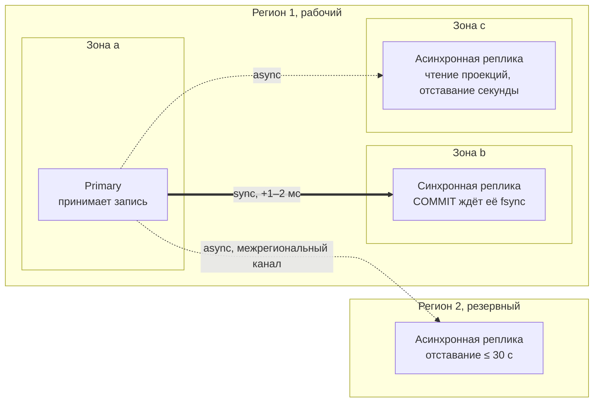

# ДЗ 5. Отказоустойчивость, observability и тестирование — решение

> Условие: [../Задание.md](../Задание.md)
> Шаблоны: [метрики](../Чек-лист%20метрик.md) · [алерты](../Шаблон%20описания%20алертов.md) ·
> [chaos-эксперименты](../Примеры%20Chaos-экспериментов.md). Схемы — в [diagrams/](diagrams/).

> Выполняется для системы, выбранной в ДЗ 2: платёжный сервис Xsolla Paystation.
> Архитектура и паттерны — [hw_02](../../hw_02/solution/README.md), хранилища и
> их топология — [hw_03](../../hw_03/solution/README.md), нагрузка и ресурсы —
> [hw_04](../../hw_04/solution/README.md).

## Что защищаем

Цель из ДЗ 2 §Масштаб: доступность приёма платежа ≥ 99.95 %, то есть **не
больше 22 минут недоступности в месяц**, и строгая консистентность по деньгам,
«баланс сходится всегда». Отсюда две рамки на весь документ. Всё, что на пути
платежа (Gateway, BFF, Orchestrator, Risk, Provider Gateway, Ledger), обязано
восстанавливаться за минуты и без участия человека. Всё, что хранит деньги
(Ledger, Orchestrator, Payout), обязано восстанавливаться без потери записей.
Остальное может лежать часами — так спроектирована деградация в ДЗ 2 §7, и
здесь она получает числа.

Бюджеты задержки из ДЗ 2, на которые опираются пороги ниже: витрина
p95 ≤ 300 мс, оплата p95 ≤ 1.5 с, Risk p99 ≤ 100 мс, Ledger p99 ≤ 50 мс,
вебхук мерчанту p95 ≤ 5 с, статус в виджет по SSE (Server-Sent Events) ≤ 1 с.

## Уточнения к ДЗ 2–4

Два места, где этот документ уточняет предыдущие. Как и в ДЗ 3, собраны
отдельно, чтобы читались как осознанные правки, а не как расхождения.

| Место | Как было | Как читать теперь |
|---|---|---|
| ДЗ 2 §7 и §4.2, деградация при отказе Redis | «Опрос `GET …/status` раз в 5 секунд» | Раз в 5–10 секунд со случайным разбросом. При 65 тыс. открытых сессий из ДЗ 4 ровный интервал в 5 с дал бы 13 тыс. RPS синхронной волной на Orchestrator; джиттер размазывает её до ~9 тыс. Подробнее §3, проверяется экспериментом №3 |
| ДЗ 4 §5, итог $27 900 в месяц | Без резервного региона | Бюджет ДЗ 4 это один регион. Тёплый резерв для DR из §4 добавляет $7–10 тыс. в месяц; в ДЗ 4 он не считался, потому что требование к RTO при потере региона появляется только здесь |

---

## Отказоустойчивость

### 1. RTO / RPO по сервисам

RTO (Recovery Time Objective) — за сколько сервис снова работает, RPO (Recovery
Point Objective) — сколько данных **допустимо** потерять. Числа даны для отказа
внутри региона (зона, инстанс, база); потеря региона — отдельный режим в §4.
RPO в таблице это требование, а не факт: фактически синхронная реплика из §2
даёт ноль для всех PostgreSQL. Запас у некритичных сервисов говорит, где при
переключении на асинхронную реплику в другой регион потеря приемлема сама по
себе, а где (RPO 0) требует сверки из §4.

| Сервис | RTO | RPO | Обоснование |
|---|---|---|---|
| Ledger | ≤ 1 мин | **0** | Единственный источник правды по деньгам. Потерянная проводка это деньги, списанные с карты и не существующие в книге (ДЗ 2 §Два решения в саге). RPO 0 даёт синхронная реплика, RTO минута — автоматический failover. Деградации нет по определению, ДЗ 2 §7 |
| Payment Orchestrator | ≤ 1 мин | **0** | Состояние саги: потеря шага означает платёж, застрявший между авторизацией и проводкой. `SAGA_STEP` и Outbox позволяют продолжить с прерванного шага, но только если они не потеряны |
| Payout | ≤ 4 ч | **0** | Выплаты идут батчами по расписанию (ДЗ 2 §5), четыре часа простоя никто не заметит. Но `bank_transfer` терять нельзя: потеря состояния «перевод отправлен» это двойная выплата |
| Wallet | ≤ 5 мин | ≤ 1 мин | Суммы и заморозки живут проводками в Ledger (ДЗ 2 §4.5), в Wallet только TTL и лимиты. Потерянная минута TTL означает заморозку, снятую на минуту позже. Пока лежит, оплата с баланса скрыта из витрины |
| Provider Gateway | ≤ 2 мин | ≤ 1 мин | Состояние платежа не хранит. Inbox вебхуков за потерянную минуту восполняется самим PSP (Payment Service Provider): провайдеры повторяют неподтверждённые вебхуки, а дедупликация по `provider_transaction_id` делает повтор безопасным |
| Risk & Fraud | ≤ 5 мин | правила 1 ч, счётчики — всё окно | Правила версионируются и восстанавливаются из истории. Счётчики скорости живут в Redis и теряются целиком: это принято в ДЗ 3 §6 как AP-выбор. Пока сервис лежит, включается «3DS (3-D Secure) всем» из ДЗ 2 §7 |
| Subscription | ≤ 1 ч | ≤ 5 мин | Списание, не случившееся в 10:00, случится в 11:00, планировщик идемпотентен по `schedule_id`. Пять минут расписания восстанавливаются из `current_period_end` подписок |
| Notification | ≤ 30 мин | ≤ 5 мин | События лежат в Kafka 7 суток и перечитываются с оффсета. Теряются только состояния попыток за окно: повторим лишний раз, мерчант дедуплицирует по `event_id` (ДЗ 2 §4.3) |
| Merchant Config | ≤ 15 мин | ≤ 1 ч | Меняется несколько раз в день, читается из кэша с TTL 15 мин (ДЗ 3 §4): пока лежит источник, потребители работают на кэше |
| Checkout BFF, API Gateway | ≤ 1 мин | нет данных | Без состояния, кроме открытых соединений. Браузер переподключает SSE сам и досылает пропущенное по `Last-Event-ID` |
| Kafka | ≤ 2 мин | **0** | `acks=all`, `min.insync.replicas=2`, фактор репликации 3 (ДЗ 3 §5). Событие подтверждено — значит, оно на двух брокерах в разных зонах |
| RabbitMQ | ≤ 10 мин | ≤ 10 мин | Отложенные повторы восстанавливаются из таблицы `delivery` в PostgreSQL: она источник, очередь только таймер |
| Redis | ≤ 5 мин | всё | Данные в Redis по построению восстановимы или необязательны (ДЗ 3 §4). SSE переходит на опрос `GET …/status`, кэши прогреваются, счётчики антифрода начинаются заново |
| ClickHouse, OpenSearch | ≤ 4 ч | ≤ 1 ч | Проекции, перестраиваются из Kafka и журнала Ledger. Отчёты с пометкой времени, приём платежей не затронут |

Сумма по критическому пути: любой одиночный отказ на пути платежа стоит не
больше минуты недоступности приёма. При бюджете 22 минуты в месяц это до
двадцати таких отказов — с большим запасом к реальной частоте failover.

### 2. Репликация критичных БД

Топология из ДЗ 3 §3 для каждого шарда Ledger и Orchestrator, теперь с
объяснением, почему именно такая:



| Решение | Почему |
|---|---|
| Синхронная реплика в другой зоне | Даёт RPO 0 при отказе primary или всей зоны. Цена — 1–2 мс на каждый `COMMIT` внутри региона, что укладывается в p99 ≤ 50 мс Ledger. Именно этот пункт в ДЗ 4 §6 отказались оптимизировать |
| Одна синхронная, а не две | Вторая синхронная реплика удвоила бы шанс, что запись остановится из-за отказа реплики, а не primary: при `synchronous_commit` primary ждёт всех синхронных. Кворум «любая одна из двух» решает это, но усложняет failover; при трёх зонах хватает одной |
| Асинхронная реплика для чтения | Снимает с primary чтение проекций и `GetBalance`, отставание секунды. Решения о деньгах туда не ходят: `GetSettledBalance` идёт только в primary (ДЗ 3 §6) |
| Failover автоматический, ≤ 60 с | Управляемая база (Multi-AZ из ДЗ 4) переключает на синхронную реплику по потере heartbeat. Приложение переподключается по DNS-имени. Ключи идемпотентности `PostTransaction` делают повтор запроса, зависшего в момент переключения, безопасным |
| Межрегиональная реплика асинхронная | Синхронная стоила бы 30–80 мс на каждый `COMMIT` и сломала бы бюджет Ledger в полтора раза. Поэтому при потере региона RPO не ноль, а секунды — и §4 описывает, чем этот разрыв закрывается |

Остальные хранилища:

| Хранилище | Репликация |
|---|---|
| Payout, Notification, Wallet, Subscription, Merchant Config, Provider Gateway, правила Risk | Primary + синхронная реплика в другой зоне (Multi-AZ). RPO 0 везде, где база небольшая: дешевле, чем разбираться, кому из них терять данные можно |
| Kafka | 6 брокеров по два в зоне, фактор репликации 3, `min.insync.replicas=2`: событие подтверждено, когда оно в двух зонах. В резервный регион зеркалируются `payment.events` и `ledger.entries` |
| Redis | Primary + реплика в другой зоне на каждый шард, без персистентности на диск: потеря принята, репликация нужна только чтобы не ронять SSE-слой при отказе одной зоны |
| ClickHouse | 2 реплики на шард в разных зонах, наполняются из Kafka независимо |
| Объектное хранилище | Межрегиональная репликация архивов и бэкапов включена: это самое дешёвое место хранить RPO |

### 3. Паттерны отказоустойчивости

Механизмы перечислены в ДЗ 2 §7; здесь у каждого появляются параметры и
объяснение, откуда они.

| Паттерн | Где | Параметры | Откуда параметры |
|---|---|---|---|
| **Timeout** | Orchestrator → Risk | 150 мс | Бюджет p99 100 мс плюс запас. Не ответил — «3DS всем» для этого платежа, ДЗ 2 §7 |
| | Orchestrator → Ledger | 250 мс, 3 попытки | p99 50 мс; повтор безопасен по `idempotency_key`. Три неудачи подряд — новые саги останавливаются **до** `PENDING`, деньги не двигались; дошедшие до `PENDING` ждут подъёма, как описано в ДЗ 2 §7 |
| | Provider Gateway → PSP | 15 с на Authorize, 30 с на Capture | Столько реально отвечают банки под нагрузкой. Дольше — считаем неизвестным исходом и уходим в сверку, а не в повтор |
| | Notification → мерчант | 5 с | Контракт ДЗ 2 §4.3: `2xx` за 5 секунд |
| | Gateway → BFF → Orchestrator, синхронный путь оплаты | 1.5 с сквозной | Бюджет p95 оплаты. Каждый следующий прыжок получает остаток бюджета, а не свой независимый таймаут: иначе сумма таймаутов вдвое превышает обещанное игроку |
| **Retry** | Ledger, Kafka produce, вызовы банка при выплатах | Экспоненциальный backoff с джиттером: 50, 100, 200 мс; не больше 3 | Только для идемпотентных операций. Джиттер, чтобы 460 клиентов Ledger не повторили одновременно в одну и ту же миллисекунду после failover |
| | Вебхуки мерчанту | 1 мин, 5 мин, 30 мин, 2 ч, 6 ч, 24 ч | ДЗ 2 §4.3, через RabbitMQ |
| | PSP Authorize | **без повтора** после получения любого ответа; повтор только при сетевой ошибке до ответа, с тем же ключом идемпотентности провайдера | Второй Authorize это вторая заморозка на карте игрока. Неизвестный исход разбирает сверка авторизаций из ДЗ 2 §Два решения в саге |
| **Retry budget** | Все клиенты | Не больше 10 % дополнительных запросов к сервису за минуту | Защита от retry storm: когда Ledger деградировал, три попытки на каждый из 460 запросов в секунду превратили бы 460 TPS в 1 400 и добили бы его |
| **Circuit Breaker** | Provider Gateway, по каждому PSP отдельно | Открывается при ≥ 50 % ошибок или таймаутов за 20 с при ≥ 20 вызовах; полуоткрыт через 30 с, пробный вызов 1 из 10 | Разомкнутый breaker сразу отправляет платёж в каскад на резервный PSP (только до 3DS, ДЗ 2 §7), не тратя 15 с ожидания игрока. Состояние общее для всех инстансов через Redis, ДЗ 3 §4 |
| | Клиенты Risk | Открывается при 30 % таймаутов за 10 с | Размыкание переводит в «3DS всем» до восстановления, а не на каждый платёж |
| **Bulkhead** | Пулы соединений к PSP | Отдельный пул на провайдера, по 50 соединений | Один зависший банк выедает свой пул и только свой. При 350 вызовах/с и 15 с таймауте без изоляции общий пул исчерпался бы за секунды |
| | Notification, по мерчанту | Не больше 10 одновременных доставок на мерчанта | Один лежащий мерчант с 5-секундным таймаутом не должен занять все 2.5 тыс. слотов доставки, посчитанных в ДЗ 4 |
| | Пулы к PostgreSQL | Отдельный пул на шард, размер ≤ 2 × vCPU базы | Пул больше числа ядер не ускоряет, а удлиняет очередь блокировок на горячих счетах |
| **Rate Limiter** | API Gateway | По ключу мерчанта на создание платежей и отдельно на `GET /payments`; по IP и сессии на `checkout` | ДЗ 2 §7 и §4.1. Защита от card testing и от мерчанта, опрашивающего все платежи подряд |
| **Load shedding** | API Gateway | При насыщении сначала отбрасываются отчёты и `GET`, потом витрина, оплата и вебхуки PSP — последними | Оплата это деньги, витрина это конверсия, отчёт подождёт. Приоритет задан явно, а не «кто первый пришёл» |
| **Идемпотентность** | Везде, таблица в ДЗ 2 §6 | — | Предпосылка для всех повторов выше: без неё retry это двойное списание |
| **Деградация** | По компонентам, ДЗ 2 §7 | Опрос `GET …/status` каждые 5–10 с с джиттером при отказе Redis | Джиттер добавлен здесь: 65 тыс. сессий из ДЗ 4, опрашивающих ровно раз в 5 с, это 13 тыс. RPS синхронной волной на Orchestrator. С разбросом 5–10 с волна размазывается до ~9 тыс. RPS, и это точечные чтения по ключу, 2 тыс. на шард — проверяется экспериментом №3 |

### 4. План DR: потеря региона

DR (Disaster Recovery) — режим, когда недоступен весь рабочий регион: все три
зоны, база и сеть. Схема **active-passive с тёплым резервом**: во втором
регионе постоянно живут реплики данных и минимальный кластер, трафика там нет.

| Вопрос | Ответ |
|---|---|
| Почему не active-active | Active-active для Ledger требует синхронной записи между регионами, это 30–80 мс на проводку против бюджета 50 мс. Либо два независимых Ledger с распределённой сверкой — вторая книга это ровно то двоевластие, от которого ушли в ДЗ 2 §1 |
| Что реплицируется постоянно | PostgreSQL всех сервисов — асинхронно, отставание секунды. Kafka: `payment.events` и `ledger.entries` зеркалом. Объектное хранилище — межрегиональная репликация. Redis, ClickHouse, OpenSearch не реплицируются: перестраиваются |
| Что живёт в резерве | Кластер на 6 узлов вместо 18 с включённым автомасштабированием, реплики баз в размере primary, зеркало Kafka. Стоимость $7–10 тыс. в месяц, +25–35 % к бюджету ДЗ 4: реплики 19 баз, зеркало Kafka, 6 узлов, межрегиональный трафик. Это цена RTO 30 минут против дней на пересборку с нуля |
| Цели | **RTO 30 мин, RPO ≤ 30 с** для денег; проекции догоняют часами |
| Кто решает | Человек. Переключение региона для платёжной системы не автоматизируется: ложное срабатывание на сетевом разрыве между регионами даст два primary и двойные проводки. Автоматика внутри региона, руки между регионами |

Последовательность:

| Шаг | Время | Что происходит |
|---|---|---|
| Обнаружение | 0–3 мин | Синтетические платежи из трёх внешних точек не проходят, алерт №1 из §6, контрольная плоскость региона недоступна. Одного сигнала недостаточно, нужны все три |
| Решение | 3–8 мин | Дежурный инженер и дежурный руководитель платежей подтверждают переключение. Проверяют, что старый регион **не пишет**: отключаются учётные данные приложений к старым базам, закрывается сетевой доступ. Fencing раньше promote, иначе split-brain |
| Данные | 8–15 мин | Реплики PostgreSQL повышаются до primary, шард за шардом по списку. Зеркало Kafka становится основным кластером, потребители стартуют с зеркалированных оффсетов |
| Трафик | 15–20 мин | DNS с TTL 60 с переводится на резервный регион. Адреса вебхуков у PSP глобальные, за anycast, и указывают на активный регион — менять их у сотен провайдеров руками невозможно |
| Мощность | 15–25 мин | Автомасштабирование поднимает кластер с 6 до 18 узлов; пока он растёт, Gateway отбрасывает отчёты и витрину по правилу load shedding |
| Проверка | 25–30 мин | Синтетический платёж проходит до вебхука. Запускается сверка (ниже) |

Чем закрывается разрыв в 30 секунд RPO. За это время до потери региона успело
случиться ~2 тыс. транзакций в среднем и до 7 тыс. на пике ×4 (ДЗ 4 §1), часть
из них дошла до PSP, но не дошла до реплики.

| Что могло потеряться | Чем восстанавливается |
|---|---|
| Авторизация у PSP есть, `PENDING` в реплику не доехал | Сверка авторизаций с PSP из ДЗ 2 §Два решения в саге: неизвестные нам авторизации гасятся `Void`. Запускается сразу после переключения, а не раз в час |
| `PENDING` есть, `Capture` неизвестен | Запрос статуса у PSP по `provider_transaction_id`; по ответу либо `SETTLED`, либо `REVERSED` |
| Событие в Outbox есть, в Kafka не опубликовано | Relay публикует после старта, дубли гасятся по `event_id` у потребителей |
| Вебхук ушёл мерчанту, отметка о доставке потерялась | Уйдёт второй раз, мерчант дедуплицирует по `event_id`, `sequence` защищает от устаревшего |
| Платёж целиком не доехал до реплики, а игрок уже подтвердил его в банке | У нас платежа нет, у PSP авторизация есть: сверка из первой строки гасит её `Void`, деньги возвращаются игроку, мерчант видит неоплаченный заказ. Это и есть реальная цена RPO 30 с: не потерянные деньги, а до нескольких тысяч игроков, которым придётся заплатить второй раз. Повтор создания мерчантом дубля не даёт: `external_id` уникален в пределах мерчанта (ДЗ 3 §1.1), повтор вернёт существующий платёж |

Возврат в основной регион — той же процедурой в обратную сторону, в плановое
окно, после того как репликация из резервного в основной догнала. Учения DR
проводятся дважды в год на полном переключении реального трафика: план,
который не исполняли, не план.

---

## Observability

### 5. Ключевые метрики

RED (Rate, Errors, Duration) для сервисов, USE (Utilization, Saturation,
Errors) для ресурсов под ними, плюс бизнес-метрики. Отбор по вопросу из
чек-листа: «если метрика выйдет за порог, что я сделаю». Латентность везде в
перцентилях, ошибки разделены на клиентские, серверные и таймауты.

| # | Сервис / ресурс | Метод | Метрика | Как меряем | Что покажет и что сделаем |
|---|---|---|---|---|---|
| 1 | Бизнес | — | **Успешных платежей в минуту** против прогноза по дню недели и часу | Счётчик `payment.succeeded` из Kafka, прогноз по 4 неделям | Единственная метрика, которая видит «всё сломалось» независимо от причины. Алерт №1 |
| 2 | Бизнес | — | Конверсия «открытие витрины → `succeeded`» по способу оплаты и стране | Отношение счётчиков за 15 мин | Падение по одному способу при нормальной общей — проблема PSP или каскада, а не системы |
| 3 | Бизнес | — | Доля отказов по коду: `declined` PSP, `deny` антифрода, таймаут | Гистограмма причин `payment.failed` | Рост `deny` при включённом «3DS всем» — ожидаемо; рост таймаутов — нет |
| 4 | Ledger, контроль | — | **Сумма транзитных счетов старше 1 ч** и заморозок старше TTL | Запрос в ClickHouse каждые 10 мин | Бесплатный инструмент контроля из ДЗ 2 §4.4: ненулевое значение это зависшие между шагами платежи. Алерт №7 |
| 5 | API Gateway | RED | Rate по эндпоинтам, доля `5xx` и таймаутов, p95/p99 | Гистограммы по маршруту | Симптом для игрока и мерчанта. Сравнение с ДЗ 4: 120 RPS оплаты на пике — норма, 300 — начало ×10 |
| 6 | Checkout BFF | RED + USE | p95 витрины против 300 мс; **открытых SSE-соединений на под** | Гистограмма; gauge | Витрина медленнее 300 мс это конверсия. Соединений больше 20 тыс. на под — насыщение, пора масштабировать раньше CPU |
| 7 | Orchestrator | RED | Длительность саги от `Pay` до `succeeded`, p95 против 1.5 с; число саг в каждом состоянии | Гистограмма; gauge по `state` | Рост «застрявших в `authorize`» показывает проблему PSP до того, как игрок пожалуется |
| 8 | Ledger | RED | **p99 `PostTransaction` против 50 мс**, доля `FAILED_PRECONDITION` и `INVALID_ARGUMENT` | Гистограмма по методу | Главный бюджет системы. `INVALID_ARGUMENT` в проде это баг клиента Ledger, каждый — инцидент |
| 9 | Ledger, PostgreSQL | USE | Время ожидания блокировок на горячих счетах, p99 | `pg_stat` по шардам | Причина для симптома №8. Растёт у одного шарда — крупный мерчант перерос его, ДЗ 3 §3.1 |
| 10 | PostgreSQL, все шарды | USE | **Lag синхронной и асинхронной реплики**; занятость пула соединений | Секунды отставания; % занятых | Lag синхронной > 0 значит `COMMIT` ждёт и p99 плывёт. Асинхронная > 30 с — нарушен RPO для DR. Алерт №6 |
| 11 | PostgreSQL | USE | Свободное место и IOPS (Input/Output Operations Per Second) к лимиту диска | % от провизии | Место кончается предсказуемо по ДЗ 4 §2, IOPS — внезапно на пике |
| 12 | Risk & Fraud | RED | p99 `Assess` против 100 мс, доля таймаутов; доля решений `require_3ds` | Гистограмма | Таймауты выше 1 % — сработал breaker и все пошли в 3DS: конверсия падает, но это ожидаемая деградация |
| 13 | Provider Gateway | RED | По каждому PSP: доля ошибок и таймаутов, p95, **состояние Circuit Breaker** | Гистограммы с меткой провайдера; gauge открыт/закрыт | Открытый breaker при отсутствии резервного PSP для страны — платежи в этой стране не проходят. Алерт №5 |
| 14 | Provider Gateway | USE | Занятость пула соединений по PSP | % от 50 | Насыщение одного пула при здоровых остальных подтверждает, что bulkhead работает |
| 15 | Kafka | USE | **Lag потребителей по группам**, в первую очередь группа BFF на `payment.status`; under-replicated partitions | Секунды и сообщения; счётчик | Lag группы BFF > 1 с ломает бюджет SSE. Under-replicated > 0 значит следующий отказ брокера остановит публикацию. Алерт №4 |
| 16 | Notification | RED | Доля вебхуков, доставленных с первой попытки; **p95 от `succeeded` до `2xx` мерчанта** против 5 с; глубина DLQ (Dead-Letter Queue) по мерчантам | Гистограмма; gauge | Падение доли первой попытки по всем мерчантам — наша проблема; по одному — его. Алерт №3 |
| 17 | RabbitMQ | USE | Сообщений в очередях задержки по ступеням | Gauge по `x-delay` | Рост на ступени 24 ч это мерчанты, которые лежат сутки. Кабинет и поддержка узнают до DLQ |
| 18 | Redis | USE | Занятость памяти, вытеснения в секунду, число каналов Pub/Sub | Gauge | Вытеснения на кластере SSE и счётчиков должны быть нулём по ДЗ 3 §4; ненулевые — неправильно разведены ключи |
| 19 | Kubernetes | USE | CPU throttling подов, рестарты по OOM (Out Of Memory), время выкладки нового пода | Счётчики | Throttling на Orchestrator при свободных узлах — заниженные лимиты, не нехватка железа |
| 20 | Синтетика | — | Синтетический платёж каждые 30 с из трёх внешних точек до вебхука включительно | Внешний прогон | Единственная метрика, которая работает, когда сломано всё остальное, включая сбор метрик. Первый сигнал в DR |

Wallet, Subscription и Payout отдельных строк не получили намеренно: они не на
пути платежа, а их отказы видны через метрики 3 (отказы по коду), 4 (зависшие
заморозки) и инварианты книги. Отдельная метрика есть у Payout в сверке с
банковской выпиской, но это отчёт раз в сутки, а не сигнал дежурному.

### 6. Алерты

Принцип: на симптомы, SLO-based (Service Level Objective), каждый алерт равен
действию. Семь алертов, из них четыре будят ночью.

| # | Алерт | Порог | Severity | Симптом | Реакция дежурного в первые 5 минут |
|---|---|---|---|---|---|
| 1 | **Платежи не проходят** | Успешных платежей в минуту < 70 % от прогноза 5 минут подряд, **или** синтетический платёж не прошёл из ≥ 2 точек подряд | critical | Игроки не могут заплатить, мерчанты теряют деньги | Открыть панель по шагам саги (метрика 7): где копятся. Если везде — Gateway или сеть; если в `authorize` — PSP, смотреть №5; если в `post_pending` — Ledger, смотреть №2. Проверить последний деплой, откатить при совпадении по времени |
| 2 | **Ledger не укладывается в бюджет** | p99 `PostTransaction` > 50 мс 5 мин, или > 200 мс 1 мин, или доля ошибок > 0.1 % | critical | Каждый платёж медленнее, при 200 мс проводка подходит к таймауту 250 мс из §3 и сага начинает повторять | Метрика 9 и 10 по шардам: один шард или все. Один — горячий счёт или его диск, смотреть блокировки; все — реплика отстаёт и `COMMIT` ждёт, проверить сеть между зонами. Не рестартовать primary: failover сам решит, если это он |
| 3 | **Вебхуки не доходят** | p95 доставки > 5 с 10 мин, или доля первой попытки < 95 % по ≥ 20 % мерчантов | warning, critical при < 80 % | Игры выдают товар с задержкой, мерчанты пишут в поддержку | Если по всем мерчантам — Notification или NAT (Network Address Translation), проверить его пулы и исходящую сеть. Если по одному — уведомить его через кабинет, в DLQ ничего не трогать |
| 4 | **Статус до виджета не доезжает** | Lag группы BFF на `payment.status` > 2 с 3 мин | warning | Игрок после 3DS смотрит на колесо, хотя платёж прошёл | Проверить число инстансов BFF и ребаланс группы после деплоя; при отказе Redis убедиться, что виджеты перешли на опрос (RPS `GET …/status` растёт) |
| 5 | **PSP выпал без замены** | Circuit Breaker открыт > 5 мин **и** для его способа оплаты и страны нет резервного PSP | critical | Платежи по способу или стране не проходят: каскаду некуда идти | Проверить статус-страницу провайдера; если у него инцидент — временно скрыть способ из витрины через Merchant Config, чтобы игроки видели альтернативы, а не ошибку. Открытый breaker при наличии резерва — только запись в журнал |
| 6 | **Нарушен RPO** | Lag синхронной реплики > 0 дольше 1 мин, или асинхронной межрегиональной > 30 с 5 мин | critical для синхронной, warning для DR | Прямых симптомов у пользователя нет, но следующий отказ станет потерей данных | Синхронная: проверить реплику и сеть зоны, при её отказе база сама переключит `COMMIT` в ожидание — решить, переводить ли на асинхронный режим осознанно. Межрегиональная: проверить канал, эскалировать до починки, DR в этот момент недоступен |
| 7 | **Деньги зависли между шагами** | Сумма транзитных счетов старше 1 ч > 0, или заморозок старше TTL > 100 | warning, утром | Игроки с замороженными и не списанными деньгами; расхождение в сверке | Выгрузить `reference_id` зависших, запустить сверку с PSP вручную: по каждому либо `Capture`, либо `Void` с `REVERSED`. Один-два в час — норма, сотни — проблема шага саги |

Что осознанно **не** алертит: CPU, память, число подов — это причины, и они
видны на панели, когда сработал симптом. Единственное исключение — место на
диске PostgreSQL < 20 %: это симптом будущего отказа, на который нельзя
отреагировать за минуту.

### 7. Логи и трейсы

| Аспект | Решение |
|---|---|
| Формат | Структурированные записи с обязательными полями `payment_id`, `merchant_id`, `trace_id`, сервис, шаг саги. По `payment_id` собирается вся история платежа через восемь сервисов одним запросом — это ответ на вопрос поддержки «где сейчас платёж» из ДЗ 2 §6 |
| Что логируем | Каждый переход состояния саги с причиной; каждый вызов PSP с его идентификатором запроса, кодом ответа и длительностью; решение Risk с версией правила и сработавшими правилами; каждую попытку доставки вебхука с кодом ответа мерчанта; каждое переключение Circuit Breaker |
| Что **не** логируем | Номер карты никогда: он и так не проходит через наши сервисы (ДЗ 2 §4.2), но запрет распространяется на тела вебхуков PSP, которые могут его содержать — маскируются до записи. Тела запросов мерчанта с персональными данными — только хэш `email` и страна. Секреты подписи и ключи API — маскируются на уровне библиотеки логирования |
| Объём | ~30 записей на транзакцию × 300 байт × 5 млн = ~45 ГБ в сутки. Горячее хранение 30 суток, холодное 1 год для разбора чарджбеков. Это статья «мониторинг» в ДЗ 4 §5 |
| Трейсы | OpenTelemetry, один трейс на платёж от Gateway до `SETTLED`. Контекст трейса едет в заголовках gRPC и в заголовках сообщений Kafka, поэтому вебхук мерчанту и SSE-событие привязаны к трейсу платежа как асинхронные продолжения, а не отдельные трейсы |
| Выборка | 100 % трейсов с ошибкой или длительностью выше бюджета, 5 % остальных. Полная выборка на 5 млн платежей это ~50 млн спанов в сутки, ради которых нечего смотреть: медианный платёж не интересен |
| Аудит | Ledger сам себе аудит: append-only, ДЗ 3 §1.2. Отдельно и без выборки логируется доступ сотрудников к платежам и персональным данным через кабинет поддержки |

---

## Тестирование

### 8. План нагрузочного тестирования

Цель: подтвердить, что сайзинг из ДЗ 4 держит пик ×4 в бюджетах ДЗ 2 и
переживает ×10 деградацией, а не отказом. Среда — отдельный контур в полном
размере ДЗ 4, поднимается на время теста и гасится: постоянно держать второй
продакшен ради квартального прогона дорого. PSP заменены заглушками с
настраиваемой задержкой и долей отказов, мерчант — заглушкой-приёмником
вебхуков. Данные синтетические: 10 млн активных игроков из условия ДЗ 4 и 2 тыс.
мерчантов из ДЗ 2.

| # | Сценарий | Профиль | Что проверяем | Критерий успеха |
|---|---|---|---|---|
| 1 | **Базовый** | ×1 из ДЗ 4: 58 TPS транзакций, 90 RPS витрины, 16 тыс. SSE, 1 ч | Калибровка: система в норме соответствует расчёту | Все бюджеты ДЗ 2 выполнены, CPU узлов < 40 %, ни один пул не занят более чем на 30 % |
| 2 | **Пик ×4** | 230 TPS, 360 RPS витрины, 65 тыс. SSE, PSP отвечают 800 мс, 2 ч | Расчётный режим ДЗ 4 без автомасштабирования, на 18 узлах | Витрина p95 ≤ 300 мс, оплата p95 ≤ 1.5 с, Ledger p99 ≤ 50 мс, вебхук p95 ≤ 5 с, SSE ≤ 1 с; ошибок < 0.05 %; lag групп Kafka не растёт; CPU < 70 % |
| 3 | **Всплеск ×10** | С ×1 до ×10 за 2 минуты, 15 минут на плато: 580 TPS, 160 тыс. SSE | Релиз игры из ДЗ 2. Автомасштабирование и load shedding | Автомасштаб доводит кластер до нужного за ≤ 3 мин; во время роста оплата и вебхуки PSP не отбрасываются, отчёты и витрина — допустимо; после плато все бюджеты восстановлены; ошибок оплаты < 0.5 % за всё окно |
| 4 | **Выдержка** | ×2, 24 часа | Утечки, рост таблиц, фрагментация, снимки Ledger | Латентность в конце не хуже начала более чем на 10 %; память подов стабильна; партиции Notification отцепляются по расписанию; после теста сумма транзитных счетов равна нулю |
| 5 | **Медленный PSP** | ×4, один из трёх PSP-заглушек отвечает 12 с, потом 50 % ошибок | Timeout, bulkhead и Circuit Breaker из §3 | Пулы остальных PSP не затронуты; breaker открывается за ≤ 20 с; каскад уводит платежи до 3DS на резервный; p95 оплаты по остальным способам не меняется |
| 6 | **Первое число месяца** | 3 млн списаний по подпискам на одну дату, вдвое больше обычного дня | Планировщик размазывает пик (ДЗ 2 §5) | Списания растянуты на сутки с потолком 35 TPS из ДЗ 4 (3 млн / 35 = 24 ч); ни одного дубля по `schedule_id`; dunning стартует по расписанию |
| 7 | **Шторм переподключений SSE** | 65 тыс. соединений рвутся и переподключаются за 30 с, как при рестарте балансировщика | Досылка по `Last-Event-ID`, кольцевой буфер Redis | Все клиенты получают пропущенные события, ни одного дубля статуса; BFF не превышает 20 тыс. соединений на под |

После каждого прогона — проверка инвариантов, а не только латентности: сумма
всех записей Ledger по валютам равна нулю, транзитные счета пусты, число
`succeeded` равно числу вебхуков, дошедших до заглушки мерчанта. Тест, где
латентность в бюджете, а книга не сходится, — провален.

### 9. Chaos Engineering

Три эксперимента бьют по трём разным механизмам: failover базы, Circuit
Breaker с каскадом, деградация SSE-слоя. Все три сначала в тестовом контуре
на нагрузке ×1, потом в продакшене в дневное окно с малым blast radius.

```
Эксперимент №1: потеря primary шарда Ledger
Steady state:    успешных платежей/мин в норме прогноза; p99 PostTransaction ≤ 50 мс;
                 сумма транзитных счетов = 0
Гипотеза:        primary одного шарда исчезает — за ≤ 60 с запись переезжает на
                 синхронную реплику, ни одна проводка не потеряна и не задвоена, потому что
                 RPO 0 у синхронной реплики и повторы идемпотентны по idempotency_key
Blast radius:    один шард из восьми, 1/8 мерчантов, в продакшене — дневное окно,
                 предварительно на тестовом контуре
Метод:           принудительный останов инстанса primary средствами облака, без graceful
Наблюдаем:       метрики 8, 10, 4 и 1; алерты №2 и №6 должны сработать и закрыться сами
Rollback:        если через 90 с запись не восстановилась — ручное повышение реплики;
                 если алерт №1 сработал — немедленно
Ожидаемый вывод: реальный RTO failover и что делают клиенты Ledger в момент переключения:
                 отдают ли ошибку игроку или тихо повторяют. Второе проверяет retry budget
```

```
Эксперимент №2: деградация PSP
Steady state:    конверсия по картам в норме; p95 оплаты ≤ 1.5 с; breaker закрыт
Гипотеза:        основной карточный PSP начинает отвечать за 12 с — breaker разомкнётся
                 за ≤ 20 с, платежи до 3DS уйдут каскадом на резервный эквайер, пулы к
                 другим PSP не пострадают, конверсия просядет не больше чем на 5 %
Blast radius:    один PSP, 10 % его трафика через флаг маршрутизации в Provider Gateway;
                 расширение до 100 % только при подтверждении гипотезы на 10 %
Метод:           инъекция задержки в адаптер провайдера на egress-прокси, потом 50 % ошибок
Наблюдаем:       метрики 13, 14, 2 и 7; алерт №5 не должен сработать — резерв есть
Rollback:        конверсия по картам упала более чем на 10 %, или открылся breaker
                 другого PSP, или сработал алерт №1 — снять инъекцию
Ожидаемый вывод: настроен ли breaker под реальную задержку банков, не разомкнётся ли он
                 от штатных 3 с; сколько игроков уходит на втором 3DS при каскаде после
                 подтверждения — это подтверждает или опровергает правило «каскад только
                 до 3DS» из ДЗ 2
```

```
Эксперимент №3: отказ Redis SSE-слоя
Steady state:    статус доезжает до виджета ≤ 1 с; RPS GET …/status ≈ 27 из ДЗ 4
Гипотеза:        кластер Redis под Pub/Sub и буферами исчезает — виджеты за ≤ 10 с
                 переходят на опрос GET …/status, ни один платёж не падает, Orchestrator
                 держит волну опроса благодаря джиттеру 5–10 с и точечным чтениям по ключу
Blast radius:    тестовый контур при 65 тыс. SSE из сценария 2; в продакшене — одна зона
                 кластера Redis, то есть треть шардов
Метод:           остановить все узлы кластера Redis SSE; остальные кластеры Redis не трогать
Наблюдаем:       метрики 6, 15, 5 (RPS status) и 8 — Ledger не должен заметить ничего;
                 алерт №4 должен сработать
Rollback:        доля ошибок оплаты > 0.1 %, или p99 чтения статуса у Orchestrator > 200 мс
Ожидаемый вывод: реальный RPS опроса при 65 тыс. сессий — расчёт §3 даёт ~9 тыс., и это
                 главная неизвестная: если выйдет больше, опрос надо ограничивать на
                 Gateway или отдавать статус из кэша BFF
```

Раз в полгода — учения потери зоны на продакшене: отключение одной зоны
целиком проверяет все три механизма сразу и является репетицией DR из §4.

---

## Безопасность

### 10. Аутентификация и авторизация

| Кто | Аутентификация | Авторизация |
|---|---|---|
| Бэкенд мерчанта | Ключ API в `Authorization: Bearer`, хранится у нас только хэшем; опционально список разрешённых IP. Ключи ротируются из кабинета без простоя: новый ключ работает параллельно старому 24 ч | Область действия ключа: создание платежей, чтение платежей, рефанды — отдельно. Ключ для создания платежей не может сделать рефанд, компрометация витринного ключа не даёт вывести деньги |
| Вебхуки мерчанту | Подпись HMAC-SHA256 на секрете мерчанта, ДЗ 2 §4.3; в заголовке — метка времени, окно 5 мин против повтора перехваченного вебхука | — |
| Виджет | Токен из `checkout_url`: подписанный JWT (JSON Web Token) с `payment_id`, `merchant_id` и сроком действия, равным `expires_at` платежа. Права ровно на одну сессию одного платежа, `POST …/pay` одноразовый по `sequence` | Токен не даёт ничего, кроме этого платежа: утечка ссылки даёт увидеть витрину и сумму, но не чужие платежи и не персональные данные |
| PSP → Provider Gateway | Подпись вебхука по правилам провайдера плюс список исходящих IP провайдера | Принимаются только для известных `provider_transaction_id`: чужой вебхук отбрасывается до разбора |
| Сервис → сервис | mTLS (mutual TLS) через service mesh, каждый сервис со своей идентичностью | Матрица вызовов: `Ledger.PostTransaction` разрешён Orchestrator, Wallet и Payout (у каждого свои типы проводок: Payout только `PAYOUT`), `GetSettledBalance` — им же, `PostTransactionChecked` — только Wallet. Тот же принцип, что у двух методов баланса в ДЗ 2 §4.4: нельзя случайно, можно только осознанно |
| Сотрудники | SSO (Single Sign-On) с MFA (Multi-Factor Authentication) | RBAC (Role-Based Access Control): поддержка видит платежи без персональных данных, финансы видят Ledger, рефанд выше лимита требует двух подтверждений. Каждый просмотр логируется без выборки, §7 |

### 11. Что шифруем

| Данные | Как | Почему так |
|---|---|---|
| Номер карты | **Не храним и не видим.** Вводится в поле провайдера и уходит к нему из браузера, к нам приходит токен, ДЗ 2 §4.2 | Единственный способ держать в зоне PCI DSS (Payment Card Industry Data Security Standard) только Provider Gateway |
| Весь трафик снаружи | TLS 1.2+, HSTS (HTTP Strict Transport Security) на виджете и API | Обязательный минимум для платёжного API |
| Весь трафик внутри | mTLS между сервисами, TLS к базам, Kafka и Redis | Внутренняя сеть не считается доверенной: один скомпрометированный под не должен читать проводки с провода |
| Диски и бэкапы | Шифрование на уровне хранилища ключами из KMS (Key Management Service), включая снимки и межрегиональные реплики | Дёшево, прозрачно, закрывает физический доступ и утечку снимка |
| Персональные данные игрока: email, IP | Шифрование на уровне поля отдельным ключом на мерчанта; в логах и в OpenSearch — только HMAC от email, по нему работает точный поиск для поддержки из ДЗ 3 §2. Страна не шифруется: она нужна витрине и отчётам в открытом виде | Утечка базы не раскрывает email; отзыв ключа мерчанта делает его данные нечитаемыми при расторжении договора — это удаление по требованию без физического удаления проводок |
| Секреты подписи вебхуков, ключи API, учётные данные к PSP | Хранилище секретов, выдача подам по идентичности mesh, ротация без перезапуска. Ключи API мерчантов — только хэш | Секрет, лежащий в переменной окружения или репозитории, это секрет, который уже утёк |
| Документы KYC (Know Your Customer) | Объектное хранилище с шифрованием и отдельной политикой доступа только для Payout и комплаенса | Сканы паспортов не должны быть доступны тем же ролям, что и платежи |
| Проводки Ledger | Не шифруются на уровне поля: суммы и идентификаторы счетов не персональные данные, а поиск и агрегация по зашифрованным полям невозможны | Защита Ledger — append-only и матрица доступа, а не шифрование содержимого |
