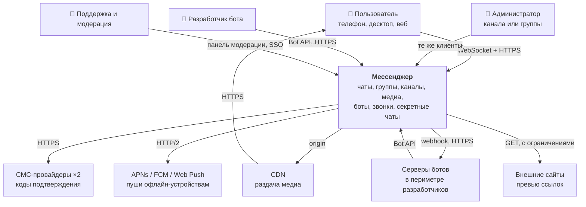
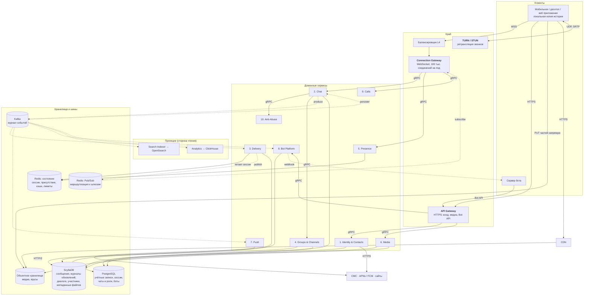
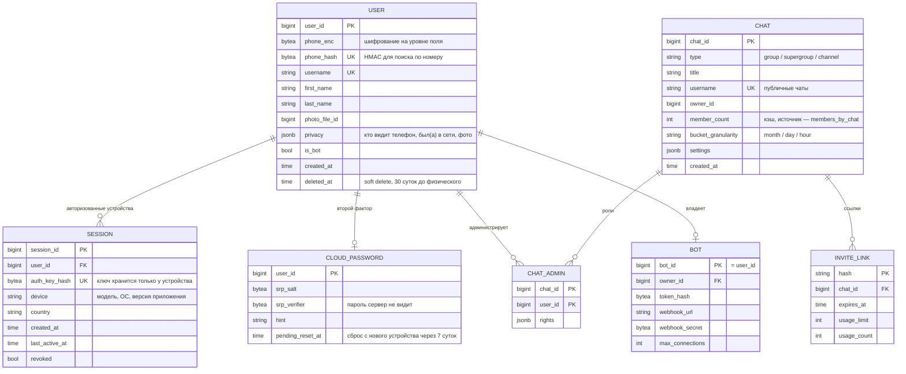
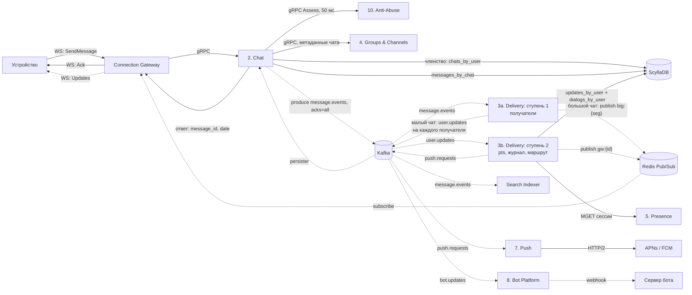
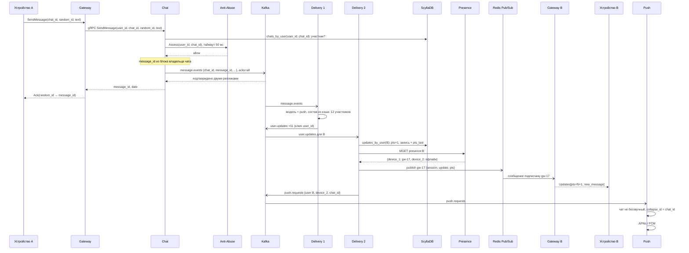
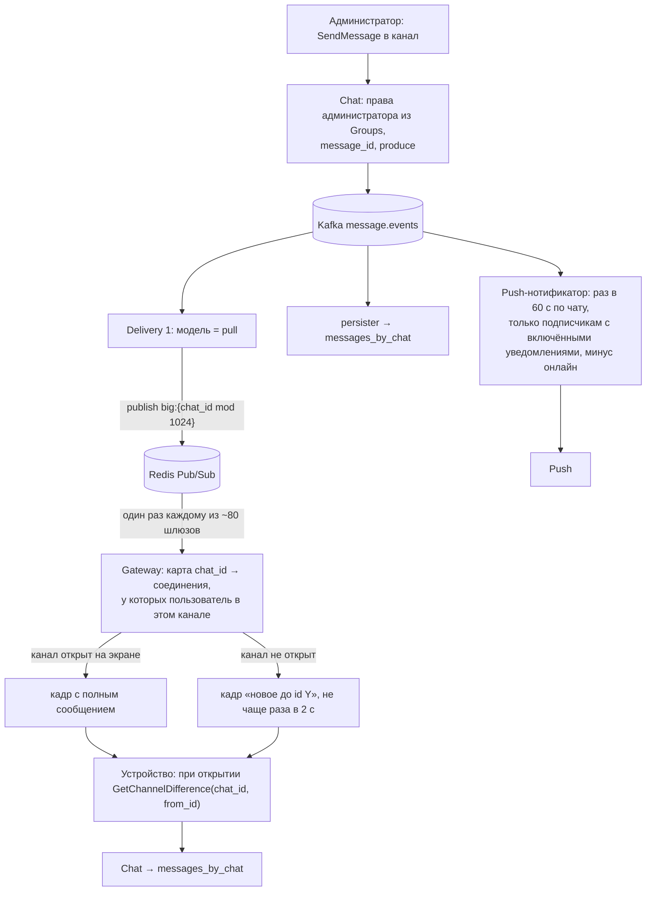
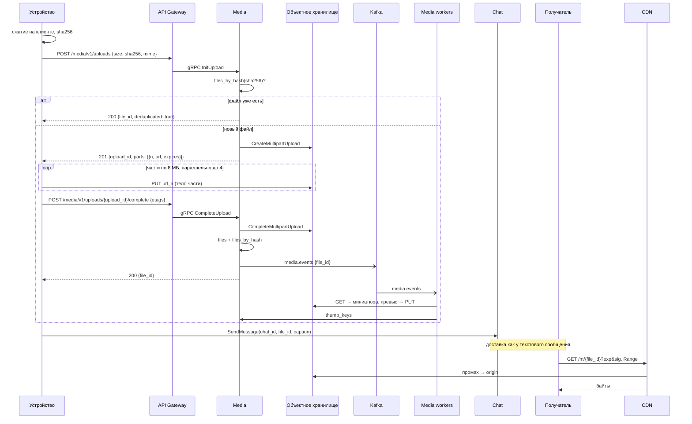
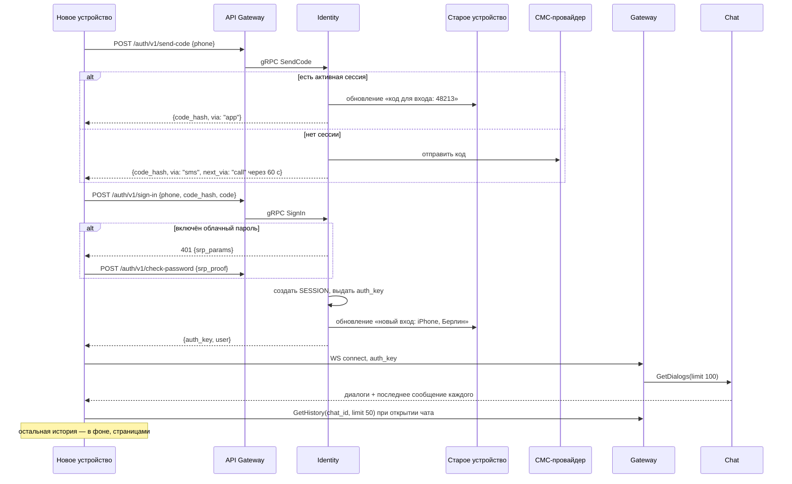
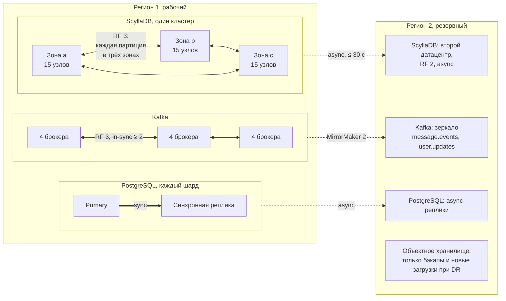

# ДЗ 6. Проектная работа — решение

> Условие: [../Задание.md](../Задание.md). Схемы — mermaid прямо в тексте; те же
> схемы в PNG и SVG лежат в [diagrams/](diagrams/). Презентация — [presentation.html](presentation.html).

> Новая система, **отличная** от выбранной в ДЗ 2–5.

## Выбранная тема

Мессенджер с групповыми чатами, аналог Telegram: личные и групповые чаты,
супергруппы до 200 тыс. участников, каналы-трансляции с миллионами
подписчиков, медиа до 2 ГБ, боты, голосовые и видеозвонки один на один,
секретные чаты со сквозным шифрованием. История облачных чатов хранится на
сервере без срока и доступна с любого устройства пользователя.

Референсом служит публично наблюдаемое поведение Telegram: облачная история,
мультиустройство, последовательные номера сообщений в чате, модель
обновлений с номером состояния, Bot API. Внутреннее устройство Telegram не
воспроизводится и неизвестно; все решения ниже принимаются заново и
обосновываются расчётом.

### Термины

| Термин | Расшифровка |
|---|---|
| DAU / MAU | Daily / Monthly Active Users: уникальные пользователи за сутки и за месяц |
| Чат | Общее имя для диалога, группы, супергруппы и канала. У каждого чата свой `chat_id` и своя лента сообщений |
| Диалог | Личный чат двух пользователей |
| Группа | Чат до 200 участников, все равны, историю видят только участники |
| Супергруппа | Чат до 200 тыс. участников с ролями администраторов |
| Канал | Трансляция: пишут администраторы, читают подписчики, число подписчиков не ограничено |
| Малый чат / большой чат | Техническое деление: малый — диалог или группа до 200 участников, большой — супергруппа или канал. По нему выбирается модель доставки, см. [ADR-1](#adr-1-гибридная-модель-доставки-push-для-малых-чатов-pull-для-больших) |
| `message_id` | Номер сообщения, монотонно растёт внутри чата. Задаёт порядок сообщений |
| `pts` | Points: порядковый номер состояния пользователя, +1 на каждое изменение, которое должны увидеть все его устройства. Задаёт порядок обновлений, см. [ADR-2](#adr-2-синхронизация-устройств-через-журнал-обновлений-с-pts) |
| Обновление (update) | Событие для устройства: новое сообщение, прочтение, редактирование, изменение чата. Устройство применяет обновления по порядку `pts` |
| Fan-out | Размножение одного сообщения на N получателей. Главная проблема мессенджера |
| Push-модель | Fan-out при записи: сообщение сразу раскладывается в журнал каждого получателя |
| Pull-модель | Fan-out при чтении: сообщение лежит один раз в ленте чата, получатели читают её сами |
| Облачный чат | Сервер хранит и видит содержимое, история доступна с любого устройства |
| Секретный чат | E2EE (End-to-End Encryption): ключи только на двух устройствах, сервер пересылает шифротекст и ничего не хранит после доставки |
| Сессия | Авторизованное устройство пользователя. У одного пользователя их несколько |
| Соединение | Открытый WebSocket между устройством и Connection Gateway. У сессии в каждый момент не больше одного |
| Присутствие (presence) | Онлайн-статус и «был(а) в сети» |
| CDN | Content Delivery Network: раздача медиа с краевых узлов |
| STUN / TURN | Session Traversal Utilities for NAT / Traversal Using Relays around NAT (Network Address Translation): обнаружение внешнего адреса и ретрансляция медиа звонка, когда прямое соединение невозможно |
| SFU | Selective Forwarding Unit: сервер групповых звонков, в backlog |
| APNs / FCM | Apple Push Notification service / Firebase Cloud Messaging: доставка пушей на устройства, когда приложение не в сети |

### Ключевые сценарии

Отправка сообщения в диалог и в группу, пост в канале на миллионы
подписчиков, вход с нового устройства и догон истории, прочтение с одного
устройства и снятие счётчика на другом, загрузка и просмотр фото и видео,
сообщение боту и ответ бота, звонок один на один, секретный чат.

### Масштаб

Заказчика у проекта нет, поэтому базовые цифры выбраны ориентировочно, по
порядку величины крупного мессенджера; остальные строки — допущения, которые
из них следуют. Все расчёты ниже опираются на эту таблицу.

| Метрика | Значение | Комментарий |
|---|---|---|
| MAU / DAU | 200 млн / 50 млн | ориентировочно; DAU / MAU = 25 % — типичное соотношение для мессенджера |
| Исходящих сообщений на DAU в сутки | 15 | ориентировочно, консервативная оценка; у WhatsApp по публичным данным ~50 |
| Сообщений в сутки | **750 млн** | 50 млн × 15; ≈ 8.7 тыс./с в среднем |
| Пик суточный | ×3 | вечерние часы; расчётный режим, под него покупается мощность |
| Пик событийный | ×10 | полночь Нового года, крупное событие; запас на автомасштабирование, не оплачивается постоянно |
| Устройств на пользователя | 1.4 | телефон плюс десктоп или веб у 40 % |
| Доля пользователей онлайн в момент времени | ~7 % от DAU в среднем, ~11 % в пик | ≈ 3.6 млн / 5.7 млн пользователей; с учётом 1.4 устройства **5 млн соединений в среднем, 8 млн в пик** |
| Вероятность, что получатель сообщения онлайн | 15 % | Выше средней доли онлайн: сообщения приходят в активные чаты активным людям. Используется в расчётах онлайн-доставки (§1.3, §3.1, сценарии 5–6) |
| Доля сообщений с медиа | 10 % | 75 млн вложений в сутки |
| Средний размер вложения | 1.5 МБ | фото 0.4 МБ после сжатия на клиенте (70 %), видео 5 МБ (20 %), файлы и голосовые 2 МБ (10 %) |
| Звонков в сутки | 2.5 млн | 5 % DAU, средняя длительность 5 минут |
| Входов с кодом подтверждения в сутки | 1.5 млн | регистрации и повторные входы |

Состав сообщений по типам чатов, он определяет форму fan-out:

| Тип чата | Доля сообщений | В сутки | Средний размер аудитории | Модель доставки |
|---|---|---|---|---|
| Диалоги | 56 % | 420 млн | 1 получатель | push |
| Группы ≤ 200 | 36 % | 270 млн | 12 участников | push |
| Супергруппы | 7 % | 52 млн | 3 000 участников | pull |
| Посты в каналах | 1 % | 8 млн | 5 000 подписчиков, взвешенно по постам | pull |

Бюджеты задержки, на которые опираются все дальнейшие разделы:

| Ребро | Бюджет |
|---|---|
| Отправка → подтверждение сервера на устройстве отправителя | p95 ≤ 200 мс |
| Отправка → получение онлайн-получателем, сквозная | p95 ≤ 500 мс, p99 ≤ 1 с |
| Открытие списка чатов, страница истории | p95 ≤ 300 мс |
| Догон после переподключения (`GetDifference`) | p95 ≤ 500 мс |
| Открытие фото из CDN | p95 ≤ 1 с; начало воспроизведения видео ≤ 2 с |
| Передача пуша в APNs / FCM после отправки | p95 ≤ 1 с (дальше время самих APNs / FCM, обычно единицы секунд) |
| Установка звонка | ≤ 2 с; односторонняя задержка медиа ≤ 150 мс |
| Внутри: `Chat.SendMessage` | p99 ≤ 50 мс |
| Внутри: запись и чтение ScyllaDB | p99 ≤ 10 мс |
| Внутри: поиск сессии в Presence | p99 ≤ 5 мс |

---

## 1. Требования

### 1.1. Функциональные требования (scope)

| # | Область | Что входит |
|---|---|---|
| F1 | Учётная запись | Регистрация и вход по номеру телефона с кодом подтверждения; код доставляется в активную сессию, если она есть, иначе СМС. Облачный пароль как второй фактор. Список сессий, выход с любого устройства удалённо. Имя пользователя (username), профиль, настройки приватности: кто видит телефон, «был(а) в сети», фото |
| F2 | Контакты | Синхронизация телефонной книги, поиск по username, уведомление «контакт присоединился» |
| F3 | Диалоги и группы | Текст, ответы, пересылка, редактирование и удаление (для себя и для всех), статусы «доставлено» и «прочитано», индикатор набора текста. Группы до 200 участников |
| F4 | Супергруппы | До 200 тыс. участников, роли администраторов, права, пригласительные ссылки, публичные группы по username, закреплённые сообщения |
| F5 | Каналы | Трансляция без ограничения подписчиков, несколько администраторов, счётчик просмотров, публичные и приватные каналы |
| F6 | Мультиустройство | Облачная история без срока на любом устройстве; при входе с нового устройства — вся история. Непрочитанные и статусы прочтения согласованы между устройствами |
| F7 | Медиа | Фото, видео, файлы до 2 ГБ, голосовые. Превью и миниатюры, дозагрузка с места обрыва, просмотр через CDN. Хранение без срока |
| F8 | Поиск | Серверный поиск по тексту облачных чатов пользователя и внутри чата; глобальный поиск публичных каналов и групп |
| F9 | Боты | Bot API поверх HTTPS: отправка сообщений, получение обновлений через webhook или long polling, inline-кнопки. Бот это учётная запись с флагом `bot` |
| F10 | Звонки 1:1 | Голос и видео между двумя пользователями, сквозное шифрование медиа, прямое соединение через STUN, ретрансляция через TURN, когда напрямую нельзя |
| F11 | Секретные чаты | E2EE между двумя устройствами, без облачной истории, таймер самоуничтожения, сервер хранит шифротекст только до доставки |
| F12 | Уведомления | Пуши через APNs / FCM / Web Push, беззвучные чаты, счётчик на иконке |
| F13 | Антиспам | Лимиты частоты, временная блокировка отправки (`FLOOD_WAIT`), жалобы на спам, репутация номера при регистрации |

### 1.2. Нефункциональные требования

| # | Требование | Значение | Обоснование |
|---|---|---|---|
| N1 | Доступность отправки и получения сообщений | **≥ 99.95 %**, ≤ 22 мин недоступности в месяц | Мессенджер заменяет людям телефон; простой в 10 минут виден всем 50 млн и попадает в новости |
| N2 | Доступность медиа, звонков, Bot API, входа | ≥ 99.9 % | Не блокируют текстовое общение; при отказе медиа текст работает |
| N3 | Сквозная задержка доставки онлайн → онлайн | p95 ≤ 500 мс, p99 ≤ 1 с | Порог, после которого диалог перестаёт ощущаться «живым» |
| N4 | Подтверждение отправки | p95 ≤ 200 мс | Галочка «отправлено» появляется до того, как пользователь успеет усомниться |
| N5 | Сохранность | Ни одно подтверждённое сообщение не теряется (RPO (Recovery Point Objective) 0). Медиа: 11 девяток долговечности объектного хранилища | Подтверждение означает обещание |
| N6 | Порядок | Строгий внутри чата по `message_id`; на каждом устройстве обновления применяются в порядке `pts` | Иначе ответы оказываются выше вопросов |
| N7 | Согласованность устройств | Прочтение на одном устройстве снимает счётчик на остальных ≤ 1 с | Главное ожидание от мультиустройства |
| N8 | Масштаб | 50 млн DAU, 750 млн сообщений в сутки, 26 тыс./с на расчётном пике, 87 тыс./с на событийном, 8 млн одновременных соединений | §Масштаб |
| N9 | Размеры | Группа 200, супергруппа 200 тыс., канал без ограничения (расчёт до 10 млн подписчиков), файл 2 ГБ, текст 4 096 символов | Границы, которые видны пользователю, фиксируются в требованиях |
| N10 | Хранение | Облачная история без срока; медиа без срока с ярусами; журнал обновлений 30 суток; очередь секретных чатов 7 суток | Срок жизни определяет расчёт §3 |
| N11 | Безопасность | TLS 1.3 на всех внешних рёбрах, E2EE в секретных чатах и звонках, второй фактор, шифрование на диске, удаление аккаунта по запросу ≤ 30 суток | §7 |
| N12 | Холодный вход | Вход с нового устройства: список чатов ≤ 1 с, последняя страница каждого открываемого чата ≤ 300 мс, остальное в фоне | История без срока не должна означать минуту загрузки |
| N13 | Восстановление при отказе региона | RTO (Recovery Time Objective) 30 мин, RPO ≤ 30 с для сообщений и учётных записей | §6 |

### 1.3. Риски и ограничения

| Риск / ограничение | Почему это риск | Как учтено |
|---|---|---|
| **Медиа без срока хранения** | 80 ТБ новых уникальных байт в сутки, 29 ПБ в год; хранение и раздача медиа дают три четверти счёта (§3.5) | Ярусы по возрасту для крупных объектов, дедупликация пересылок по хэшу, сжатие на клиенте; это главный рычаг стоимости, а не инфраструктура сообщений |
| **Горячие чаты** | Один пост в канале на 5 млн подписчиков это 750 тыс. онлайн-устройств; супергруппа на 200 тыс. с десятками сообщений в секунду | Pull-модель для больших чатов, широковещание на уровне шлюзов, объединение обновлений для чатов, не открытых на экране ([ADR-1](#adr-1-гибридная-модель-доставки-push-для-малых-чатов-pull-для-больших), §5) |
| **Один регион** | Пользователь на другом континенте получает 150–250 мс RTT (Round-Trip Time) на каждом запросе; бюджет N3 для него выполняется на границе | Принято рамкой задания; CDN и TURN на краю частично компенсируют. Мультирегион active-active в backlog как следующий шаг |
| **Стоимость и доставляемость СМС** | 1.5 млн кодов в сутки по $0.03 это $1.35 млн в месяц, больше всей инфраструктуры сообщений; в части стран СМС теряются | Код в активную сессию по умолчанию, СМС только при её отсутствии: ~0.3 млн СМС в сутки. Два провайдера с переключением по странам (§8, алерт №6) |
| **Спам и злоупотребления** | Бесплатная регистрация по номеру, массовые рассылки, вредоносные файлы | Anti-Abuse на пути отправки, репутация номера, `FLOOD_WAIT`; машинное обучение в backlog |
| **Захват номера (SIM swap)** | Вход по номеру означает, что владелец номера владеет аккаунтом | Облачный пароль, уведомление во все сессии о новом входе, сессия моложе 24 ч не может сменить пароль и отозвать другие сессии (§7.1); сброс забытого пароля с нового устройства — через 7 суток ожидания (§5.6.2) |
| **Зависимость от APNs / FCM** | Офлайн-доставка целиком через внешние системы с собственными лимитами и отказами | Пуш это только «разбуди приложение»; содержимое приложение забирает через `GetDifference`. Потеря пуша не теряет сообщение |
| **E2EE против регуляторики** | В ряде юрисдикций требуют доступ к переписке | Облачные чаты по умолчанию, секретные по явному выбору пользователя ([ADR-3](#adr-3-облачные-чаты-по-умолчанию-e2ee-только-в-секретных-чатах)); юридическая оценка вне документа |
| **Разнообразие клиентов** | Старые версии приложений живут годами | Протокол версионируется, сервер поддерживает две мажорные версии, обновления с неизвестными типами клиент пропускает |

### 1.4. Backlog: что не входит в scope

| Что | Почему не сейчас |
|---|---|
| Групповые звонки и трансляции (SFU) | Отдельный медиа-контур с собственным сайзингом; 1:1 звонки закрывают 90 % сценариев |
| Мультирегион active-active | Требует разрешения конфликтов записи и маршрутизации по «домашнему» региону пользователя; сначала один регион с DR (Disaster Recovery) |
| Сторис, реакции, опросы, стикеры и кастомные эмодзи, папки чатов | Продуктовые надстройки над готовой моделью сообщений; не меняют архитектуру |
| Платные подписки и платежи | Отдельный домен; решён в ДЗ 2–5 |
| ML-антиспам | Сначала правила и лимиты, модель обучается на собранных жалобах |
| E2EE в группах | Протокол группового E2EE (Sender Keys / MLS) и мультиустройство в E2EE; не требуется для аналога Telegram |
| Поиск в секретных чатах на сервере | Невозможен по построению: сервер не видит текст; только локальный поиск на устройстве |
| Перевод, суммаризация, расшифровка голосовых | Внешние ML-сервисы поверх готовых данных |
| Веб-версия с полной офлайн-историей | Клиент-специфично |

---

## 2. Концептуальная архитектура

### 2.1. C4: Context



| Легенда | Значение |
|---|---|
| 👤 | Роль пользователя системы |
| Жирная рамка | Проектируемая система |
| Остальные прямоугольники | Внешние системы, которыми мы не управляем |
| Стрелка | Направление инициативы вызова, подпись — протокол |

### 2.2. C4: Container



| Легенда | Значение |
|---|---|
| Сплошная стрелка | Синхронный вызов, подпись — протокол |
| Пунктир | Асинхронно: публикация в шину или подписка |
| Цилиндр | Хранилище или брокер |
| Номер у сервиса | Один из десяти доменных сервисов из §2.3 |
| Две стрелки `MOB → S3` и `MOB → CDN` | Байты медиа идут мимо наших сервисов, см. §5.3 |

### 2.3. Компоненты

Десять доменных сервисов. У каждого своя предметная область, свои данные и
своя причина масштабироваться отдельно.

| # | Сервис | Зона ответственности | State |
|---|---|---|---|
| 1 | Identity & Contacts | Регистрация и вход по телефону, коды подтверждения, облачный пароль, сессии устройств и их отзыв, профиль и приватность, username, синхронизация контактов. Единственный, кто знает телефон пользователя | stateful |
| 2 | Chat | Приём сообщения: проверка прав, выдача `message_id`, запись в журнал Kafka и ответ отправителю. Правки, удаления, отметки прочтения, выдача истории и `GetDifference`. Включает persister: потребитель Kafka, который кладёт сообщения в ScyllaDB | stateful |
| 3 | Delivery | Fan-out: по событию сообщения находит получателей, пишет обновления в журнал каждого (push-модель) или широковещает шлюзам (pull-модель), выдаёт `pts`, передаёт офлайн-получателей в Push. Две ступени, §5.2 | stateful |
| 4 | Groups & Channels | Создание чатов, участники, роли и права администраторов, пригласительные ссылки, публичные username чатов, закреплённые сообщения, счётчики подписчиков и просмотров | stateful |
| 5 | Presence | Реестр сессий: какое устройство на каком шлюзе. Онлайн и «был(а) в сети» с учётом приватности, индикатор набора текста | stateful, эфемерный |
| 6 | Media | Загрузка по частям напрямую в объектное хранилище, дедупликация по хэшу, миниатюры и превью, подписанные ссылки для CDN, ярусы хранения | stateful |
| 7 | Push | Пуши через APNs / FCM / Web Push: учёт беззвучных чатов, схлопывание, счётчик на иконке, инвалидация токенов | stateful |
| 8 | Bot Platform | Bot API поверх HTTPS, очередь обновлений на бота, доставка webhook с повторами, long polling, токены ботов | stateful |
| 9 | Calls | Сигналинг звонка через существующее соединение, обмен ключами, выдача адресов TURN, состояние звонка, сбор качества | stateful, эфемерный |
| 10 | Anti-Abuse | Решение по каждой отправке и регистрации: пропустить, замедлить (`FLOOD_WAIT`), отклонить. Лимиты, репутация номера, жалобы | stateful |

Край и инфраструктура, в счёт десяти не идут:

| Компонент | Роль |
|---|---|
| Connection Gateway | Держит WebSocket-соединения, терминирует TLS, авторизует сессию по ключу, отдаёт запросы в gRPC доменным сервисам, принимает из Redis Pub/Sub обновления и раскладывает их по своим соединениям. Своей бизнес-логики нет; единственное состояние — таблица «соединение → сессия → подписки» в памяти |
| API Gateway | HTTPS для того, что не нуждается в постоянном соединении: вход, загрузка медиа, Bot API. Rate Limiter, маршрутизация |
| TURN / STUN | Парк серверов с публичными адресами для звонков. Без состояния, кроме активных ретрансляций |
| CDN | Раздача медиа по подписанным ссылкам, origin — объектное хранилище |
| Kafka | Журнал событий. На пути отправки сообщения это точка долговечности: сообщение считается принятым, когда Kafka подтвердила запись (§5.2) |
| ScyllaDB | Все большие и равномерно растущие данные: ленты сообщений, журналы обновлений, диалоги, участники больших чатов, контакты, метаданные файлов (§4) |
| PostgreSQL | Учётные записи, сессии, метаданные чатов и роли, боты: реляционные данные с транзакциями и ограниченным объёмом |
| Redis, кластер состояния | Реестр сессий и присутствие, кэши диалогов и метаданных чатов, лимиты, `pts` для быстрой проверки |
| Redis, кластер Pub/Sub | Разноска обновлений от Delivery к шлюзам: точечно по каналу шлюза и широковещательно по сегментам больших чатов (§5.2) |
| Объектное хранилище | Медиа; ярусы Standard → Infrequent Access → Glacier Instant Retrieval по возрасту для крупных объектов |
| OpenSearch, ClickHouse | Сторона чтения: поиск по тексту и аналитика. Наполняются из Kafka, при потере перестраиваются |

### Почему декомпозиция такая

Нет god-service:

- Chat и Delivery разведены по профилю нагрузки. Chat принимает 26 тыс.
  сообщений в секунду на пике и отвечает отправителю за 200 мс. Delivery
  делает из них 118 тыс. записей в журналы получателей и 185 тыс. публикаций
  шлюзам, которые раздают 320 тыс. кадров устройствам (§3.1): это в десять
  раз больше работы, которую можно делать на
  десятки миллисекунд позже. Смешав их, пришлось бы масштабировать приём
  сообщений под нагрузку fan-out.
- Presence отделён от Gateway. Шлюз знает только свои соединения, а вопрос
  «где сейчас устройство пользователя X» задают Delivery и Calls, которым
  всё равно, на каком из 80 шлюзов оно висит. Реестр общий, шлюзы — его
  клиенты.
- Identity единственный хранит телефон. Остальные сервисы знают только
  `user_id`; утечка базы сообщений не раскрывает номера.
- Media вынесен, потому что байты медиа идут мимо остальных сервисов: клиент
  пишет напрямую в объектное хранилище и читает из CDN. Media управляет
  метаданными и ссылками, а не трафиком.
- Anti-Abuse отделён от Chat по той же причине, что Risk & Fraud от
  оркестратора в ДЗ 2: правила меняются ежедневно, отдельно от релизов ядра.
- Bot Platform отделён от Delivery: доставка webhook живёт секундами и
  минутами с повторами, доставка обновления устройству — миллисекунды.

Нет избыточного дробления:

- Секретные чаты не стали сервисом: это режим Chat и Delivery с другим
  хранилищем (очередь на устройство вместо ленты чата) и без persister.
- Поиск не стал сервисом: это проекция из Kafka, у неё нет своей записи.
- Контакты не стали сервисом: синхронизация телефонной книги это операция
  над номерами, а номера знает только Identity.
- Отметки прочтения и индикатор набора не стали сервисом: прочтение — это
  обновление в Chat, набор — эфемерный сигнал через Presence.
- Диалоги (список чатов пользователя) не стали сервисом: их пишет Delivery
  при fan-out и читает Chat; отдельный сервис добавил бы прыжок на самом
  частом чтении.

### 2.4. Архитектурный стиль

Сервисы вокруг журнала событий: синхронный путь короткий (устройство →
шлюз → Chat → Kafka → ответ), всё остальное — потребители журнала. Плюс
отдельный слой долгоживущих соединений на краю.

| Альтернатива | Почему нет |
|---|---|
| Монолит | Профили нагрузки несовместимы: Gateway это миллионы соединений и мало CPU, миниатюры это CPU и ноль соединений, Delivery это запись в ScyllaDB. Один процесс пришлось бы сайзить по худшему из них. Релизы Anti-Abuse несколько раз в день перезапускали бы 8 млн соединений |
| Акторная модель (Erlang/OTP, как у WhatsApp на старте) | Рабочий вариант, который решает ту же задачу: процесс на соединение, супервизоры, горячие обновления кода. Отвергнут из-за стоимости владения: команда и экосистема инструментов под JVM/Go шире, а выигрыш акторов на шлюзе достигается и без них — Go-рутинами или Netty. Идея «одно соединение — одна лёгкая сущность» в Gateway сохранена |
| Serverless / функции | Нет долгоживущих соединений, холодный старт на пути отправки, цена при 26 тыс. вызовов в секунду постоянной нагрузки выше, чем у подов |
| Чистая хореография без журнала | Fan-out требует переигрывания при отказе и нового потребителя для каждого нового продукта (поиск, аналитика, боты). Без журнала событие, не дошедшее до Delivery, потеряно |
| Монолитная БД (один PostgreSQL на всё) | 750 млн строк сообщений в сутки и 3.4 млрд записей fan-out: ни одна реляционная база без шардирования не примет, а с шардированием это уже §4 |

Границы стиля честно названы: Kafka на пути отправки добавляет ~5–10 мс и
второй брокерный прыжок в Delivery ещё столько же; слой соединений
stateful по построению и требует аккуратного переподключения (§6);
проекции отстают на секунды, и это записано в N7 как «≤ 1 с», а для поиска
как «секунды».

### 2.5. ADR

#### ADR-1. Гибридная модель доставки: push для малых чатов, pull для больших

**Контекст.** Сообщение в группе на 12 человек и пост в канале на 5 млн
подписчиков это одна и та же операция «доставить N получателям» с разницей
в шесть порядков по N. Нужна модель fan-out, которая держит оба случая.

**Варианты.**

| Вариант | Как работает | Что ломается |
|---|---|---|
| Push везде | На каждое сообщение — запись в журнал обновлений каждого получателя | Пост в канал на 5 млн это 5 млн записей; 8 млн постов в сутки × 5 тыс. = 40 млрд записей в сутки только на каналы, 460 тыс./с в среднем. Публикация в большой канал занимала бы минуты, а каждый подписчик хранил бы копию указателя |
| Pull везде | Сообщение лежит один раз в ленте чата, устройство опрашивает все свои чаты | У пользователя 80 чатов: догон после переподключения это 80 запросов вместо одного; список диалогов с непрочитанными собирается из 80 лент. Бюджет N12 не выполняется |
| **Гибрид по размеру чата** | До 200 участников push: журнал обновлений получателя, один `GetDifference` на всё. Свыше — pull: лента чата, шлюзы широковещают «в чате X новое до id Y», устройство читает ленту само | Два кода доставки и порог, который надо выбрать |

**Решение.** Гибрид с порогом 200 участников, он же продуктовая граница
«группа / супергруппа». Запись усиливается не более чем в 200 раз и
ограничена сверху: 3.4 млрд записей в сутки при любом росте каналов (§3.1).
Большие чаты не пишут ничего на получателя, их стоимость не зависит от
аудитории. Для онлайн-доставки в больших чатах амплификация ограничена
числом шлюзов, а не подписчиков: Delivery публикует одно сообщение в сегмент
Pub/Sub, каждый из ~80 шлюзов получает его один раз и раздаёт своим
соединениям (§5.2).

**Последствия.** Непрочитанные в большом чате устройство считает по разнице
`last_id − read_id`, сервер хранит только `read_id`. Список диалогов
сортируется по времени последнего сообщения чата, которое для больших чатов
берётся из метаданных чата, а не из журнала пользователя. Для супергруппы с
десятками сообщений в секунду шлюз объединяет уведомления: если чат не открыт
на экране, устройство получает не каждое сообщение, а «новое до id Y» не чаще
раза в 2 с. Переход группы через 200 участников это миграция: лента уже
общая (сообщения всегда лежат по `chat_id`), меняется только флаг модели
доставки, журналы участников не трогаются.

#### ADR-2. Синхронизация устройств через журнал обновлений с `pts`

**Контекст.** У пользователя 1.4 устройства, каждое держит локальную копию
истории и бывает офлайн часами. Нужно, чтобы любое устройство после
переподключения получило ровно то, что пропустило, в правильном порядке, и
чтобы прочтение на одном снимало счётчик на другом.

**Варианты.**

| Вариант | Что ломается |
|---|---|
| Подтверждение каждого сообщения каждым устройством, очередь на устройство | 1.4 очереди на пользователя с независимым состоянием; «прочитано на телефоне» это ещё одно сообщение в очередь десктопу; устройство, не бывшее онлайн месяц, накапливает очередь, которую нужно отдельно обрезать |
| Синхронизация по времени: «дай всё после момента T» | Часы Delivery-инстансов расходятся на миллисекунды; обновление с меньшей меткой, записанное позже, устройство не увидит никогда. Лечится запасом в несколько секунд и запретом считать себя догнавшим, что ломает «≤ 1 с» из N7 |
| **Один журнал обновлений на пользователя с плотным счётчиком `pts`** | Выдача `pts` требует единственного писателя на пользователя: решено владением партицией Kafka (§5.2) |

**Решение.** У каждого пользователя один журнал обновлений в ScyllaDB и
счётчик `pts`. Каждое изменение, которое должны увидеть устройства (новое
сообщение в малом чате, прочтение, правка, изменение состава чата),
становится записью журнала с `pts = предыдущий + 1`. Устройство хранит свой
`pts`; получив обновление с номером больше ожидаемого на 1, применяет; с
разрывом — вызывает `GetDifference(pts)` и получает хвост журнала; с меньшим
— отбрасывает как дубль. Для больших чатов журнал пользователя не
используется: там роль `pts` играет `message_id` чата, и устройство вызывает
`GetChannelDifference(chat_id, from_id)`. Журнал живёт 30 суток; устройство,
отсутствовавшее дольше, делает полную загрузку списка диалогов и последних
страниц.

**Последствия.** Онлайн-доставка через Redis Pub/Sub может быть at-most-once
(§5.2): потерянный кадр обнаружится по разрыву `pts` при следующем кадре или
по периодической проверке состояния раз в 60 с, и устройство доберёт его из
журнала. Это то же разделение «push — подсказка, журнал — источник правды»,
что и у вебхуков с `sequence` в ДЗ 2 §4.3. Цена: вторая ступень Delivery с
владением пользователями по партициям и дополнительная запись `pts` в той же
партиции ScyllaDB (§4.1).

#### ADR-3. Облачные чаты по умолчанию, E2EE только в секретных чатах

**Контекст.** Нужно выбрать между моделью Telegram (сервер видит содержимое
облачных чатов) и моделью WhatsApp/Signal (сквозное шифрование везде).

| Критерий | Облачные чаты | E2EE везде |
|---|---|---|
| История на новом устройстве | Из облака, мгновенно | Только переносом с другого устройства или резервной копией вне нашей системы |
| Серверный поиск | Да | Нет |
| Мультиустройство | Естественно: все устройства читают одну ленту | Каждое устройство отдельный получатель с своими ключами; групповое E2EE на 200 тыс. участников это нерешённая на практике задача на этом масштабе |
| Боты и каналы | Сервер раздаёт содержимое миллионам | Канал на миллионы с E2EE лишён смысла: содержимое публично |
| Приватность от оператора | Нет: оператор технически может прочитать | Да |
| Регуляторный риск | Запросы на выдачу переписки исполнимы | Конфликт с рядом юрисдикций |

**Решение.** Облачные чаты по умолчанию. Для тех, кому нужна приватность от
оператора, секретные чаты: E2EE между двумя конкретными устройствами, ключи
согласуются через сервер по Диффи-Хеллману с проверкой отпечатка на экране,
сервер хранит шифротекст только до доставки и не дольше 7 суток. Звонки
шифруются сквозным образом всегда: медиа идёт между устройствами или через
TURN, который видит только шифрованные пакеты.

**Последствия.** Поиск, история и мультиустройство работают так, как
обещано в F6 и F8. Зона ответственности за приватность облачных чатов
переносится на сервер: шифрование на диске, матрица доступа, аудит обращений
сотрудников (§7). Секретный чат привязан к устройству: на десктопе его нет,
и это надо честно показывать в интерфейсе. Групповое E2EE в backlog.

### 2.6. Пользователи и внешние интеграции

| Кто / что | Как взаимодействует | Что от нас требуется |
|---|---|---|
| Пользователь | Приложение держит WebSocket к Connection Gateway, HTTPS к API Gateway для входа и медиа, UDP к TURN в звонках, HTTPS к CDN за медиа | Протокол версионирован, две мажорные версии живут параллельно |
| Администратор канала или группы | Те же клиенты, расширенные права через Groups & Channels | Права проверяются на сервере на каждом действии, а не в интерфейсе |
| Разработчик бота | Bot API поверх HTTPS по токену; получает обновления webhook'ом на свой адрес или long polling | Повторы webhook с backoff, подпись секретом, лимит 30 сообщений в секунду на бота |
| Поддержка и модерация | Веб-панель через SSO (Single Sign-On) с MFA (Multi-Factor Authentication); видят жалобы и метаданные, содержимое — по отдельному разрешению с аудитом | Каждый просмотр логируется без выборки (§7) |
| СМС-провайдеры, два | HTTPS API провайдера, статус доставки вебхуком | Маршрутизация по стране, переключение по успешности (§8, алерт №6) |
| APNs / FCM / Web Push | HTTP/2 с токеном приложения | Инвалидация устаревших токенов устройств по ответам провайдера |
| CDN | Origin — объектное хранилище, подписанные ссылки с TTL (Time To Live) | Ключ подписи ротируется, старые ссылки живут 24 ч |
| Внешние сайты | Превью ссылок: сервис ходит за `<title>` и картинкой | Белый список схем, таймаут 3 с, лимит размера, выход через отдельный NAT, чтобы не стать сканером чужих сетей |
| Хранилище секретов и KMS (Key Management Service) | Ключи шифрования дисков и полей, секреты интеграций | Выдача по идентичности пода, ротация без перезапуска |

---

## 3. Сайзинг

Формулы: `RPS_ср = N_сутки / 86 400`, `RPS_пик = RPS_ср × 3`,
`RPS_запас = RPS_ср × 10`. Объём: `записей в сутки × размер × срок ×
коэффициент сжатия или индексов × реплики`. Bandwidth:
`Гбит/с = ТБ в сутки × 8 000 / 86 400 ≈ ТБ в сутки × 0.093`.

### 3.1. RPS

Внешние операции, то, что приходит от устройств и ботов:

| Операция | Тип | В сутки | RPS ср. | Пик ×3 | Запас ×10 |
|---|---|---|---|---|---|
| `SendMessage` | запись | 750 млн | 8 700 | 26 000 | 87 000 |
| Открытие соединения, с авторизацией сессии | — | 420 млн: 1.4 устройства × 6 подключений | 4 900 | 14 600 | шторм: 8 млн за 60 с = 133 000 |
| `GetDifference` при подключении | чтение | 420 млн | 4 900 | 14 600 | 133 000 в шторм |
| Проверка состояния `pts` раз в 60 с на простаивающем соединении | чтение | 5 млн соединений / 60 с | 83 000 | 133 000 | — |
| `GetHistory`, страницы | чтение | 1 млрд: 20 на DAU | 11 600 | 34 700 | 116 000 |
| `GetChannelDifference` | чтение | 500 млн | 5 800 | 17 400 | 58 000 |
| `GetDialogs` | чтение | 150 млн | 1 700 | 5 200 | 17 000 |
| `ReadHistory`, отметки прочтения | запись | 1 млрд | 11 600 | 34 700 | 116 000 |
| Медиа: init + complete загрузки | запись | 150 млн | 1 700 | 5 200 | 17 000 |
| Медиа: `PUT` частей напрямую в объектное хранилище | запись | 90 млн: при части 8 МБ почти все файлы в одну часть, видео и файлы в несколько | 1 000 | 3 100 | мимо наших сервисов |
| Медиа: скачивания через CDN | чтение | 2.3 млрд | 26 600 | 80 000 | в origin 10 %: 8 000 |
| Bot API, входящие вызовы ботов | запись | 100 млн | 1 200 | 3 500 | 12 000 |
| Вход: отправка кода + подтверждение | запись | 3 млн | 35 | 100 | 350 |
| Установка звонка | — | 2.5 млн | 29 | 87 | одновременно: 8 700 ср., 26 000 пик |
| Синхронизация контактов | чтение | 50 млн | 600 | 1 700 | 6 000 |

Внутренние потоки, они и определяют сайзинг:

| Поток | Откуда | В сутки | RPS ср. | Пик ×3 |
|---|---|---|---|---|
| Kafka `message.events` | Chat | 750 млн | 8 700 | 26 000 |
| Delivery, ступень 1 → `user.updates` | 420 млн × 1 + 270 млн × 11 получателей | **3.4 млрд** | 39 000 | 118 000 |
| Chat → `user.updates`: копия отправителю на его второе устройство (750 млн × 40 %) и прочтения `ReadInbox` / `ReadOutbox` (~1 млрд) | Chat | ~1.3 млрд | 15 000 | 45 000 |
| ScyllaDB, запись `updates_by_user` + `dialogs_by_user` одной батч-записью | Delivery, ступень 2 | 3.4 млрд новых сообщений; с копиями и прочтениями ~4.7 млрд | 39 000 (54 000) | 118 000 (163 000) |
| ScyllaDB, запись `messages_by_chat` | persister | 750 млн | 8 700 | 26 000 |
| ScyllaDB, чтения | история, догон, диалоги | 2.1 млрд | 24 000 | 73 000 |
| Redis, поиск сессий получателей | Delivery | 3.4 млрд ключей, MGET | 39 000 | 118 000 |
| Redis, обновление TTL присутствия | Gateway, пачками | 5 млн / 60 с | 83 000 | 133 000 |
| Redis Pub/Sub, точечные публикации к шлюзу | онлайн-получатели малых чатов: 3.4 млрд × 15 % | 510 млн | 6 000 | 18 000 |
| Redis Pub/Sub, широковещание больших чатов | 60 млн сообщений × ~80 шлюзов-подписчиков | 4.8 млрд доставок | 56 000 | 167 000 |
| Кадры шлюз → устройства | малые 510 млн + большие 29 млрд × 0.3 после объединения | 9.3 млрд | 108 000 | 320 000 |
| `AntiAbuse.Assess` | Chat, на каждое сообщение | 750 млн | 8 700 | 26 000 |
| Push → APNs / FCM | офлайн и не беззвучные: малые 1.4 млрд + большие 1.1 млрд | 2.5 млрд | 29 000 | 87 000 |
| Миниатюры и превью | Media | 75 млн | 870 | 2 600 |
| Индексация в OpenSearch | текстовые сообщения облачных чатов | 675 млн | 7 800 | 23 000 |
| Webhook ботам | Bot Platform | 100 млн | 1 200 | 3 500 |

Дальше по документу fan-out считается по новым сообщениям: 3.4 млрд записей
и 118 тыс./с на пике. Копии отправителю и прочтения добавляют ~40 %: это
укладывается в запас 30 % подов Delivery и в десятикратный запас ScyllaDB
по операциям (§3.4), а журнал `updates_by_user` вырастает с 12 до ~17 ТБ,
что помещается в округление числа узлов (§3.2, §3.4).

Два наблюдения, которые определяют всё дальше. Первое: запись вдвое
больше чтения, если считать по операциям хранилища: fan-out превращает
26 тыс. сообщений в секунду в 118 тыс. записей, и вместе с persister это
144 тыс. записей против 73 тыс. чтений, потому что чтение почти целиком
обслуживается локальной копией на устройстве и догоном по `pts`. Второе:
самая массовая операция системы не сообщения, а проверка `pts` и TTL
присутствия, по 130 тыс./с каждая на пике, и обе обязаны быть обращениями к
памяти, а не к диску.

### 3.2. Хранилище

Срок хранения из N10: сообщения и медиа без срока, журнал обновлений 30
суток, очередь секретных чатов 7 суток, события Kafka 1–7 суток.

| Хранилище | Расчёт | Год 1 | Год 3 | Год 3 с репликами |
|---|---|---|---|---|
| ScyllaDB, `messages_by_chat` | 750 млн × 300 Б = 225 ГБ/сут логически; сжатие ×0.5; RF 3 | 41 ТБ после сжатия (82 логич.) | 124 ТБ после сжатия | **372 ТБ** на дисках |
| ScyllaDB, `updates_by_user` | 3.4 млрд × 120 Б × 30 сут = 12 ТБ, стационарно; с копиями и прочтениями (§3.1) ~17 ТБ, +2 узла в пределах округления §3.4 | 12 ТБ | 12 ТБ | 18 ТБ |
| ScyllaDB, диалоги и отметки прочтения | 200 млн × 80 чатов × 120 Б | 1.9 ТБ | 2.5 ТБ | 4 ТБ |
| ScyllaDB, участники (`members_by_chat`, `chats_by_user`) | 200 млн × 80 × 40 Б × 2 таблицы | 1.3 ТБ | 1.7 ТБ | 3 ТБ |
| ScyllaDB, контакты | 200 млн × 300 × 24 Б | 1.4 ТБ | 1.6 ТБ | 3 ТБ |
| ScyllaDB, метаданные файлов | 75 млн × 250 Б = 19 ГБ/сут | 7 ТБ | 20 ТБ | 30 ТБ |
| **ScyllaDB, итого** | | **65 ТБ** | **162 ТБ** | **430 ТБ** |
| PostgreSQL | учётные записи 200 млн × 1 КБ, сессии 500 млн × 300 Б, чаты 20 млн × 2 КБ, боты; ×1.3 индексы | 0.5 ТБ | 0.6 ТБ | ×2 Multi-AZ (Availability Zone) = 1.2 ТБ |
| Redis, состояние | сессии 8 млн × 200 Б; присутствие 50 млн × 100 Б; кэш диалогов 50 млн × 50 × 50 Б = 125 ГБ; метаданные чатов 10 ГБ; участники горячих малых чатов 20 ГБ; `pts` 50 млн × 20 Б; лимиты | 180 ГБ | 200 ГБ | ×2 = 400 ГБ памяти |
| Kafka | `message.events` 750 млн × 500 Б × 7 сут = 2.6 ТБ; `user.updates` 4.7 млрд × 300 Б × 1 сут = 1.4 ТБ; `push.requests`, `media.events`, `bot.updates` ~3 ТБ | 7 ТБ | 7 ТБ | ×3 = 21 ТБ |
| OpenSearch | 675 млн × 150 Б индекса = 100 ГБ/сут; горячие 12 месяцев на узлах, старше — UltraWarm | 37 ТБ | 37 горячих + 73 тёплых | ×2 = 75 ТБ горячих + 150 ТБ тёплых |
| ClickHouse | события 5 млрд/сут × 100 Б, сжатие ×10 = 50 ГБ/сут, 90 суток | 4.5 ТБ | 4.5 ТБ | ×2 = 9 ТБ |
| **Объектное хранилище** | 75 млн × 1.5 МБ = 112 ТБ/сут загрузок; пересылки одного файла дедуплицируются по хэшу, уникальных 70 % = **80 ТБ/сут** | **29 ПБ** | **87 ПБ** | без реплик, хранилище избыточно само |

Про объектное хранилище отдельно, потому что оно решает бюджет:

| Ярус | Что лежит | Почему |
|---|---|---|
| Standard | Все объекты первые 90 суток; все объекты меньше 1 МБ (фото, миниатюры, голосовые) всегда | Infrequent Access тарифицирует минимум 128 КБ и берёт плату за чтение; для фото, которое смотрят годами, это дороже, чем Standard |
| Infrequent Access | Объекты больше 1 МБ, 90–365 суток | Видео и файлы смотрят в первые дни, дальше редко. 80 % байт — именно они |
| Glacier Instant Retrieval | Объекты больше 1 МБ старше года | Чтение за миллисекунды, хранение в 6 раз дешевле Standard. Платим за запрос, но запросов к старому видео единицы |
| Intelligent-Tiering | **Отвергнут** | Плата за мониторинг $0.0025 за 1 000 объектов в месяц при 27 млрд объектов в год это $68 тыс. в месяц за автоматику, которую заменяет правило по возрасту |

Масштаб медиа в 87 ПБ за три года не ошибка расчёта, а свойство
требования «без срока»: это 2.2 МБ загрузок на DAU в сутки, бытовой уровень.

### 3.3. Bandwidth

| Поток | Расчёт | ТБ/сут | Гбит/с ср. | Пик ×3 |
|---|---|---|---|---|
| **CDN → устройства** | 2.3 млрд скачиваний: фото 0.4 МБ × 1.8 млрд, видео частично 3 МБ × 0.4 млрд, файлы | **2 100** | **194** | 580, поглощают краевые узлы CDN |
| Origin → CDN, промахи 10 % | | 210 | 19 | 58 |
| Устройства → объектное хранилище, загрузки | 112 ТБ до дедупликации | 112 | 10 | 31 |
| Шлюзы → устройства, кадры обновлений | 9.3 млрд × 300 Б + keepalive 5 млн × 30 Б / 30 с | 3.2 | 0.3 | 0.9 |
| Устройства → шлюзы | 750 млн × 500 Б + служебные | 0.6 | 0.06 | 0.2 |
| TURN, ретрансляция 20 % звонков | 2.5 млн мин/сут × 25 КБ/с | 3.8 | 0.35 | 1.0 |
| Push → APNs / FCM | 2.5 млрд × 500 Б | 1.3 | 0.1 | 0.4 |
| Kafka: запись + репликация ×2 + чтение ×4 потребителями | 8 млрд событий (сообщения 0.75 + `user.updates` 4.7 + `push.requests` 2.5 + остальное) × 300 Б × 7 | 17 | 1.6 | 4.7 |
| ScyllaDB, межзональная репликация | 7.5 млрд записей × 200 Б × 2 копии | 3.0 | 0.3 | 0.8 |
| Внутренний gRPC | 750 млн × 8 вызовов × 1 КБ | 6.0 | 0.6 | 1.7 |
| **Итого внутри кластера** | | **~31** | **~3** | **~9** |

Пропускная способность внутри кластера не ограничивает ничего: единицы
гигабит на сотни узлов. Снаружи единственный значимый поток — медиа из CDN,
194 Гбит/с в среднем, и это не инженерная проблема (CDN построены под
терабиты), а статья расходов: 63 ПБ в месяц, §3.5. Для шлюзов, как и в ДЗ 4,
ограничением служат не байты, а 8 млн открытых соединений.

### 3.4. Ресурсы

Сервисы без состояния в Kubernetes, число подов под пик ×3 с запасом 30 %.
Событийный пик ×10 на сообщениях добирается автомасштабированием; соединения
при этом растут не в 10 раз, а до ~12 млн, потому что онлайн-аудитория
ограничена числом людей, а не их активностью.

| Сервис | Что сайзит | Подов ×3 | vCPU / ГБ на под | Итого vCPU / ГБ |
|---|---|---|---|---|
| Connection Gateway | 8 млн соединений по 100 тыс. на под: TLS, ~50 КБ памяти на соединение, 320 тыс. кадров/с | 80 | 4 / 16 | 320 / 1 280 |
| Chat, с persister | 26 тыс. отправок/с × ~2 мс CPU, 73 тыс. чтений/с | 30 | 4 / 8 | 120 / 240 |
| Delivery, две ступени | 118 тыс. записей fan-out/с, 118 тыс. поисков сессий, 185 тыс. публикаций | 40 | 4 / 8 | 160 / 320 |
| Presence | 133 тыс. обновлений TTL/с пачками, 118 тыс. поисков | 16 | 2 / 4 | 32 / 64 |
| Groups & Channels | Редкие записи, чтения из кэша | 10 | 2 / 4 | 20 / 40 |
| Identity & Contacts | 100 входов/с, 1.7 тыс. синхронизаций контактов/с | 10 | 2 / 4 | 20 / 40 |
| Media API | 5.2 тыс. init/complete в секунду, подписи ссылок | 10 | 2 / 4 | 20 / 40 |
| Media workers: миниатюры, превью | 52 млн фото × 50 мс + 23 млн видео и файлов × 1 с = 300 ядер в среднем; очередь сглаживает пик до ×1.5 | 56 | 8 / 16 | 450 / 900 |
| Push | 87 тыс. передач/с, HTTP/2 к APNs / FCM, I/O-bound | 20 | 2 / 4 | 40 / 80 |
| Bot Platform | 3.5 тыс. webhook/с с ожиданием до 5 с: ~17 тыс. в полёте | 10 | 2 / 4 | 20 / 40 |
| Calls, сигналинг | 26 тыс. одновременных звонков, 87 установок/с | 6 | 2 / 4 | 12 / 24 |
| Anti-Abuse | 26 тыс. оценок/с × ~2 мс | 16 | 4 / 8 | 64 / 128 |
| Проекции: Search Indexer, Analytics, превью ссылок | 26 тыс. событий/с | 10 | 2 / 4 | 20 / 40 |
| **Итого** | | **314 подов** | | **~1 300 vCPU / 3 200 ГБ** |

С запасом 30 % и системными компонентами — ~1 700 vCPU: **54 узла
m6i.8xlarge (32 vCPU / 128 ГБ)**, по 18 в трёх зонах. Media workers живут на
spot-узлах: миниатюра, не построенная за минуту, никого не блокирует.

Хранилища и брокеры:

| Кластер | Топология | Инстанс | Штук: год 1 → год 3 | Почему такой |
|---|---|---|---|---|
| ScyllaDB | Один кластер, RF (Replication Factor) 3 по трём зонам, запись и чтение `LOCAL_QUORUM` | i3en.3xlarge: 12 vCPU / 96 ГБ / 7.5 ТБ NVMe | **45 → 117** | Диск, а не CPU: 7.5 ТБ при 50 % полезной ёмкости (компакция и запас) даёт 3.75 ТБ на узел; 162 ТБ × 3 / 3.75 = 130 к третьему году, с ярусным сжатием текста 117. По операциям 260 тыс. записей/с на 45 узлов это 6 тыс. на узел — десятая часть возможностей |
| PostgreSQL | Identity 4 шарда по `user_id` + Groups + Bots, каждый primary + синхронная реплика | db.r6g.2xlarge: 8 vCPU / 64 ГБ | 6 × 2 | Данных 0.6 ТБ, но 100 входов/с и 500 млн сессий требуют индексов в памяти |
| Redis, состояние | 12 шардов × (primary + реплика) | r6g.xlarge, 26 ГБ | 24 | 200 ГБ данных, 250 тыс. операций/с |
| Redis, Pub/Sub | 3 шарда × 2, sharded Pub/Sub | r6g.large | 6 | 185 тыс. публикаций/с, 80 подписчиков-шлюзов на сегмент |
| Kafka | 12 брокеров по 4 в зоне, RF 3, `min.insync.replicas = 2` | kafka.m5.2xlarge | 12 | ~240 тыс. сообщений/с на пике: `message.events` 26 тыс., `user.updates` 118 тыс., `push.requests` 87 тыс., остальное единицы тысяч; 21 ТБ с репликами |
| OpenSearch | 25 data + 3 master, UltraWarm с года 2 | r6g.2xlarge.search, 3 ТБ EBS (Elastic Block Store) | 28 → 30 | 75 ТБ горячего индекса |
| ClickHouse | 3 узла, 2 реплики | r6i.4xlarge + 20 ТБ EBS | 3 | аналитика и контрольные запросы §8 |
| TURN | По 2 в зоне, публичные адреса, anycast не нужен | c6gn.2xlarge, 25 Гбит/с | 6 | 1 Гбит/с на пике ретрансляции, запас под отказ зоны |

### 3.5. Стоимость

Облако AWS, регион us-east-1, on-demand, прайс округлён. Как и в ДЗ 4,
точные цены меняются, структура счёта — нет.

| Позиция | Цена |
|---|---|
| m6i.8xlarge, 32 vCPU / 128 ГБ | $1.54/ч ≈ $1 120/мес |
| i3en.3xlarge, 7.5 ТБ NVMe | $1.36/ч ≈ $990/мес |
| RDS db.r6g.2xlarge | $660/мес, Multi-AZ ×2 |
| ElastiCache r6g.xlarge / r6g.large | $300 / $150 в мес |
| MSK kafka.m5.2xlarge | $440/мес + $0.10/ГБ-мес |
| OpenSearch r6g.2xlarge.search / master / UltraWarm | $490 / $120 / $175 в мес; EBS $0.135/ГБ-мес; UltraWarm $0.024/ГБ-мес |
| ClickHouse на r6i.4xlarge + EBS gp3 | $740/мес + $0.08/ГБ-мес |
| S3 Standard / Infrequent Access / Glacier Instant Retrieval | $0.023 / $0.0125 / $0.004 за ГБ-мес; PUT $0.005 за 1 000; переходы между ярусами $0.01–0.02 за 1 000 объектов |
| CloudFront, уровень > 5 ПБ в месяц | ≈ $0.015/ГБ по договору; $0.01 за 10 000 HTTPS-запросов |
| Исходящий трафик EC2 / межзональный / NAT | $0.09 / $0.01 в каждую сторону / $0.045 за ГБ + $33 за шлюз |
| Балансировщик L4 на 8 млн соединений | ≈ $5 000/мес |
| СМС, средняя по миру | ≈ $0.03 |
| c6gn.2xlarge для TURN | $250/мес |

По компонентам, в месяц. Год 1 — в конце первого года, когда в хранилище
29 ПБ медиа; год 3 — при той же нагрузке и 87 ПБ.

| Компонент | Расчёт | Год 1 | Год 3 |
|---|---|---|---|
| Kubernetes: 54 узла + control plane | 54 × $1 120 + $73 | $60 500 | $60 500 |
| ScyllaDB | 45 → 117 × $990 | $44 600 | $115 800 |
| PostgreSQL | 6 × $1 320 + диски | $8 000 | $8 500 |
| Redis | 24 × $300 + 6 × $150 | $8 100 | $8 100 |
| Kafka | 12 × $440 + 21 ТБ × $0.10 | $7 300 | $7 300 |
| OpenSearch | 25 × $490 + 3 × $120 + 75 ТБ EBS; с года 2 UltraWarm 150 ТБ | $22 700 | $26 700 |
| ClickHouse | 3 × $740 + 20 ТБ | $3 800 | $3 800 |
| **Объектное хранилище** | Год 1: Standard 11.6 ПБ (все мелкие + крупные до 90 сут) $267 тыс. + IA 17.6 ПБ $220 тыс. + запросы и переходы $30 тыс. Год 3: Standard 22.8 ПБ $524 тыс. + IA 17.6 ПБ $220 тыс. + Glacier Instant Retrieval 46 ПБ $184 тыс. + $30 тыс. | **$517 000** | **$958 000** |
| **CDN** | 63 ПБ × $0.015 + 69 млрд запросов × $0.01 / 10 000 | **$1 014 000** | $1 014 000 |
| Сеть прочее | Кадры шлюзов 130 ТБ × $0.09; TURN 112 ТБ × $0.09; NAT 50 ТБ; межзональный 150 ТБ × $0.02; балансировщики | $32 000 | $32 000 |
| TURN | 6 × $250 | $1 500 | $1 500 |
| **СМС** | 0.3 млн/сут × 30 × $0.03 (после «код в активную сессию»; без него было бы $1.35 млн) | **$270 000** | $270 000 |
| Мониторинг, логи, трейсы | Свой стек на узлах кластера + выборка логов 10 % (§8.3): ~250 ГБ/сут логов плюс метрики и трейсы | $25 000 | $25 000 |
| DR, тёплый резерв (§6.3) | ScyllaDB второй датацентр RF 2 (⅔ основного), реплики PostgreSQL, зеркало Kafka на 6 брокеров, 12 узлов, межрегиональный трафик 90 ТБ | $52 000 | $100 000 |
| **Итого** | | **≈ $2.07 млн** | **≈ $2.63 млн** |

### Проверка на здравый смысл

$2.07 млн на 50 млн DAU — **$0.041 на активного пользователя в месяц,
$0.50 в год**. Публично называвшаяся оценка расходов Telegram — порядка
$0.7 на пользователя в год; порядок совпадает, и это при том, что у нас
меньше звонков и нет групповых трансляций. На сообщение приходится
$0.00009, на мегабайт медиа — десятые доли цента за всю жизнь объекта.

Структура счёта: **CDN 49 %, хранение медиа 25 %, СМС 13 %**, всё
остальное — вычисления, базы, брокеры, сеть и резервный регион — 13 %.
Мессенджер стоит не сообщениями, а картинками и входом. Поэтому
оптимизация ниже целится в три первые статьи, а споры о размере инстанса
Scylla экономят доли процента.

### Оптимизация

| # | Способ | Что делаем | Экономия в месяц | Чем платим |
|---|---|---|---|---|
| 1 | **Меньше байт в CDN** | Клиент кодирует видео в H.265 / AV1, фото в WebP; видео в каналах раздаётся адаптивно по битрейту, зритель на телефоне не качает 1080p. −30 % байт: 63 → 44 ПБ | **−$300 000** | Поддержка кодеков на старых устройствах, транскод на клиенте дольше |
| 2 | **Ещё меньше СМС** | Доверенное устройство 30 суток без кода; второй канал — звонок с кодом в номере (в 3 раза дешевле СМС) в странах, где это работает; email как резерв для повторного входа. 0.3 → 0.2 млн СМС в сутки | **−$90 000** | Логика доверия устройству это поверхность атаки, нужна ревизия безопасности |
| 3 | **Резервирование** | Compute Savings Plans на 54 базовых узла и TURN, Reserved на RDS, ElastiCache, OpenSearch; ScyllaDB на EC2 — Reserved Instances. Скидка ~35 % на ~$150 тыс. постоянной мощности | **−$52 000** | Обязательство на год; нагрузка предсказуема |
| 4 | **Сжатие текста в ScyllaDB** | Словарное сжатие zstd на `messages_by_chat`: короткие сообщения на естественном языке жмутся ×3 вместо ×2. 117 → 95 узлов к году 3 | −$5 000 в год 1, **−$22 000** в год 3 | Небольшая нагрузка на CPU при компакции |
| 5 | **Spot и Graviton** | Media workers на spot (−60 % на 450 vCPU), остальной кластер m6i → m7g (−15 %) | **−$15 000** | Образы под ARM; spot-вытеснение для воркеров миниатюр штатно |
| | **Итого** | | **≈ −$460 000**, год 1: $2.07 → ≈ $1.6 млн | |

Что не оптимизируем и почему:

| Соблазн | Почему нет |
|---|---|
| Срок хранения медиа, например год | Экономия к году 3 около 440 тыс. долларов в месяц: хранилище остаётся на уровне года 1, \$517 тыс. вместо \$958 тыс.; но это отказ от F7 и от обещания «облако навсегда», ради которого люди выбирают такой мессенджер |
| RF 2 вместо 3 в ScyllaDB | Экономия $15–40 тыс. При RF 2 кворум это обе реплики: отказ одного узла останавливает запись по его диапазонам. Это нарушает N1 чаще, чем экономит |
| Один Redis-кластер вместо двух | Экономия $900. Широковещание больших чатов, вытеснившее реестр сессий, оставит Delivery без адресов получателей |
| Журнал обновлений 7 суток вместо 30 | Экономия ~$4 000: журнал на дисках 18 → 4 ТБ, это 4 узла Scylla. Устройство, отсутствовавшее 10 дней, вместо догона делает полную загрузку — это те самые 80 запросов из [ADR-1](#adr-1-гибридная-модель-доставки-push-для-малых-чатов-pull-для-больших) на каждое такое возвращение |
| Intelligent-Tiering для медиа | Разобрано в §3.2: мониторинг объектов стоит дороже, чем правило по возрасту |

---

## 4. Хранение данных

Принцип тот же, что в ДЗ 3: database per service, чужие таблицы никто не
читает, связи между сервисами по идентификаторам `user_id`, `chat_id`,
`message_id`, `file_id` без внешних ключей. Отличие в пропорциях: в
платёжной системе реляционные базы держали ядро, здесь ядро — три таблицы в
ScyllaDB, а реляционная база обслуживает редкие операции с людьми и чатами.

### 4.1. Модель данных

#### ScyllaDB

Wide-column модель: таблица спроектирована под один запрос, партиция —
единица локальности и единица, которую нельзя дать расти бесконечно.

| Таблица | Partition key | Clustering | Основные колонки | Под какой запрос |
|---|---|---|---|---|
| `messages_by_chat` | `(chat_id, bucket)` | `message_id DESC` | `sender_id`, `kind`, `text`, `file_id`, `reply_to`, `fwd_from`, `edit_date`, `views`, `deleted_for_all` | Страница истории: последние N сообщений чата; `GetChannelDifference(from_id)`; точечное чтение по `(chat_id, message_id)` |
| `updates_by_user` | `user_id` | `pts ASC` | `type`, `chat_id`, `message_id`, `payload`; **static** `pts_last`; TTL 30 сут | `GetDifference(pts)`: хвост журнала одним range-запросом. Static-колонка держит текущий `pts` в той же партиции, что и записи, поэтому запись обновления и продвижение счётчика атомарны ([ADR-2](#adr-2-синхронизация-устройств-через-журнал-обновлений-с-pts)) |
| `dialogs_by_user` | `user_id` | `chat_id` | `last_msg_id`, `last_msg_at`, `read_inbox_id`, `read_outbox_id`, `muted_until`, `pinned`, `draft` | Список чатов пользователя одним чтением партиции; сортировка по `last_msg_at` в кэше и на устройстве |
| `hidden_by_user` | `user_id` | `(chat_id, message_id)` | — | «Удалить для себя»: сообщение лежит в общей ленте один раз, пользователь получает список скрытых при загрузке чата. Редкая операция, ради неё не дублируем ленту диалога |
| `members_by_chat` | `(chat_id, bucket = user_id mod 64)` | `user_id` | `role`, `rights`, `joined_at` | Участники большого чата постранично; 64 бакета держат канал на 10 млн подписчиков в партициях по ~6 МБ |
| `chats_by_user` | `user_id` | `chat_id` | `type`, `joined_at`, `delivery_model` | «В каких чатах состоит пользователь» и **проверка членства точечным чтением** — одна партиция на пользователя, не нужно искать его среди 10 млн подписчиков |
| `contacts_by_user` | `user_id` | `contact_user_id` | `phone_hash`, `local_name` | Синхронизация контактов, «кто из моих контактов здесь» |
| `files` | `file_id` | — | `size`, `sha256`, `mime`, `owner_id`, `object_key`, `tier`, `thumb_keys`, `created_at` | Метаданные файла по идентификатору из сообщения |
| `files_by_hash` | `sha256` | — | `file_id` | Дедупликация: пересылка и повторная загрузка того же файла получают существующий `file_id` |
| `secret_queue_by_device` | `device_id` | `seq` | `blob`; TTL 7 сут | Шифротекст секретного чата до доставки устройству. После подтверждения удаляется |
| `chat_counters` | `chat_id` | — | `next_block` | Выдача блоков `message_id` через LWT (Lightweight Transactions), §4.1 ниже |

Размер партиций под контролем:

| Партиция | Рост | Как ограничена |
|---|---|---|
| `messages_by_chat` | Диалог: единицы сообщений в день. Супергруппа: до 100 в секунду | `bucket` зависит от типа чата: месяц для малых чатов, сутки для больших, час для чатов с темпом выше 5 сообщений в секунду. Гранулярность хранится в метаданных чата; страница истории идёт по бакетам назад, пока не наберёт N строк. Худшая партиция: 100/с × 3 600 × 300 Б = 108 МБ |
| `updates_by_user` | 68 обновлений на DAU в сутки × 30 суток = ~2 000 строк, 240 КБ | TTL. Самый активный пользователь ×10 — 2.4 МБ, в пределах нормы |
| `dialogs_by_user`, `chats_by_user` | 80 чатов, у тяжёлых пользователей 2 000 | Продуктовый лимит 2 000 чатов на пользователя |
| `members_by_chat` | До 10 млн на канал | 64 бакета |

**Выдача `message_id`.** Номер должен монотонно расти внутри чата, а
выдавать его должен один писатель, иначе два инстанса Chat выдадут один и
тот же номер. Запросы по чату маршрутизируются на инстанс-владельца
(consistent hashing по `chat_id` в клиенте gRPC); владелец берёт из
`chat_counters` блок в 1 000 номеров одной LWT-операцией
(compare-and-set на `next_block`) и раздаёт из памяти. При смене владельца
новый инстанс берёт следующий блок: два владельца в окне переключения
получат разные блоки, и монотонность сохранится. Цена: разрывы в нумерации
до 1 000 при каждом переключении. Поэтому непрочитанные считаются не как
`last_id − read_id`, а запросом `COUNT` по диапазону `(read_id, last_id]` с
потолком 1 000 строк — для чата с тысячей непрочитанных показывается
«999+», и считать точнее незачем. LWT в ScyllaDB стоит ~5–10 мс, но
выполняется раз на тысячу сообщений: амортизированно 0.01 мс.

**Выдача `pts`.** Устроена иначе, потому что писателей на пользователя было
бы много: обновления для одного пользователя рождаются в разных чатах, а
значит в разных партициях `message.events`. Поэтому ступень 1 Delivery
только определяет получателей и перекладывает обновление в топик
`user.updates` с ключом `user_id`, а ступень 2 — потребитель этого топика,
единственный владелец своих партиций Kafka, а значит, и своих
пользователей. Он читает `pts_last` из static-колонки при первом обращении
к пользователю, дальше инкрементирует в памяти и пишет обновление вместе с
новым `pts_last` одной записью в одну партицию. Ребаланс партиций Kafka
передаёт владение; новый владелец читает `pts_last` из базы и продолжает без
разрыва и без повтора номера. Дубли при at-least-once возможны: одно
сообщение получит два `pts`, устройство дедуплицирует по
`(chat_id, message_id)`.

#### PostgreSQL



Диалоги двух пользователей не имеют строки в `CHAT`: `chat_id` диалога
вычисляется из пары `(min(user_a, user_b), max(...))`, метаданных у него
нет. Группы до 200 участников хранят состав в `members_by_chat` в ScyllaDB
так же, как большие чаты: одна таблица для всех размеров, чтобы переход
группы в супергруппу не переносил данные.

### 4.2. Выбор БД

Правило: реляционная база там, где есть многострочные транзакции и
объём в сотни гигабайт; wide-column там, где миллиарды записей в сутки под
известный набор запросов; память там, где данные живут секунды или
восстановимы.

| Сервис / данные | Форма | Ключевые запросы | БД | Почему именно она |
|---|---|---|---|---|
| **Chat**: ленты сообщений | Append-mostly, 750 млн строк в сутки, 124 ТБ в год | Последние N по чату, диапазон по `message_id`, точечное чтение | **ScyllaDB** | Запись 26 тыс./с и чтение 73 тыс./с при p99 ≤ 10 мс на партициях, которые по построению локальны. Горизонтальное масштабирование добавлением узлов без ручного шардирования, TTL и компакция встроены. Транзакций нет — и они не нужны: одно сообщение это одна строка |
| **Delivery**: журналы обновлений, диалоги | 3.4 млрд записей в сутки, TTL 30 сут | Хвост по `pts`, партиция целиком | **ScyllaDB** | Та же нагрузка ×4. Static-колонка даёт атомарность «запись + счётчик» внутри партиции без транзакции |
| **Groups**: участники | До 10 млн на чат, 1.7 ТБ всего | Страница участников, членство по пользователю | **ScyllaDB** | Реляционная таблица `members` на 16 млрд строк с индексом по двум колонкам не укладывается ни в одну базу без шардирования; здесь шардирование бесплатное |
| **Groups**: метаданные чатов, роли, ссылки | 20 млн строк, транзакции «создать чат + назначить владельца + выдать ссылку» | По `chat_id`, по `username` | **PostgreSQL** | Транзакции и уникальность `username` на уровне базы. 40 ГБ |
| **Identity**: учётные записи, сессии, пароли | 200 млн + 500 млн строк, 0.5 ТБ | По `user_id`, по `phone_hash`, по `auth_key_hash` | **PostgreSQL**, шардированный | Уникальность телефона и username, транзакция «создать пользователя + первую сессию», история входов. Шардирование нужно не по объёму, а чтобы отказ одного шарда не касался всех входов (§4.3) |
| **Identity**: контакты | 60 млрд пар, 1.4 ТБ | Партиция пользователя | **ScyllaDB** | Объём и форма «список по владельцу» |
| **Media**: метаданные файлов | 75 млн строк в сутки | Точечно по `file_id`, по хэшу | **ScyllaDB** | 27 млрд строк в год — вне возможностей реляционной базы без шардирования |
| **Media**: байты | 80 ТБ/сут | Загрузка по частям, чтение через CDN | **Объектное хранилище** | Единственный класс хранилищ с 11 девятками долговечности и ценой $4–23 за ТБ в месяц |
| **Presence**: сессии и присутствие | 8 млн сессий, 50 млн статусов, TTL 90 с | MGET по списку пользователей, обновление TTL | **Redis**, кластер без вытеснения | 250 тыс. операций/с в памяти. Данные восстановимы: шлюзы перерегистрируют соединения при потере кластера |
| **Chat / Delivery**: `pts` для быстрой проверки, кэш диалогов, метаданные чатов | Горячие ключи | GET / ZRANGE | **Redis**, кластер с LRU (Least Recently Used) | Проверка `pts` 133 тыс./с не должна ходить в ScyllaDB; промах безопасен, источник в базе |
| **Anti-Abuse**: счётчики, `FLOOD_WAIT` | Инкременты с окном | INCR с TTL | **Redis** | Как счётчики антифрода в ДЗ 3: потеря допустима, запасная политика — более жёсткие статические лимиты |
| **Bot Platform**: очередь обновлений на бота для long polling | 100 млн в сутки, живут 24 ч | Чтение с позиции, подтверждение | **Redis Streams** + Kafka как источник | Очередь с позицией потребителя на 24 ч; Kafka `bot.updates` даёт долговечность, Streams — удобный `XREAD` с блокировкой под long polling |
| **Calls**: состояние звонка | Десятки тысяч, TTL минуты | По `call_id` | **Redis** | Эфемерно по природе |
| **Поиск** | Инвертированный индекс, 100 ГБ в сутки | Полнотекст с фильтром по чатам пользователя | **OpenSearch** | Единственное место, где нужен инвертированный индекс. Индекс партиционирован по месяцам, фильтр `chat_id IN (...)` до 2 000 значений |
| **Аналитика**, контрольные запросы | Агрегаты по миллиардам событий | Отчёты, инварианты §8 | **ClickHouse** | Проекция из Kafka, при потере перестраивается |

Что отвергнуто:

| Кандидат | Где напрашивался | Почему нет |
|---|---|---|
| **Apache Cassandra** | Везде, где ScyllaDB | Та же модель данных и тот же протокол, можно заменить одно на другое без изменения схемы. ScyllaDB выбрана за предсказуемый p99 без пауз сборщика мусора и за втрое меньшее число узлов на тот же объём; при смене вендора схема не меняется |
| **PostgreSQL с шардированием (Citus)** | Ленты сообщений | 750 млн вставок и 3.4 млрд записей fan-out в сутки это непрерывный vacuum, TTL через удаление строк или отцепление партиций на сотнях шардов. Реляционные гарантии здесь не используются: сообщение — одна строка |
| **DynamoDB** | Ленты и журналы: управляемый сервис той же модели | 7.5 млрд записей в сутки × $1.25 за миллион = $9.4 тыс. в сутки, **$280 тыс. в месяц** против $45 тыс. за ScyllaDB. Модель оплаты за операцию не подходит системе, где операций в 10 раз больше сообщений |
| **MongoDB** | Метаданные чатов, файлы | Транзакции есть, но ни одна из задач не требует гибкой схемы; это ещё одна СУБД в эксплуатации |
| **Kafka как хранилище журналов обновлений** | «Журнал обновлений — это же лог» | Не отвечает на `GetDifference(pts)` для конкретного пользователя без чтения всей партиции; нет чтения по ключу |
| **Redis как основное хранилище сессий с персистентностью** | Сессии авторизации | Сессия должна переживать всё: это право доступа. Источник в PostgreSQL, Redis только кэш проверки по `auth_key_hash` |

### 4.3. Шардирование

ScyllaDB шардирует сама: партиции распределяются по узлам consistent
hashing'ом с виртуальными узлами, добавление узла перераспределяет часть
диапазонов. Поэтому проектное решение здесь не «как шардировать», а «какой
ключ партиции выбрать и чем ограничить партицию» — это сделано в §4.1.
Проверка выбора ключа для главной таблицы:

| Кандидат ключа `messages_by_chat` | Равномерность | Локальность | Hotspot | Вывод |
|---|---|---|---|---|
| `message_id` | Идеальная | Никакой: история чата собирается со всех узлов | Нет | Не подходит: страница истории это главный запрос |
| `user_id` получателя | Хорошая | История диалога у каждого своя, но для группы на 200 — 200 копий сообщения, для канала невозможно | Нет | Не подходит: fan-out в хранилище, ADR-1 |
| **`(chat_id, bucket)`** | Хорошая: чатов десятки миллионов | История чата в одной партиции на бакет | Супергруппа 100 сообщений/с | **Выбран**; hotspot ограничен часовым бакетом |

Остальные хранилища:

| Хранилище | Ключ | Стратегия | Шардов | Cross-shard |
|---|---|---|---|---|
| PostgreSQL Identity | `user_id` | Consistent hashing, 1 024 бакета → 4 шарда, карта в etcd, как в ДЗ 3 §3 | 4 | Поиск по телефону и username — через отдельные directory-таблицы `phone_hash → user_id` и `username → id`, шардированные по своему ключу; тот же приём, что у `IDEMPOTENCY_KEY` в ДЗ 3 §1.1 |
| PostgreSQL Groups, Bots | — | Не шардируются: 40 ГБ и единицы ГБ, у каждого одна нода с репликой | (1 + 1) × 2 | — |
| Redis | Ключ | 16 384 hash-слота кластера; ключ присутствия `presence:{user_id}`, диалогов `dialogs:{user_id}` | 12 + 3 | MGET по 200 пользователям группы это до 12 обращений к шардам параллельно, p99 ≤ 5 мс выполняется |
| Kafka `message.events` | `chat_id` | 256 партиций | — | Порядок внутри чата. Чат на 100 сообщений/с занимает долю партиции, рассчитанной на 10 тыс./с |
| Kafka `user.updates` | `user_id` | 512 партиций | — | Порядок обновлений пользователя и единственный владелец для выдачи `pts` |
| OpenSearch | Месяц + hash | Индекс на месяц, 20 шардов | — | Поиск пользователя идёт по индексам нужных месяцев с фильтром по его чатам |

Главный риск шардирования — не объём, а горячие ключи, и все три решаются
одинаково: ограничить сверху. Часовой бакет для чатов быстрее 5
сообщений/с; 64 бакета участников; `FLOOD_WAIT` на отправителя, который
пишет быстрее 30 сообщений в секунду в один чат. Мониторинг больших
партиций ScyllaDB — метрика 8 в §8.

### 4.4. Кэширование

Правило отбора такое же, как в ДЗ 3: кэшируем то, что часто читают и редко
меняют, и то, по чему не принимают решений о правах. Уровней четыре, и
первый из них — главный.

| Что кэшируем | Уровень | Стратегия | TTL | Инвалидация | Зачем |
|---|---|---|---|---|---|
| **Вся история пользователя** | Локальная база приложения | Write-behind со стороны сервера: обновления по `pts` | Без срока | Обновлениями | Устройство — реплика данных пользователя. 95 % чтений истории не доходят до сервера вовсе; без этого 50 млн DAU делали бы не 73 тыс. чтений/с, а миллионы |
| Медиа | CDN | Read-through, ключ кэша — `file_id` без параметров подписи | Год, объекты неизменяемы | Не нужна: файл не меняется, другой файл — другой `file_id` | 90 % скачиваний не доходят до origin. Подпись проверяется на краю CDN, кэш общий для всех, у кого есть ссылка |
| Реестр сессий, присутствие | Redis без вытеснения | Write-through из Gateway, TTL продлевается пачками | 90 с | Закрытие соединения | Это не кэш, а само хранилище, эфемерное по природе |
| `pts` пользователя | Redis LRU | Write-through из Delivery, ступень 2 | 24 ч | — | 133 тыс. проверок/с в простое. Промах — чтение static-колонки в ScyllaDB |
| Список диалогов, топ-50 по времени (125 ГБ в §3.2); остальное из `dialogs_by_user` | Redis LRU, sorted set | Write-through из Delivery | 24 ч | — | `GetDialogs` 5 тыс./с за p95 ≤ 300 мс без сортировки на лету |
| Метаданные чата: название, фото, число участников, гранулярность бакета, модель доставки | Память процесса + Redis LRU | Cache-aside, два яруса | 5 с в памяти, 10 мин в Redis | По событию `chat.updated` | Читается на каждом сообщении и при каждом открытии чата; у канала на 10 млн ключ горячий — ярус в памяти убирает его из Redis |
| Состав малых чатов | Redis LRU, set | Cache-aside | 10 мин | По событию изменения состава | Delivery резолвит 12 получателей на каждое из 26 тыс. сообщений/с; поход в ScyllaDB за составом каждый раз это ещё 26 тыс. чтений |
| Проверка сессии по `auth_key_hash` | Redis LRU | Cache-aside | 5 мин | Отзыв сессии публикует инвалидацию во все шлюзы, которые рвут соединение | Авторизация соединения без похода в PostgreSQL |
| Метаданные файла | Redis LRU | Cache-aside | 1 ч | — | При формировании ссылок на медиа в истории |
| Превью ссылок | Redis LRU | Cache-aside | 1 ч | — | Один и тот же URL пересылают тысячи раз, внешний сайт не должен это замечать |
| `username → id`, `phone_hash → user_id` | Redis LRU | Cache-aside | 10 мин | По смене username | Поиск и синхронизация контактов |
| Счётчики лимитов, `FLOOD_WAIT` | Redis | На месте | Окно правила | Истечение | Хранилище, а не кэш; потеря допустима |

Что не кэшируем:

| Данные | Почему нет |
|---|---|
| Проверка членства в большом чате при отправке | Точечное чтение `chats_by_user` в ScyllaDB за 2 мс; кэш дал бы окно, в котором исключённый участник ещё пишет. Права проверяются по источнику |
| Права администратора | То же: удалённый администратор не должен удалять чужие сообщения ещё 10 минут |
| Выдача `message_id` и `pts` | Единственный писатель с состоянием в памяти — это не кэш, а владение; кэш подразумевает возможность промаха, а здесь промах означает дубль |
| Шифротекст секретных чатов | Лежит до доставки и удаляется; второй копии быть не должно |

Проблемы и решения:

| Проблема | Решение |
|---|---|
| Stampede на метаданных канала при вирусном посте | Ярус в памяти процесса на 5 с и singleflight: один инстанс делает один запрос в Redis на все одновременные обращения |
| Холодный старт шлюза | Шлюз без состояния по данным; состояние это соединения, которые приходят постепенно. Ограничение темпа приёма новых соединений на старте — 2 тыс./с на под — защищает Presence от волны регистраций при выкладке |
| Холодный старт Delivery, ступень 2 | `pts_last` читается лениво при первом обновлении пользователя после ребаланса: 512 партиций × тысячи пользователей, но запросы точечные и размазаны по времени |
| Расхождение кэша с источником | Допускается везде, кроме прав. Для числа участников и просмотров задержка в минуты записана в продуктовых требованиях |
| Вытеснение | Кластер состояния разделён логически: сессии и присутствие на 8 узлах с `noeviction` и алертом на память, кэши на 16 узлах с `allkeys-lru`. Диалоги, вытеснившие реестр сессий, оставили бы Delivery без адресов получателей |

### 4.5. Консистентность по хранилищам

| Хранилище | Выбор | Что это значит | Чем платим |
|---|---|---|---|
| Kafka, `acks=all`, `min.insync.replicas=2` | CP | Сообщение подтверждено отправителю только после записи в две зоны | При недоступности двух из трёх реплик партиции отправка в чаты этой партиции получает ошибку; клиент повторяет с тем же `random_id` |
| ScyllaDB, `LOCAL_QUORUM` на запись и чтение | CP внутри региона | Чтение видит запись после подтверждения; отказ одного узла из трёх не мешает ни тому, ни другому | Задержка кворума ~1–2 мс к каждой операции |
| PostgreSQL Identity, Groups | CP | Синхронная реплика; права и сессии не раздваиваются | Переключение в десятки секунд останавливает входы и изменения чатов, не сообщения |
| Redis: присутствие, кэши | AP | Устаревший статус «онлайн» на секунды, промах кэша | Delivery отправит кадр на шлюз, где устройства уже нет; шлюз ответит «нет такого», Delivery передаст в Push |
| Redis Pub/Sub | AP, at-most-once | Потерянный кадр | Устройство доберёт его по `pts` ([ADR-2](#adr-2-синхронизация-устройств-через-журнал-обновлений-с-pts)) |
| OpenSearch, ClickHouse | AP | Поиск отстаёт на секунды, при сбое дольше | Записано в требованиях к поиску |
| Объектное хранилище | Read-after-write для новых объектов | Ссылка в сообщении работает сразу после `complete` | — |

Граница между C и A, как и в ДЗ 3, проходит внутри одного сценария: факт
отправки сообщения — C (Kafka, кворум), его доставка онлайн-устройству — A
(Pub/Sub), а их согласует журнал с `pts`, который снова C. Push-уведомление
и статус «онлайн» — A по построению, и ни одно решение о правах по ним не
принимается.

---

## 5. Взаимодействие

### 5.1. Протоколы

Как и в ДЗ 2, протокол выбирается на каждое ребро отдельно.

| # | Ребро | Протокол | Почему |
|---|---|---|---|
| 1 | Устройство ↔ Connection Gateway | **WebSocket поверх TLS 1.3, кадры Protobuf**, порт 443 | Нужна двунаправленность: устройство шлёт сообщения и подтверждения, сервер шлёт обновления, и всё это по одному соединению, которое держится часами через мобильный NAT. SSE односторонний. gRPC bidi-streaming не проходит через часть мобильных прокси и не работает в браузере без прокси-слоя. Собственный бинарный протокол поверх TCP, как MTProto, режут корпоративные сети; WebSocket на 443 неотличим от HTTPS. Protobuf вместо JSON: 300 Б на кадр вместо 1 КБ при 9.3 млрд кадров в сутки |
| 1а | То же, запасной режим | HTTPS long polling | Для сетей, где WebSocket режут. Включается клиентом после двух неудачных рукопожатий |
| 2 | Устройство → API Gateway | REST поверх HTTPS, JSON | Вход, загрузка медиа, Bot API — операции без постоянного соединения. Отлаживаются через curl, кэшируются, не требуют состояния |
| 3 | Устройство → объектное хранилище | HTTPS `PUT` частей по подписанным ссылкам | Байты медиа не должны идти через наши поды: 112 ТБ в сутки. Хранилище принимает их напрямую, мы подписываем право на запись одного объекта |
| 4 | Устройство → CDN | HTTPS `GET` по подписанной ссылке, `Range` для видео | 2 100 ТБ в сутки с краевых узлов; `Range` даёт начало воспроизведения без скачивания файла целиком |
| 5 | Устройство ↔ TURN | UDP, DTLS-SRTP; запасной TCP/TLS на 443 | Голос требует UDP: потерянный пакет лучше опоздавшего. TCP только когда UDP закрыт |
| 6 | Между сервисами | gRPC | Внутренняя сеть, строгий контракт, бюджет `Chat.SendMessage` p99 ≤ 50 мс. Те же аргументы, что в ДЗ 2 §2 |
| 7 | События между сервисами | Kafka | Журнал с переигрыванием, порядок внутри ключа, новые потребители без изменения ядра. На пути отправки — ещё и точка долговечности (§5.2) |
| 8 | Delivery → шлюзы | **Redis Pub/Sub**: канал `gw:{gateway_id}` точечно, каналы `big:{chat_id mod 1024}` широковещательно | Delivery знает `gateway_id` из Presence, но не должен держать 80 gRPC-потоков с каждого из 40 подов и следить за автомасштабированием шлюзов; брокер отделяет его от топологии шлюзов. Одна механика для точечной и широковещательной доставки. At-most-once принято осознанно: источник правды — журнал с `pts` ([ADR-2](#adr-2-синхронизация-устройств-через-журнал-обновлений-с-pts)). Kafka здесь отвергнута по той же причине, что в ДЗ 2 §SSE-слой: группа на эфемерный инстанс |
| 8а | Отвергнутая альтернатива для 8 | Прямой gRPC-stream Delivery → Gateway | Рабочий вариант без лишнего прыжка (~1 мс). Отвергнут из-за связности: каждый Delivery-под должен знать все шлюзы и переподключаться при их автомасштабировании, а широковещание в 80 шлюзов делал бы каждый под сам. Кандидат на пересмотр, если Pub/Sub станет узким местом |
| 9 | Push → APNs / FCM | HTTP/2 | Диктуют провайдеры; мультиплексирование 87 тыс. запросов/с по сотням соединений |
| 10 | Bot Platform → сервер бота | Webhook: HTTPS `POST` с секретом в заголовке; или long polling `getUpdates` | Бот в чужом периметре. Два способа, потому что у разработчика бота может не быть публичного адреса |
| 11 | Identity → СМС-провайдер | HTTPS API провайдера, статусы доставки вебхуком | Диктует провайдер |

Логика микса: устройству — одно долгоживущее соединение, потому что
обновления идут в обе стороны и часто; тяжёлым байтам — прямые пути в
хранилище и CDN мимо сервисов; внутрь — gRPC и Kafka; к чужим системам —
то, что они принимают.

### 5.2. Схема взаимодействия



Сплошные стрелки синхронны, пунктирные асинхронны. Внешних входов два:
WebSocket через Gateway и HTTPS через API Gateway (на схеме не показан —
вход, медиа и Bot API). Обновление доезжает до устройства только через
Pub/Sub и шлюз; ни один доменный сервис не знает, на каком шлюзе висит
устройство, кроме Presence, который хранит это как данные.

#### Отправка сообщения в группу

Группа на 12 человек: один получатель онлайн, остальные офлайн.



Пять точек, где схема согласована с остальными разделами:

| Точка | С чем согласована |
|---|---|
| Ответ отправителю после подтверждения Kafka, а не после записи в ScyllaDB | N4 (p95 ≤ 200 мс) и N5 (RPO 0): Kafka с `acks=all` долговечна, а persister пишет в базу на десятки миллисекунд позже. Пока он пишет, страница истории может не содержать только что отправленного сообщения, но у отправителя оно есть локально, а получатели узнают о нём из Delivery, а не из базы. Если ScyllaDB медленна, доставка не страдает, отстаёт только история |
| Две ступени Delivery | ADR-2: выдача `pts` требует единственного писателя на пользователя, его даёт владение партицией `user.updates` |
| `MGET` в Presence на каждого получателя | §3.1, 118 тыс./с; §4.4, кластер без вытеснения |
| Pub/Sub без подтверждения | ADR-2: потерю обнаружит разрыв `pts` или проверка состояния раз в 60 с |
| Push как отдельный поток | Пуш — «разбуди приложение», содержимое приложение заберёт через `GetDifference`. Потеря пуша не теряет сообщение, §1.3 |

#### Пост в канале



Что здесь важно. Публикация стоит одинаково для канала на тысячу и на
10 млн: одна запись в Kafka, одна публикация в Pub/Sub, ≤ 80 доставок
шлюзам. Шлюз знает состав своих соединений по большим чатам, потому что
устройство при подключении присылает список своих больших чатов (его
`chats_by_user` с `delivery_model = pull`), а при вступлении или выходе —
обновление; это десятки идентификаторов на соединение, 100 тыс. соединений
дают карту на несколько миллионов записей в памяти пода. Пуши для больших
чатов схлопываются до одного в минуту на чат, и для чатов больше 10 тыс.
участников уведомления по умолчанию выключены — иначе пришлось бы на каждый
пост перебирать миллионы подписчиков.

#### Загрузка и просмотр медиа



Ключевое решение — байты медиа не проходят через наши сервисы ни на
загрузке, ни на скачивании. Media выдаёт права: подписанные ссылки на
запись частей и на чтение из CDN. Проверка `sha256` сервером идёт
асинхронно в воркере: совпадение подтверждает дедупликацию, расхождение
помечает файл и отзывает его из сообщений. Ссылка на чтение подписывается
при формировании ответа с историей и живёт 24 ч; ключ кэша CDN — `file_id`
без параметров подписи, поэтому один файл в кэше один раз для всех.

#### Вход с нового устройства



Бюджет N12 (список чатов ≤ 1 с на холодном входе) держится на том, что
`GetDialogs` это одна партиция `dialogs_by_user` плюс точечные чтения
последних сообщений, а не обход 80 лент.

### 5.3. Асинхронность

| Синхронно | Почему нельзя иначе |
|---|---|
| Отправка → подтверждение отправителю | Галочка «отправлено» это обещание доставки, она должна появляться сразу и только после долговечной записи |
| `Chat → Anti-Abuse` | Решение «пропустить или замедлить» блокирует следующий шаг; таймаут 50 мс, при таймауте — пропустить с ужесточением лимитов |
| Проверка членства и прав | Нельзя принять сообщение от исключённого участника |
| `GetDifference`, `GetHistory`, `GetDialogs` | Пользователь смотрит на экран |
| Вход, проверка кода и пароля | Результат нужен сейчас |
| Сигналинг звонка | Установка за 2 с требует синхронного обмена предложением и ответом, пусть и через обновления |

| Асинхронно | Почему |
|---|---|
| Fan-out и доставка получателям | Отправитель не должен ждать 11 получателей и Presence; задержка в десятки миллисекунд приемлема в бюджете 500 мс |
| Запись в ScyllaDB (persister) | База — не на пути подтверждения; это делает отправку независимой от её задержки |
| Пуши | Внешние системы с собственными задержками и отказами |
| Миниатюры и превью | Сообщение с фото уходит сразу; миниатюра приедет обновлением через секунду, пока клиент показывает размытую локальную |
| Webhook ботам | Бот в чужом периметре, повторы до часов |
| Индексация, аналитика, счётчики просмотров | Лаг в секунды записан в требованиях |
| Пуши в больших чатах | Схлопываются по таймеру, §5.2 |

### 5.4. Паттерны

| Паттерн | Где | Что сломалось бы без него | Trade-off |
|---|---|---|---|
| **Журнал как точка долговечности** (log-first) | Chat → Kafka → persister | Запись в ScyllaDB с последующей публикацией оставляла бы окно «сообщение в базе, события нет» без транзакции между ними; Outbox в ScyllaDB не сделать, транзакций нет | История отстаёт от доставки на десятки миллисекунд |
| **Идемпотентность на каждом уровне** | Таблица ниже | Дубли сообщений при повторе отправки после обрыва | Хранение ключей |
| **Единственный писатель по владению** | `message_id` по чату, `pts` по пользователю | Дубликаты номеров | Переключение владельца даёт разрыв в `message_id` |
| **Coalescing** | Шлюз для неоткрытых больших чатов; Push для больших чатов | Супергруппа на 100 сообщений/с присылала бы 100 кадров в секунду каждому из 30 тыс. онлайн-участников | Задержка до 2 с для чата, который не смотрят |
| **CQRS** (Command Query Responsibility Segregation) | Поиск и аналитика как проекции из Kafka | Полнотекстовый запрос по ScyllaDB невозможен | Лаг проекций |
| **Прямые пути для байтов** | Медиа в хранилище и из CDN | 112 ТБ в сутки через поды и 2 100 ТБ наружу с них | Сложнее контроль доступа: подписанные ссылки |
| **Клиент как реплика** | Локальная база устройства + `pts` | Миллионы чтений истории в секунду | Сложность клиента: применение обновлений, разрешение разрывов |

Идемпотентность:

| Уровень | Ключ | Что защищает |
|---|---|---|
| Устройство → Chat | `random_id` от клиента, хранится в Redis 24 ч на пару `(user_id, random_id)` | Повтор `SendMessage` после обрыва возвращает тот же `message_id`, а не создаёт второе сообщение |
| Chat → Kafka | Идемпотентный продюсер | Повтор при таймауте брокера не дублирует событие |
| Delivery, ступень 2 | `(chat_id, message_id)` в обновлении | Устройство отбрасывает дубль, даже если он пришёл с новым `pts` |
| Persister | Запись по первичному ключу `(chat_id, bucket, message_id)` | Повторная запись той же строки безвредна |
| Media | `sha256` | Повторная загрузка того же файла — тот же `file_id` |
| Push | `collapse_id = chat_id` | Три пуша по одному чату схлопываются в один на устройстве |
| Bot Platform → бот | `update_id` монотонный на бота | Бот дедуплицирует; тот же контракт, что `sequence` у вебхуков в ДЗ 2 §4.3 |

### 5.5. Топики Kafka

| Топик | Ключ | Партиций | Хранение | Продюсеры → потребители | Почему так |
|---|---|---|---|---|---|
| `message.events` | `chat_id` | 256 | 7 сут | Chat → persister, Delivery 1, Search Indexer, Analytics, Push-нотификатор больших чатов | Порядок внутри чата; 7 суток хватает переподнять любую проекцию |
| `user.updates` | `user_id` | 512 | 1 сут | Delivery 1, Chat (прочтения, правки, свои события) → Delivery 2 | Владение партицией даёт единственного писателя `pts`. Сутки: журнал в ScyllaDB уже источник, топик только транспорт |
| `push.requests` | `user_id` | 128 | 1 сут | Delivery 2, нотификатор → Push | Отделяет темп доставки от темпа APNs / FCM |
| `media.events` | `file_id` | 64 | 3 сут | Media → workers, Analytics | Очередь на миниатюры с переигрыванием |
| `chat.events` | `chat_id` | 64 | compacted | Groups → все, у кого кэш метаданных и состава | Важно последнее состояние чата |
| `bot.updates` | `bot_id` | 64 | 1 сут | Delivery 1 → Bot Platform | Сутки — обещание Bot API: обновления ждут бота 24 ч |
| `abuse.signals` | `user_id` | 32 | 7 сут | Chat, Identity, жалобы → Anti-Abuse | Признаки для правил и будущих моделей |
| `call.events` | `call_id` | 16 | 3 сут | Calls → Analytics | Качество звонков по отчётам клиентов |

Общее: `acks=all`, `min.insync.replicas=2`, фактор репликации 3,
идемпотентные продюсеры. `message.events` на пути подтверждения отправки,
поэтому его продюсер настроен на `linger.ms = 5`: батчирование даёт
пропускную способность ценой 5 мс в бюджете 200 мс.

### 5.6. API-контракты

#### 5.6.1. Протокол устройства: отправка, обновления, догон (WebSocket + Protobuf)

```protobuf
syntax = "proto3";
package messenger.client.v1;

// Каждый кадр WebSocket — один Envelope. request_id связывает запрос и ответ;
// кадры сервера без request_id — это обновления.
message Envelope {
  uint64 request_id = 1;
  oneof body {
    SendMessageRequest   send_message        = 10;
    SendMessageResponse  send_message_result = 11;
    GetDifferenceRequest get_difference      = 20;
    Difference           difference          = 21;
    Updates              updates             = 30;   // сервер → устройство, без запроса
    GetStateRequest      get_state           = 40;   // проверка pts раз в 60 с
    State                state               = 41;
    Error                error               = 99;
  }
}

message SendMessageRequest {
  int64  chat_id    = 1;
  uint64 random_id  = 2;   // идемпотентность: повтор с тем же random_id
                           // возвращает тот же message_id
  string text       = 3;   // ≤ 4 096 символов
  int64  file_id    = 4;   // 0 — без вложения; получен из /media/v1/uploads
  int64  reply_to   = 5;
  repeated Entity entities = 6;   // форматирование, ссылки, упоминания
}

message SendMessageResponse {
  int64  message_id = 1;   // монотонен внутри chat_id, разрывы допустимы (§4.1)
  int64  date       = 2;   // unix-время сервера
  int32  pts        = 3;   // pts отправителя после этого события; для
                           // больших чатов 0 — там порядок задаёт message_id
}

message Updates {
  repeated Update updates = 1;   // в порядке pts; большие чаты — без pts
}

message Update {
  int32 pts = 1;                 // 0 для обновлений больших чатов
  oneof kind {
    NewMessage      new_message       = 10;
    ReadInbox       read_inbox        = 11;   // read_id изменился на другом устройстве
    ReadOutbox      read_outbox       = 12;   // собеседник прочитал до read_id
    EditMessage     edit_message      = 13;
    DeleteMessages  delete_messages   = 14;
    ChatBump        chat_bump         = 20;   // большой чат: «новое до last_id»
    ChatUpdated     chat_updated      = 21;
    UserTyping      user_typing       = 30;   // эфемерно, без pts, не в журнале
    LoginCode       login_code        = 40;   // код для входа на новом устройстве
  }
}

message GetDifferenceRequest { int32 pts = 1; }

message Difference {
  repeated Update updates = 1;     // хвост журнала с pts > запрошенного
  int32 pts      = 2;              // текущий pts пользователя
  bool  too_long = 3;              // журнал за 30 суток не покрывает разрыв:
                                   // устройство перезагружает диалоги целиком
}

message GetStateRequest {}
message State { int32 pts = 1; }

message Error {
  int32  code    = 1;   // 400 плохой запрос, 401 сессия отозвана, 403 нет прав,
                        // 420 FLOOD_WAIT, 429 лимит, 503 повторить
  string message = 2;
  int32  retry_after_seconds = 3;   // для 420 и 503
}
```

| Аспект | Решение |
|---|---|
| Одно соединение — одна сессия | Рукопожатие несёт `auth_key`; шлюз проверяет его по кэшу (§4.4) и регистрирует соединение в Presence. Второе соединение той же сессии закрывает первое |
| Применение обновлений | Устройство хранит `pts`. Получено `pts = local + 1` — применить; `pts > local + 1` — `GetDifference(local)`; `pts ≤ local` — отбросить. Обновления с `pts = 0` (большие чаты, набор текста) применяются как есть |
| `too_long` | Журнал хранится 30 суток; устройство, отсутствовавшее дольше, получает флаг и перезагружает список диалогов и первую страницу каждого открываемого чата |
| Keepalive | Пинг каждые 30 с от устройства; раз в 60 с при простое — `GetState` для сверки `pts`. Это замыкает at-most-once в Pub/Sub на ограниченное окно |
| `FLOOD_WAIT` | Код 420 с `retry_after_seconds`; устройство не повторяет раньше. Это главный инструмент Anti-Abuse против рассылок |
| Версионирование | Поле `client_version` в рукопожатии; неизвестные `oneof` клиент пропускает, сервер не шлёт новые типы обновлений старым версиям |

#### 5.6.2. Вход: устройство → Identity (REST)

```http
POST /auth/v1/send-code
{ "phone": "+4915112345678", "app_hash": "a1b2c3", "device": { "model": "iPhone 15", "os": "iOS 18.1" } }

→ 200 OK
{ "code_hash": "f7c1…", "via": "app", "length": 5, "next_via": { "type": "sms", "after_seconds": 60 } }
```

```http
POST /auth/v1/sign-in
{ "phone": "+4915112345678", "code_hash": "f7c1…", "code": "48213" }

→ 200 OK
{ "auth_key": "base64…", "session_id": "s_01HR…", "user": { "id": 4471, "first_name": "Alina", "username": "alina" } }

→ 401 Unauthorized
{ "error": "PASSWORD_REQUIRED", "srp": { "salt": "…", "g": 3, "p": "…", "B": "…" } }
```

| Аспект | Решение |
|---|---|
| Куда уходит код | Если у номера есть активная сессия — обновлением `LoginCode` в неё; СМС только иначе или по явному запросу через 60 с. Это решение экономит $1 млн в месяц (§3.5) |
| `code_hash` | Сервер не доверяет клиенту номер между шагами: хэш связывает попытку с номером и ограничивает число проверок кода (5) |
| Лимиты | На номер: 5 кодов в час; на IP: 20 в час; на устройство (`app_hash` + отпечаток): 10. Превышение — 429 без раскрытия, существует ли номер |
| Облачный пароль | SRP (Secure Remote Password): сервер хранит `verifier`, пароль не передаётся и не хранится. Сброс пароля с нового устройства — через 7 суток ожидания с уведомлением во все сессии |
| `auth_key` | 256 бит, случайный, у сервера только хэш (`SESSION.auth_key_hash`). Отзыв — из списка сессий на любом устройстве; шлюзы рвут соединение по инвалидации кэша |
| Ошибки | `400` невалидный номер, `401` требуется пароль, `403` номер заблокирован, `429` лимит, `410` код истёк (5 минут) |

#### 5.6.3. Медиа: загрузка и чтение (REST + подписанные ссылки)

```http
POST /media/v1/uploads
Authorization: Bearer <auth_key>
{ "size": 7340032, "sha256": "9c1f…", "mime": "video/mp4", "kind": "video", "duration": 12.4, "width": 1280, "height": 720 }

→ 201 Created
{ "upload_id": "u_01HR…", "part_size": 8388608,
  "parts": [ { "n": 1, "url": "https://media-upload.example/…?X-Amz-Signature=…", "expires_at": "2026-10-05T12:40:00Z" } ] }

→ 200 OK   (файл с таким sha256 уже есть)
{ "file_id": 918273645, "deduplicated": true }
```

```http
POST /media/v1/uploads/u_01HR…/complete
{ "parts": [ { "n": 1, "etag": "\"3a5…\"" } ] }

→ 200 OK
{ "file_id": 918273645, "thumbnail": null }
```

Ссылка на чтение приходит внутри сообщения и действительна 24 часа:

```http
GET https://cdn.example/m/918273645?exp=1759754400&sig=Mk3…
Range: bytes=0-1048575

→ 206 Partial Content
Content-Type: video/mp4
Cache-Control: public, max-age=31536000, immutable
```

| Аспект | Решение |
|---|---|
| Прямая загрузка | Ссылки на `PUT` подписаны на конкретный объект и размер части; наши поды не видят байтов |
| Части | 8 МБ, до 4 параллельно; дозагрузка с места обрыва — повтор только недогруженных частей. 2 ГБ это 256 частей |
| Дедупликация | По `sha256` от клиента до начала загрузки; сервер проверяет хэш асинхронно после `complete`. Пересылка сообщения с файлом нового `file_id` не создаёт — ссылается на тот же |
| Доступ | Файл доступен тому, у кого есть сообщение: ссылка подписана ключом CDN, `file_id` 64-битный случайный, перебор невозможен. Отдельных прав на файл нет, как в облачных чатах референса: это осознанно и записано в §7 |
| Кэш | `immutable` на год; смена файла — смена `file_id`. Подпись проверяется на краю, в ключ кэша не входит |
| Ошибки | `413` больше 2 ГБ, `415` тип запрещён, `409` `complete` с неполным набором частей, `422` хэш не совпал при проверке — файл помечается, сообщение получает `file_id = 0` обновлением `EditMessage` |

#### 5.6.4. Bot API: бот → система и webhook (REST)

```http
POST https://api.example/bot123456:AAH…/sendMessage
{ "chat_id": 4471, "text": "Ваш заказ собран", "reply_markup": { "inline_keyboard": [[ { "text": "Где курьер?", "callback_data": "track" } ]] } }

→ 200 OK
{ "ok": true, "result": { "message_id": 1187, "date": 1759750000, "chat": { "id": 4471, "type": "private" } } }
```

```http
POST https://bot.partner.example/hook
X-Bot-Api-Secret-Token: whsec_…
Content-Type: application/json

{ "update_id": 58012347,
  "message": { "message_id": 1186, "date": 1759749990,
               "from": { "id": 4471, "first_name": "Alina" },
               "chat": { "id": 4471, "type": "private" }, "text": "/start" } }
```

| Аспект | Решение |
|---|---|
| Токен | В пути, как у референса: разработчики переносят код без изменений. У сервера только хэш, ротация из настроек бота |
| Лимиты | 30 сообщений в секунду на бота, 1 в секунду в один чат, 20 в минуту в одну группу. Превышение — `429` с `retry_after` |
| Webhook | `2xx` за ≤ 5 с, иначе повтор с backoff 1 с, 5 с, 30 с, 2 мин, 10 мин, 1 ч; `update_id` монотонный на бота, дедупликация на стороне бота. Через 24 ч обновление отбрасывается — таково обещание Bot API |
| `X-Bot-Api-Secret-Token` | Секрет, заданный разработчиком при установке webhook; без него любой может слать боту поддельные обновления |
| Long polling | `GET /bot…/getUpdates?offset=58012348&timeout=30` читает из Redis Streams бота; подтверждением служит следующий `offset` |
| Бот как пользователь | Сообщение бота идёт тем же путём `Chat.SendMessage`: те же `message_id`, тот же fan-out. Bot Platform — это адаптер протокола, а не второй движок сообщений |

#### 5.6.5. Внутренний контракт Chat (gRPC)

```protobuf
syntax = "proto3";
package messenger.chat.v1;

service Chat {
  // Принять сообщение. Идемпотентно по (sender_id, random_id).
  // Возвращает после подтверждения Kafka, не после записи в ScyllaDB.
  rpc SendMessage(SendMessageRequest) returns (SendMessageResponse);

  // Страница истории: до limit сообщений с message_id < before_id.
  rpc GetHistory(GetHistoryRequest) returns (GetHistoryResponse);

  // Хвост журнала обновлений пользователя с pts > from_pts.
  rpc GetDifference(GetDifferenceRequest) returns (GetDifferenceResponse);

  // Сообщения большого чата с message_id > from_id, до limit.
  rpc GetChannelDifference(GetChannelDifferenceRequest) returns (GetHistoryResponse);

  // Отметить прочитанным до max_id. Порождает ReadInbox другим устройствам
  // пользователя и ReadOutbox собеседнику в диалоге.
  rpc ReadHistory(ReadHistoryRequest) returns (ReadHistoryResponse);
}

message SendMessageRequest {
  int64  sender_id  = 1;   // из сессии, шлюз подставляет сам: клиенту не верим
  int64  session_id = 2;   // чтобы не слать отправителю его же сообщение на то же устройство
  int64  chat_id    = 3;
  uint64 random_id  = 4;
  string text       = 5;
  int64  file_id    = 6;
  int64  reply_to   = 7;
  repeated Entity entities = 8;
  bool   is_secret  = 9;   // секретный чат: text пуст, payload — шифротекст,
                           // маршрут на устройство, без persister
  bytes  encrypted_payload = 10;
}

message SendMessageResponse {
  int64 message_id = 1;
  int64 date       = 2;
  bool  was_duplicate = 3;   // повтор random_id
}

message GetHistoryRequest {
  int64 user_id   = 1;     // для проверки членства и фильтра hidden_by_user
  int64 chat_id   = 2;
  int64 before_id = 3;     // 0 — с конца
  int32 limit     = 4;     // ≤ 100
}

message GetHistoryResponse {
  repeated Message messages = 1;
  int64 last_id             = 2;   // последний message_id чата, для счётчика
}

message Message {
  int64  message_id = 1;
  int64  chat_id    = 2;
  int64  sender_id  = 3;
  int64  date       = 4;
  string text       = 5;
  Media  media      = 6;   // file_id, mime, размеры, подписанная ссылка CDN, миниатюра
  int64  reply_to   = 7;
  int64  edit_date  = 8;
  int32  views      = 9;   // каналы
}

message GetDifferenceRequest { int64 user_id = 1; int32 from_pts = 2; int32 limit = 3; }
message GetDifferenceResponse { repeated Update updates = 1; int32 pts = 2; bool too_long = 3; }

message GetChannelDifferenceRequest { int64 user_id = 1; int64 chat_id = 2; int64 from_id = 3; int32 limit = 4; }

message ReadHistoryRequest  { int64 user_id = 1; int64 chat_id = 2; int64 max_id = 3; }
message ReadHistoryResponse { int32 pts = 1; }

message Update { /* как в messenger.client.v1.Update */ }
message Entity { int32 offset = 1; int32 length = 2; string type = 3; string url = 4; }
message Media  { int64 file_id = 1; string mime = 2; int64 size = 3; string url = 4; string thumb_url = 5; int32 width = 6; int32 height = 7; }
```

| Аспект | Решение |
|---|---|
| `sender_id` подставляет шлюз | Клиентскому кадру не доверяем: шлюз знает сессию из рукопожатия. Поле в контракте есть, чтобы Bot Platform и внутренние вызовы могли выступать от имени бота |
| Коды ошибок | `FAILED_PRECONDITION` — не участник или нет прав; `RESOURCE_EXHAUSTED` с деталями `retry_after` — `FLOOD_WAIT` от Anti-Abuse; `UNAVAILABLE` — Kafka не подтвердила за 100 мс, шлюз отвечает устройству 503 с повтором |
| Таймауты | `SendMessage` 150 мс внутри бюджета 200 мс; внутри него `Assess` 50 мс и produce в Kafka 100 мс |
| Секретные чаты | Тот же метод с `is_secret`: Delivery маршрутизирует на конкретное устройство в `secret_queue_by_device`, persister такие события пропускает, Search Indexer тоже. Один контракт, два хранилища |
| Маршрутизация по `chat_id` | Клиент gRPC направляет `SendMessage` на инстанс-владельца чата по consistent hashing: это требование выдачи `message_id` из §4.1, а не оптимизация |

---

## 6. Надёжность

Цель из N1: доступность отправки и получения ≥ 99.95 %, ≤ 22 минут в
месяц, и RPO 0 для подтверждённых сообщений. Отсюда рамки: всё на пути
сообщения (Gateway, Chat, Kafka, Delivery, Presence, Pub/Sub)
восстанавливается за минуты без человека; всё, что хранит сообщения и
учётные записи (Kafka, ScyllaDB, PostgreSQL), — без потери записей;
остальное может лежать часами с управляемой деградацией.

### 6.1. RTO / RPO по сервисам

Для отказа внутри региона: узел, зона, кластер. Потеря региона — §6.3.

| Сервис / хранилище | RTO | RPO | Обоснование |
|---|---|---|---|
| Kafka `message.events` | ≤ 2 мин | **0** | Точка долговечности отправки. `acks=all`, две реплики в разных зонах подтверждают до ответа отправителю. Отказ брокера — перевыборы лидеров за секунды; отказ зоны — 8 брокеров из 12 держат `min.insync.replicas=2` |
| ScyllaDB | **0** при отказе узла или зоны | **0** | RF 3 по зонам, `LOCAL_QUORUM`: два из трёх узлов отвечают на любую операцию. Отказ зоны оставляет ровно два — система работает, но следующий отказ остановит затронутые диапазоны (алерт №4). Замена узла — стриминг данных часы, в это время деградации нет |
| Chat | ≤ 1 мин | 0 | Без собственного состояния, кроме блоков `message_id` в памяти владельца; при смене владельца берётся новый блок (§4.1). Клиент gRPC переключается по health-check |
| Delivery, обе ступени | ≤ 2 мин | 0 | Ребаланс групп Kafka 30–60 с; переигрывание с оффсета, дубли гасятся по `(chat_id, message_id)`. На время ребаланса доставка задерживается, не теряется |
| Connection Gateway | ≤ 1 мин | нет данных | Устройства переподключаются с экспоненциальным backoff и джиттером 0–60 с и делают `GetDifference`. Потеря пода — 100 тыс. переподключений, размазанных по 60 с, то есть ~1.7 тыс./с: Presence это переживает (§3.1) |
| Presence, Redis без вытеснения | ≤ 5 мин | всё | Данные восстановимы: шлюзы при потере кластера перерегистрируют свои соединения пачками. Пока реестр пуст, Delivery считает всех офлайн и шлёт пуши; устройства доберут сообщения по `GetState` через ≤ 60 с |
| Redis Pub/Sub | ≤ 2 мин | — | At-most-once по построению. Пока кластер недоступен, онлайн-доставка стоит; устройства догоняют по `pts` через ≤ 60 с (эксперимент №2 в §9) |
| Redis кэши | ≤ 5 мин | всё | Промахи идут в ScyllaDB и PostgreSQL; `pts` и диалоги читаются из static-колонок и партиций |
| PostgreSQL Identity | ≤ 1 мин | **0** | Синхронная реплика, автоматический failover. Пока лежит шард — не входят 1/4 новых устройств; существующие соединения не затронуты, кэш проверки сессий живёт 5 мин |
| PostgreSQL Groups | ≤ 1 мин | **0** | То же. Пока лежит — не создать чат и не сменить права; отправка в существующие чаты идёт по кэшу метаданных |
| Media API | ≤ 2 мин | 0 | Без состояния; незавершённые загрузки продолжаются с места обрыва по `upload_id` |
| Объектное хранилище | 0 | 0 | 11 девяток, три зоны. Отказ региона — §6.3 |
| Media workers | ≤ 1 ч | 0 | Очередь в `media.events` 3 суток; миниатюры приедут позже |
| Push | ≤ 30 мин | ≤ 5 мин | `push.requests` переигрывается; пуши придут поздно, но содержимое устройство заберёт само. Потерянные 5 минут — пуши, которые не стоит досылать: сообщение уже видели |
| Bot Platform | ≤ 30 мин | 0 | `bot.updates` хранит сутки, это и есть обещание Bot API |
| Calls, сигналинг | ≤ 2 мин | — | Состояние звонка в Redis с TTL; разорванный звонок пользователь перезвонит |
| TURN | ≤ 5 с для звонка | — | ICE (Interactive Connectivity Establishment) restart: устройство получает адрес другого TURN и переустанавливает медиа за 2–5 с без разрыва звонка |
| Anti-Abuse | ≤ 5 мин | счётчики — всё | Пока лежит — Chat пропускает с жёсткими статическими лимитами (10 сообщений/с на пользователя), таймаут 50 мс не ждёт |
| OpenSearch, ClickHouse | ≤ 4 ч | ≤ 1 ч | Проекции, перестраиваются из Kafka и ScyllaDB |
| СМС-провайдер | ≤ 5 мин | — | Переключение на второго по алерту №6 |

Сумма по критическому пути: одиночный отказ любого компонента на пути
сообщения стоит не больше двух минут задержки доставки и ноль потерь. В
бюджете 22 минуты в месяц это до десяти таких отказов.

### 6.2. Репликация



| Решение | Почему |
|---|---|
| ScyllaDB: RF 3, по реплике в каждой зоне, `LOCAL_QUORUM` | Запись подтверждается двумя узлами в двух зонах — RPO 0 при отказе узла и зоны. Цена — задержка кворума 1–2 мс в бюджете p99 ≤ 10 мс. RF 2 отвергнут в §3.5: кворум из двух это оба |
| ScyllaDB: не RF 5 и не `EACH_QUORUM` | Пятая копия не повышает доступность при трёх зонах; `EACH_QUORUM` через регионы — 30–80 мс на запись |
| Kafka: 12 брокеров по 4 в зоне, `min.insync.replicas=2` | Отказ зоны оставляет две реплики из трёх у каждой партиции — публикация продолжается. Отказ двух зон останавливает отправку, и это правильный выбор: лучше не подтвердить, чем подтвердить и потерять |
| PostgreSQL: синхронная реплика в другой зоне, деградация в async при её отказе через 10 с | Как в ДЗ 5 §2: RPO 0 в норме, автоматический failover, алерт на окно без синхронной реплики |
| Redis: реплика на шард в другой зоне, без персистентности | Переживает отказ зоны без потери реестра сессий; при полной потере восстанавливается шлюзами. Персистентность на диск не нужна данным, которые живут 90 с |
| Объектное хранилище: без межрегиональной репликации медиа | Репликация 80 ТБ в сутки стоила бы ~$50 тыс. в месяц трафика и удвоила бы $517 тыс. хранения. Медиа долговечно в регионе (11 девяток, три зоны); при потере региона оно **недоступно, но не потеряно**. Это сознательный выбор: при отказе региона текст работает, старые картинки показывают заглушку до возвращения региона |
| ScyllaDB второй датацентр в DR-регионе, RF 2 | Сообщения, диалоги, журналы, участники, контакты, метаданные файлов — реплицируются асинхронно, отставание секунды. RF 2 вместо 3: в резерве достаточно пережить отказ одного узла; ⅔ стоимости основного кластера |

### 6.3. План DR: потеря региона

Active-passive с тёплым резервом. Во втором регионе постоянно живут
реплики данных и минимальный кластер, трафика нет.

| Вопрос | Ответ |
|---|---|
| Почему не active-active | `message_id` требует единственного писателя на чат, `pts` — на пользователя; при двух активных регионах это либо межрегиональная координация на каждом сообщении (30–80 мс в бюджете 200 мс), либо «домашний регион» пользователя и чата с маршрутизацией между регионами. Второе — правильный следующий шаг, он в backlog; для первой версии один регион |
| Что реплицируется постоянно | ScyllaDB — второй датацентр; PostgreSQL всех шардов — async; Kafka — `message.events` и `user.updates` зеркалом; бэкапы и снапшоты — межрегионально. Redis, OpenSearch, ClickHouse — перестраиваются. Медиа — нет (§6.2) |
| Что живёт в резерве | 12 узлов Kubernetes с автомасштабированием до 54, реплики баз, 6 брокеров Kafka, 2 TURN. $52 тыс. в месяц в год 1 (§3.5) |
| Цели | **RTO 30 мин, RPO ≤ 30 с** для сообщений, диалогов и учётных записей; медиа старше момента переключения недоступно до возвращения региона |
| Кто решает | Человек, как в ДЗ 5: ложное срабатывание на разрыве между регионами дало бы два владельца `message_id` в каждом чате. Автоматика внутри региона, руки между регионами |

| Шаг | Время | Что происходит |
|---|---|---|
| Обнаружение | 0–3 мин | Синтетические пользователи из трёх внешних точек не могут отправить и получить (алерт №1), контрольная плоскость региона недоступна. Нужны оба сигнала |
| Решение | 3–8 мин | Дежурный инженер и дежурный руководитель подтверждают. Fencing: отключаются учётные данные приложений к базам старого региона, закрывается его сетевой доступ к DR-кластерам |
| Данные | 8–15 мин | Второй датацентр ScyllaDB объявляется единственным (`ALTER KEYSPACE`, RF поднимается до 3 добавлением узлов позже). Реплики PostgreSQL повышаются. Зеркало Kafka становится основным; потребители стартуют с транслированных оффсетов и перечитывают хвост в десятки секунд — дубли гасятся по `(chat_id, message_id)` |
| Трафик | 15–20 мин | DNS с TTL 60 с на шлюзы и API DR-региона; CDN переключает origin на DR-bucket для новых загрузок, старые объекты отдаёт из кэша, промахи — заглушка |
| Мощность | 15–25 мин | Автомасштабирование 12 → 54 узла; пока растёт — load shedding: сначала поиск и превью, потом история, отправка и доставка последними |
| Проверка | 25–30 мин | Синтетический пользователь проходит путь до доставки. Запускается сверка (ниже) |

Чем закрывается разрыв в 30 секунд RPO. За это время до потери региона
отправлено ~260 тыс. сообщений в среднем и до 780 тыс. на пике ×3.

| Что могло потеряться | Чем восстанавливается |
|---|---|
| Сообщение подтверждено Kafka, не доехало до зеркала | Отправитель видит галочку, получатель сообщения не получит. Это и есть цена RPO: до сотен тысяч сообщений за 30 секунд перед катастрофой. Устройство отправителя хранит сообщения с подтверждением; при переподключении к DR сверяет свои последние `message_id` по чатам с сервером (`GetHistory` последней страницы) и показывает «не доставлено, отправить снова» для тех, которых на сервере нет |
| Записано в ScyllaDB региона 1, не доехало до датацентра 2 | То же окно; журнал `user.updates` в зеркале Kafka переигрывается в DR и восстанавливает часть |
| `message_id` выдан владельцем в регионе 1 из блока, не записанного в DR | Новый владелец в DR берёт блок через LWT по значению `next_block` в DR-копии `chat_counters`, которая может отставать: риск повтора номера. Поэтому при переключении все владельцы берут блок с запасом +10 000 к `next_block` — нумерация остаётся монотонной ценой разрыва |
| Файл загружен, метаданные не доехали | Клиент повторяет `complete`; объект в регионе 1 недоступен, загрузка повторяется в DR-bucket |
| Сессия создана, не доехала | Устройство получает 401 и входит заново; код придёт в другие сессии |

Возврат в основной регион — в плановое окно после догона репликации,
той же процедурой. Учения дважды в год на реальном трафике.

### 6.4. Паттерны отказоустойчивости с параметрами

| Паттерн | Где | Параметры | Откуда |
|---|---|---|---|
| **Timeout** | Gateway → Chat.SendMessage | 150 мс | Бюджет N4 200 мс минус сеть и сериализация |
| | Chat → Anti-Abuse | 50 мс, при таймауте пропустить с жёсткими лимитами | Решение блокирует отправку, но не стоит отказа |
| | Chat → Kafka produce | 100 мс, внутри `SendMessage` 150 мс: после проверки членства и `Assess` | Не подтвердила — `UNAVAILABLE`, устройство повторит с тем же `random_id` |
| | Delivery → Presence | 20 мс, при таймауте считать офлайн | Пуш лишний раз лучше, чем задержка fan-out |
| | Push → APNs / FCM | 10 с | Так отвечают провайдеры |
| | Bot Platform → webhook | 5 с | Контракт §5.6.4 |
| | Превью ссылок → внешний сайт | 3 с, 1 МБ | Чужой медленный сайт не должен держать воркер |
| **Retry** | Устройство → SendMessage | Экспоненциально 1, 2, 4… до 60 с с джиттером; тот же `random_id` | Идемпотентность по `random_id` делает повтор безопасным |
| | Delivery → ScyllaDB | 3 попытки, 10, 20, 40 мс | Идемпотентная запись по первичному ключу |
| | Webhook ботам | 1 с … 1 ч, 6 попыток, потом отбрасывание через 24 ч | §5.6.4 |
| | Pub/Sub publish | **без повтора** | At-most-once осознанно; журнал догонит |
| **Retry budget** | Все внутренние клиенты | ≤ 10 % дополнительных запросов в минуту | При деградации ScyllaDB три попытки на 118 тыс. записей/с дали бы 350 тыс. и добили бы её |
| **Circuit Breaker** | Chat → Anti-Abuse | 30 % таймаутов за 10 с — разомкнуть на 30 с, режим жёстких лимитов | Не ждать 50 мс на каждом сообщении, когда сервис лежит |
| | Push → APNs / FCM по провайдеру | 50 % ошибок за 20 с | Копить в `push.requests`, не долбить провайдера |
| | Identity → СМС-провайдер по стране | Успешность доставки < 90 % за 15 мин при ≥ 1 000 попыток | Переключение на второго провайдера для страны |
| **Bulkhead** | Пулы к ScyllaDB по таблицам | Отдельные пулы для `messages_by_chat`, `updates_by_user`, остального | Волна `GetHistory` при шторме переподключений не должна отнимать соединения у fan-out |
| | Gateway по типам кадров | Очередь на соединение ≤ 1 000 кадров, при переполнении — один `ChatBump` вместо накопленного | Устройство на медленной сети в супергруппе не копит гигабайт на шлюзе |
| | Bot Platform по ботам | ≤ 100 одновременных webhook на бота | Один лежащий бот не занимает все 17 тыс. слотов |
| | Media workers по типу | Отдельные пулы: фото (быстро), видео (долго) | Очередь видео не задерживает миниатюры фото |
| **Rate Limiter** | Anti-Abuse: отправка | 30 сообщений/с на пользователя, 1/с в один чат с не-контактом, 20 новых диалогов в сутки у нового аккаунта | `FLOOD_WAIT`, главный инструмент против рассылок |
| | API Gateway: вход | §5.6.2 | Перебор кодов и номеров |
| | Gateway: приём соединений | 2 тыс./с на под, остальным — `503` с `Retry-After` и джиттером | Шторм переподключений (§9, сценарий 7) |
| **Load shedding** | Gateway и Chat при насыщении | Сначала поиск и превью ссылок, потом `GetHistory` старых страниц, потом набор текста и присутствие, последними отправка и `GetDifference` | Доставка важнее истории, история важнее индикатора набора |
| **Coalescing** | Шлюз для неоткрытых больших чатов | 1 кадр в 2 с на чат на соединение | §5.2 |
| **Деградация** | По компонентам | Таблица ниже | |

Управляемая деградация:

| Что упало | Как деградируем |
|---|---|
| Anti-Abuse | Жёсткие статические лимиты в Chat; конверсия спама вырастет на минуты, легитимные пользователи не заметят |
| Presence | Все считаются офлайн: пуши вместо кадров, устройства догоняют по `GetState` ≤ 60 с. Индикаторы «онлайн» и набора пропадают |
| Redis Pub/Sub | То же для онлайн-доставки; отправка и журнал не затронуты |
| Redis кэши | Задержки растут: промахи в ScyllaDB и PostgreSQL; `GetDialogs` медленнее, но в бюджете |
| ScyllaDB (медленна, не потеряна) | Отправка и онлайн-доставка работают: путь Kafka → Delivery → Pub/Sub базу не ждёт. Отстаёт история и `GetDifference`; алерт №4 |
| PostgreSQL Identity | Не входят новые устройства; всё остальное работает на кэше сессий |
| Media / объектное хранилище | Текст работает, медиа не загружается и не открывается; клиент показывает «повторить» |
| CDN | Промахи идут в origin напрямую через запасной домен; это 10× нагрузки на origin, выдержит часы |
| Push | Онлайн-доставка не затронута; офлайн-пользователи узнают при открытии приложения |
| OpenSearch | Поиск отвечает «временно недоступен», клиент ищет по локальной базе |
| Kafka | **Единственный компонент без деградации.** Отправка останавливается: устройства получают 503 и повторяют с backoff, сообщения ждут в исходящей очереди на устройстве. Лучше не подтвердить, чем подтвердить и потерять |

---

## 7. Безопасность

### 7.1. Аутентификация и авторизация

| Кто | Аутентификация | Авторизация |
|---|---|---|
| Устройство пользователя | Номер телефона + код (в активную сессию или СМС) + облачный пароль по SRP, §5.6.2. Результат — `auth_key` на 256 бит, у сервера только хэш. Сессия живёт до отзыва; неактивные 6 месяцев отзываются автоматически | Каждый запрос несёт сессию, шлюз подставляет `user_id` сам. Права на действие проверяются по источнику: членство в чате — `chats_by_user`, права администратора — PostgreSQL Groups, не из кэша (§4.4) |
| Новый вход | Уведомление во все активные сессии с устройством и городом; кнопка «это не я» отзывает новую сессию | Сессия моложе 24 ч не может отозвать другие сессии и сменить пароль — защита от захвата номера (SIM swap) |
| Бот | Токен в пути Bot API, у сервера хэш; ротация из настроек | Бот пишет только в чаты, где он есть, и только пользователям, которые ему писали первыми; не читает чужие группы без прав администратора |
| Webhook боту | `X-Bot-Api-Secret-Token`, заданный разработчиком | — |
| Сервис → сервис | mTLS (mutual TLS) через service mesh, идентичность на сервис | Матрица вызовов: `Chat.SendMessage` разрешён Gateway и Bot Platform; `Identity.GetPhone` — только Identity самому себе и панели поддержки с аудитом; `Delivery` пишет в `updates_by_user`, `Chat` только читает. Нельзя случайно, можно только осознанно — тот же принцип, что в ДЗ 5 |
| Сотрудники | SSO с MFA | RBAC (Role-Based Access Control): модерация видит жалобы и метаданные; содержимое облачного чата — по отдельному разрешению, с обоснованием и аудитом каждого просмотра; Identity-данные (телефон) — отдельная роль. Секретные чаты недоступны никому по построению |
| Подписанные ссылки CDN | HMAC (Hash-based Message Authentication Code) ключом CDN, срок 24 ч | Файл доступен всем, у кого есть ссылка; ссылка есть у всех, у кого есть сообщение. Отдельных прав на файл нет — как в облачных чатах референса. Это записано как осознанное решение: права на уровне файла требовали бы проверять членство на каждом из 80 тыс. скачиваний/с и ломали бы общий кэш CDN |
| Приватность | Настройки «кто видит телефон / был(а) в сети / фото»: все, контакты, никто | Применяются на сервере при формировании ответа, а не на клиенте: Presence отдаёт «недавно» вместо точного времени, Identity не отдаёт телефон вне разрешённого круга |

### 7.2. Шифрование и секреты

| Данные | Как | Почему так |
|---|---|---|
| Трафик устройство ↔ сервер | TLS 1.3, HSTS (HTTP Strict Transport Security), certificate pinning в мобильных приложениях | Pinning закрывает подмену сертификата корпоративным или вредоносным прокси |
| Трафик внутри | mTLS между сервисами, TLS к ScyllaDB, PostgreSQL, Kafka, Redis | Внутренняя сеть не считается доверенной |
| Облачные чаты | На диске: шифрование томов ScyllaDB и бэкапов ключами KMS. На уровне поля не шифруются | Поиск, миниатюры, модерация по жалобам и мультиустройство требуют доступа сервера к тексту ([ADR-3](#adr-3-облачные-чаты-по-умолчанию-e2ee-только-в-секретных-чатах)). Защита — матрица доступа и аудит, а не шифрование содержимого |
| Секретные чаты | E2EE: ключ согласуется по Диффи-Хеллману через сервер (сервер видит только публичные значения), отпечаток ключа показывается обоим для сверки. Шифротекст AES-256 с аутентификацией; сервер хранит его в `secret_queue_by_device` до доставки, ≤ 7 суток, на зашифрованном диске | Приватность от оператора для тех, кто её выбрал. Привязка к устройству — следствие: ключа нет больше нигде |
| Звонки | DTLS-SRTP с ключами, выведенными из DH-обмена через сигналинг; эмодзи-отпечаток на экране обоих | TURN ретранслирует пакеты, не расшифровывая. Сервер сигналинга видит факт звонка и его длительность, не содержимое |
| Номер телефона | Шифрование на уровне поля в `USER.phone_enc` отдельным ключом; поиск — по `phone_hash` (HMAC с серверным ключом). Контакты хранятся как хэши | Утечка базы не раскрывает номера; HMAC, а не чистый хэш, чтобы нельзя было перебрать 10 млрд номеров офлайн |
| Медиа в хранилище | Серверное шифрование объектов ключом KMS; объект доступен только по подписанной ссылке | Прозрачно для CDN, закрывает физический доступ и утечку снапшота. Клиентское шифрование медиа — только в секретных чатах (файл шифруется на устройстве, в хранилище лежит шифротекст) |
| Коды входа, пароли | Код — хэш с солью, 5 попыток, 5 минут. Пароль — SRP verifier, не пароль | Сервер не хранит ничего, что можно воспроизвести |
| Ключи API провайдеров, ключ подписи CDN, ключи APNs / FCM, webhook-секреты | Хранилище секретов с выдачей по идентичности пода, ротация без перезапуска; ключ CDN — две версии параллельно 24 ч | Секрет в переменной окружения или репозитории уже утёк |
| Логи | Текст сообщений в логи не попадает никогда; телефон — только `phone_hash`; `auth_key` — маскируется библиотекой | §8.3 |
| Удаление аккаунта | Soft delete, 30 суток на передумать, затем: строка `USER` и сессии удаляются, сообщения в диалогах помечаются `deleted_for_all`, в группах остаются с `sender_id = deleted`, файлы, на которые больше нет ссылок, удаляются из хранилища сборщиком | Требование N11 и регуляторики; «удалить все сообщения из всех чатов» ломало бы чужую историю |

Отдельно про границу доверия к клиенту: шлюз никогда не берёт `user_id` из
кадра, только из сессии; `file_id` в сообщении проверяется на
существование; `reply_to` — на принадлежность тому же чату; текст — на
длину и запрещённые управляющие символы. Клиент — удобный, но не доверенный
участник.

---

## 8. Observability

### 8.1. Ключевые метрики

RED (Rate, Errors, Duration) для сервисов, USE (Utilization, Saturation,
Errors) для ресурсов, плюс бизнес-метрики. Отбор по вопросу «если метрика
выйдет за порог, что я сделаю». Латентность в перцентилях, ошибки разделены
на клиентские, серверные и таймауты.

| # | Сервис / ресурс | Метод | Метрика | Как меряем | Что покажет и что сделаем |
|---|---|---|---|---|---|
| 1 | Бизнес | — | **Отправленных сообщений в минуту** против прогноза по дню недели и часу | Счётчик `message.events`, прогноз по 4 неделям | Единственная метрика, которая видит «всё сломалось» независимо от причины. Алерт №1 |
| 2 | Бизнес, сквозная | — | **Задержка доставки онлайн → онлайн**, p95 и p99 против 500 мс и 1 с | Разность `date` сообщения и момента получения кадра на устройстве, телеметрия клиента; серверная оценка — от produce до publish в Pub/Sub | Главный бюджет системы. Растёт серверная часть — смотреть 5–7; растёт только клиентская — сеть или шлюзы |
| 3 | Бизнес | — | **Доля доставок за 5 с**: онлайн-устройства, получившие обновление в течение 5 с после отправки | Отношение подтверждённых устройством `pts` к отправленным, окно 1 мин | Падение при нормальной метрике 1 — доставка, а не приём. Алерт №1 |
| 4 | Connection Gateway | RED + USE | **Открытых соединений на под**; темп подключений и переподключений; доля отвергнутых `503` | Gauge; счётчики | Соединений > 120 тыс. на под — насыщение, масштабировать раньше CPU. Переподключения ×3 к норме — шторм, алерт №2 |
| 5 | Chat | RED | p99 `SendMessage` против 50 мс; доля `UNAVAILABLE` (Kafka не подтвердила); доля `FLOOD_WAIT` | Гистограмма по методу | `UNAVAILABLE` > 0.1 % — Kafka, смотреть 9; `FLOOD_WAIT` ×2 — либо атака, либо сломанное правило Anti-Abuse |
| 6 | Delivery | RED | **Lag групп Kafka** `message.events` → ступень 1 и `user.updates` → ступень 2, секунды; записей fan-out в секунду | Lag в секундах по времени события | Lag > 2 с съедает бюджет доставки. Алерт №3 |
| 7 | Delivery → шлюзы | RED | Публикаций в Pub/Sub в секунду; доля «нет такого соединения» от шлюзов | Счётчики | Доля «нет соединения» > 5 % — Presence отстаёт от реальности, смотреть 10 |
| 8 | ScyllaDB | USE | p99 записи и чтения по таблицам против 10 мс; **размер крупнейших партиций**; незавершённые компакции; диск по узлам | Метрики узлов, предупреждения о больших партициях | p99 растёт на одной таблице — её партиции или пул; диск > 80 % — заказывать узлы; партиция > 500 МБ — чат перерос свой бакет, перевести на часовой. Алерт №4 |
| 9 | Kafka | USE | Under-replicated partitions; p99 produce `message.events`; lag зеркала в DR | Счётчик; гистограмма; секунды | Under-replicated > 0 — следующий отказ остановит отправку. Lag зеркала > 30 с — RPO для DR нарушен |
| 10 | Presence, Redis | USE | Операций в секунду; память; **вытеснения** на кластере без вытеснения (должны быть 0); доля сессий с просроченным TTL | Метрики кластера | Вытеснения > 0 — неправильно разведены ключи или кластер мал; просроченные сессии — шлюзы не продлевают TTL |
| 11 | Media | RED | Доля завершённых загрузок; время init → complete p95; lag очереди миниатюр; **hit ratio CDN**; доля `5xx` origin | Счётчики; гистограмма; секунды; метрики CDN | Hit ratio < 85 % — ключ кэша включил параметр подписи или CDN сбросил кэш; `5xx` origin — хранилище. Алерт №7 |
| 12 | Push | RED | p95 от события до передачи провайдеру против 1 с; доля отказов APNs / FCM по причине (невалидный токен, лимит, ошибка) | Гистограмма; счётчики с меткой | Рост невалидных токенов после релиза приложения — ошибка регистрации токенов на клиенте. Алерт №5 |
| 13 | Identity | RED | **Успешность доставки кодов** по провайдеру и стране; доля входов через активную сессию; СМС в сутки и их стоимость | Счётчики с метками | Падение по одной стране — провайдер, переключить; доля «через сессию» < 70 % — что-то сломало доставку кодов в приложение, и счёт за СМС вырастет втрое. Алерт №6 |
| 14 | Calls | RED | Доля успешных установок; время установки p95 против 2 с; **доля ретранслируемых через TURN**; потери пакетов и джиттер из отчётов клиентов | Счётчики; гистограммы | Доля TURN > 30 % — проблема STUN или сети оператора; потери > 3 % по одному TURN — его канал |
| 15 | Bot Platform | RED | Доля webhook с первой попытки; p95; глубина отложенных повторов по ботам; возраст очереди `getUpdates` | Гистограмма; gauge | Падение по всем ботам — наша сеть или NAT; по одному — его сервер |
| 16 | Anti-Abuse | — | Доля отклонённых и замедленных отправок; жалоб на спам в минуту; p99 `Assess` против 30 мс | Счётчики; гистограмма | Жалобы ×2 при неизменной доле отклонённых — правила не ловят новую волну |
| 17 | Синтетика | — | Пара синтетических пользователей из трёх внешних точек: отправка, доставка, пуш, загрузка фото — каждые 30 с | Внешний прогон | Единственная метрика, которая работает, когда сломан сбор метрик. Первый сигнал в DR |

Groups & Channels и Search отдельных строк не получили: первый на пути
сообщения только через кэш метаданных (его промахи видны в 8 и 10), второй
— проекция, чьё отставание измеряется lag'ом группы Kafka в метрике 6.

### 8.2. Алерты

На симптомы, SLO-based (Service Level Objective), каждый алерт равен
действию. Семь алертов, четыре будят ночью.

| # | Алерт | Порог | Severity | Симптом | Реакция дежурного в первые 5 минут |
|---|---|---|---|---|---|
| 1 | **Сообщения не доставляются** | Отправок в минуту < 70 % прогноза 5 мин подряд, **или** доля доставок за 5 с < 99 % 5 мин, **или** синтетика не прошла из ≥ 2 точек подряд | critical | Люди не могут написать или не получают | Открыть панель по пути: приём (5), lag Delivery (6), Pub/Sub (7), шлюзы (4). Падает приём — Kafka или Chat; приём в норме, доставки нет — Delivery или Presence. Проверить последний деплой, откатить при совпадении по времени |
| 2 | **Шторм переподключений** | Темп подключений > 3× от базового 3 мин, или открытых соединений упало > 20 % за 5 мин | critical | Устройства массово отвалились: зона, балансировщик, деплой шлюзов | Проверить, упало ли число подов шлюзов и балансировщик. Если шлюзы живы, а соединений нет — сеть оператора или DNS. Убедиться, что лимит приёма 2 тыс./с на под держит Presence (10) |
| 3 | **Доставка отстаёт** | Lag ступени 1 или 2 Delivery > 2 с 3 мин | critical | Сообщения приходят с задержкой, люди пишут «дошло?» | Если lag растёт на обеих ступенях — ScyllaDB (8) или Presence (10); только на ступени 1 — состав чатов, промахи кэша; только на 2 — запись журнала. Проверить ребаланс группы после деплоя |
| 4 | **ScyllaDB вне бюджета или без запаса** | p99 записи > 20 мс 5 мин; или недоступен > 1 узла в одной зоне; или диск > 80 % на любом узле; или lag репликации в DR > 30 с (RPO из N13) | critical для первых двух, warning для диска и DR | Напрямую: отстают история и `GetDifference`; косвенно: следующий отказ остановит кворум | Один узел — заменить; p99 на одной таблице — её партиции (8), искать чат, переросший бакет; все таблицы — компакции или диск. Не перезапускать узлы: кворум сам справится, а перезапуск второго узла в зоне остановит диапазоны. DR lag — проверить канал, DR в этот момент недоступен |
| 5 | **Пуши не уходят** | p95 передачи > 5 с 10 мин, или отказы провайдера > 5 % | warning | Офлайн-пользователи не узнают о сообщениях | Если по одному провайдеру — его статус-страница, breaker уже разомкнут, копим в `push.requests`; по обоим — наш NAT или Push. Утром, не ночью: содержимое пользователи получат при открытии |
| 6 | **Коды входа не доходят** | Успешность доставки СМС < 90 % за 15 мин при ≥ 1 000 попыток по стране, или глобально < 95 % | warning по стране, critical глобально | Новые устройства не входят | Переключить страну на второго провайдера (breaker делает это сам, проверить); глобально — проверить баланс и ключи у провайдеров, затем доставку кодов в активные сессии: если и она упала — Delivery, смотреть №3 |
| 7 | **Медиа не работает** | Доля завершённых загрузок < 98 % 10 мин, или `5xx` origin > 0.5 %, или hit ratio CDN < 80 % 15 мин | critical | Фото не отправляются и не открываются | Загрузки — подписанные ссылки (истёк ключ?) и хранилище; `5xx` — хранилище, переключить CDN на запасной домен origin; hit ratio — проверить, не попала ли подпись в ключ кэша после релиза |

Не алертят CPU, память, число подов — это причины, видны на панели.
Исключения: диск ScyllaDB и память Redis без вытеснения > 80 % — симптомы
будущего отказа, на которые нельзя отреагировать за минуту.

### 8.3. Логи и трейсы

| Аспект | Решение |
|---|---|
| Формат | Структурированные записи с `user_id`, `chat_id`, `message_id`, `trace_id`, сервис, шаг. По `(chat_id, message_id)` собирается путь сообщения через Chat, Kafka, две ступени Delivery, Pub/Sub и шлюз одним запросом |
| Что логируем | Приём сообщения с решением Anti-Abuse; каждую ступень Delivery с числом получателей и временем; публикацию в Pub/Sub; отправку кадра шлюзом; каждый вход и отзыв сессии; каждую передачу пуша с ответом провайдера; каждый webhook; переключения breaker'ов; каждый доступ сотрудника к данным — без выборки |
| Что **не** логируем | Текст сообщений — никогда, на уровне библиотеки логирования текстовые поля заменяются длиной. Телефон — только `phone_hash`. `auth_key`, токены ботов, коды — маскируются. Тела медиа через нас не проходят |
| Объём | ~8 записей на сообщение × 200 Б × 750 млн = 1.2 ТБ в сутки без выборки. Выборка 10 % для успешных путей, 100 % для ошибок и путей дольше бюджета: ~250 ГБ в сутки, 30 суток горячих, год холодных для разбора жалоб |
| Трейсы | OpenTelemetry; один трейс на сообщение от кадра устройства до кадра получателю. Контекст едет в заголовках gRPC, в заголовках Kafka и в payload Pub/Sub, поэтому доставка — продолжение трейса отправки, а не отдельный трейс |
| Выборка трейсов | 100 % с ошибкой или дольше 500 мс, 1 % остальных: полная выборка это 750 млн трейсов в сутки, в которых нечего смотреть |
| Аудит | Отдельный поток без выборки: входы, отзывы сессий, смена пароля, действия администраторов чатов, доступ сотрудников. Хранится 2 года |

---

## 9. Тестирование

### 9.1. План нагрузочного тестирования

Цель: подтвердить, что сайзинг §3 держит пик ×3 в бюджетах §Масштаб,
переживает ×10 деградацией, а не отказом, и что три главных неизвестных —
шторм переподключений, супергруппа и пост в большом канале — ведут себя по
расчёту. Среда — отдельный контур в полном размере §3.4, поднимается на
время теста. Устройства эмулируются генератором, который держит WebSocket,
применяет `pts` и проверяет разрывы: нагрузка без проверки целостности
журнала ничего не доказывает. APNs / FCM и СМС — заглушки. Данные
синтетические: 200 млн пользователей, 20 млн чатов с распределением
размеров из §Масштаб.

| # | Сценарий | Профиль | Что проверяем | Критерий успеха |
|---|---|---|---|---|
| 1 | **Базовый** | ×1: 8.7 тыс. сообщений/с, 5 млн соединений, 1 ч | Калибровка: система в норме соответствует расчёту | Все бюджеты выполнены; CPU узлов < 40 %; ScyllaDB p99 < 5 мс; ни один `pts` не пропущен и не повторён |
| 2 | **Пик ×3** | 26 тыс. сообщений/с, 8 млн соединений, 118 тыс. fan-out/с, 2 ч на 54 узлах без автомасштабирования | Расчётный режим §3.4 | Доставка p95 ≤ 500 мс, p99 ≤ 1 с; подтверждение p95 ≤ 200 мс; lag Delivery < 1 с; ScyllaDB p99 ≤ 10 мс; CPU < 70 %; ошибок < 0.05 % |
| 3 | **Полночь Нового года** | С ×1 до ×10 за 60 с: 87 тыс. сообщений/с, соединения до 12 млн, 15 мин на плато | Автомасштабирование и load shedding | Кластер растёт до нужного за ≤ 3 мин; отправка и `GetDifference` не отбрасываются, поиск и превью — допустимо; доставка p99 ≤ 3 с во время роста, бюджет восстановлен на плато; ошибок отправки < 0.5 % |
| 4 | **Выдержка** | ×1.5, 24 ч | Утечки, рост партиций, компакции, TTL журнала | Латентность в конце не хуже начала более чем на 10 %; память шлюзов стабильна при постоянном обороте соединений; партиции в пределах §4.1; после теста каждое отправленное сообщение есть в `messages_by_chat` и у каждого получателя в журнале |
| 5 | **Супергруппа** | Один чат на 200 тыс. участников, 30 тыс. из них онлайн, 100 сообщений/с в чат, у 3 тыс. чат открыт на экране, 30 мин | Pull-модель, coalescing, часовой бакет | Открывшие чат получают каждое сообщение ≤ 1 с; остальные — не более одного `ChatBump` в 2 с; кадров шлюз → устройства не больше 3 тыс. × 100 + 27 тыс. / 2 ≈ 315 тыс./с суммарно; партиция часа ≤ 110 МБ; остальные чаты теста задержки не замечают |
| 6 | **Пост в канале на 10 млн** | Канал на 10 млн подписчиков, 1.5 млн онлайн, пост с видео 50 МБ, затем 10 постов за минуту | Широковещание шлюзам, CDN | Публикация подтверждена ≤ 200 мс независимо от размера канала; все онлайн получают `ChatBump` ≤ 2 с; на Pub/Sub ≤ 80 доставок на пост; `GetChannelDifference` 1.5 млн за 10 с → 150 тыс./с на одну партицию ScyllaDB — проверяем, держит ли кэш горячей партиции; CDN hit ratio на этом файле > 99 %, origin отдал файл ≤ 100 раз |
| 7 | **Шторм переподключений** | 8 млн соединений рвутся за 10 с (эмуляция потери балансировщика), устройства переподключаются с backoff и джиттером 0–60 с, каждое делает `GetDifference` | Лимит приёма на шлюзах, Presence, бюджет `GetDifference` | Все устройства подключены за ≤ 90 с; шлюзы принимают 133 тыс./с (8 млн за 60 с, §3.1) при потолке 2 тыс./с × 80 подов = 160 тыс./с; Presence держит 133 тыс. регистраций/с пачками; `GetDifference` p95 ≤ 500 мс при 133 тыс./с из `updates_by_user`; ни одного пропущенного `pts` после восстановления |
| 8 | **Волна медиа** | 2.6 тыс. загрузок/с (×3, §3.1; ~3.1 тыс. `PUT` частей/с), средний 1.5 МБ, 30 % дубликаты по хэшу, 1 ч | Прямая загрузка, дедупликация, воркеры | Поды Media не видят байтов (трафик на них < 10 Мбит/с); дубликаты не создают объектов; миниатюры появляются ≤ 5 с для фото, ≤ 30 с для видео; очередь не растёт |

После каждого прогона — проверка инвариантов, а не только латентности:
каждое подтверждённое сообщение есть в ленте чата; у каждого получателя в
малом чате журнал содержит его ровно один раз (дубли по `pts` допустимы,
по `(chat_id, message_id)` — нет); `pts_last` каждого пользователя равен
максимальному `pts` в его журнале; число уникальных объектов в хранилище
равно числу уникальных хэшей. Тест, где латентность в бюджете, а журнал
расходится, — провален.

### 9.2. Chaos Engineering

Три эксперимента бьют по трём разным механизмам: кворум ScyllaDB,
at-most-once доставка с догоном по `pts`, слой соединений. Все три сначала
в тестовом контуре на нагрузке ×1, потом в продакшене в дневное окно с
малым blast radius.

```
Эксперимент №1: потеря зоны ScyllaDB под нагрузкой
Steady state:    доставка p95 ≤ 500 мс; ScyllaDB p99 ≤ 10 мс; lag Delivery < 1 с;
                 отправок/мин в норме прогноза
Гипотеза:        15 узлов одной зоны исчезают одновременно — запись и чтение продолжаются
                 на LOCAL_QUORUM из двух оставшихся реплик без ошибок; p99 вырастает не более
                 чем вдвое; ни одно сообщение не потеряно и не задвоено; после возврата зоны
                 узлы догоняют по hinted handoff и repair без вмешательства
Blast radius:    тестовый контур — вся зона; продакшен — 5 узлов из 15 в одной зоне,
                 расширение до зоны при подтверждении
Метод:           принудительный останов инстансов средствами облака, без graceful
Наблюдаем:       метрики 8, 6, 2, 1; алерт №4 должен сработать («недоступен > 1 узла в зоне»)
                 и закрыться после возврата
Rollback:        доля ошибок записи > 0.1 % или lag Delivery > 5 с — вернуть узлы немедленно
Ожидаемый вывод: реальный p99 при кворуме из двух и реальное время догона после возврата
                 зоны: если repair на 160 ТБ занимает сутки, окно уязвимости к второму отказу
                 длиннее, чем предполагает RTO/RPO, и это надо знать до инцидента
```

```
Эксперимент №2: потеря кластера Redis Pub/Sub
Steady state:    доля доставок за 5 с ≥ 99.5 %; задержка доставки p95 ≤ 500 мс;
                 GetState ≈ 83 тыс./с
Гипотеза:        кластер Pub/Sub исчезает — онлайн-доставка останавливается, но ни одно
                 сообщение не теряется: устройства обнаруживают разрыв по GetState в течение
                 ≤ 60 с и забирают хвост через GetDifference; отправка (метрика 5) не
                 замечает ничего; после возврата кластера доставка восстанавливается ≤ 30 с
                 без перезапуска шлюзов и Delivery
Blast radius:    тестовый контур при 8 млн соединений из сценария 2; продакшен — один шард
                 из трёх, то есть треть каналов gw:{id} и big:{seg}
Метод:           останов всех узлов шарда; кластеры состояния и кэшей не трогать
Наблюдаем:       метрики 3, 7, 2, 5; RPS GetDifference должен вырасти волной до
                 ~130 тыс./с и вернуться; алерт №1 по «доле доставок за 5 с» должен
                 сработать — это ожидаемо и проверяет сам алерт
Rollback:        доля ошибок отправки > 0.1 %, или p99 GetDifference > 2 с — вернуть шард
Ожидаемый вывод: реальная волна GetDifference при массовом догоне: расчёт даёт 8 млн / 60 с ≈
                 133 тыс./с чтений updates_by_user, и это главная неизвестная; если ScyllaDB
                 не держит — ставить джиттер на GetState шире 60 с или отдавать «нет изменений»
                 из Redis pts без похода в базу
```

```
Эксперимент №3: потеря зоны шлюзов
Steady state:    8 млн соединений на 80 подах; темп подключений ≈ 15 тыс./с;
                 доставка p95 ≤ 500 мс
Гипотеза:        27 подов шлюзов одной зоны исчезают — 2.7 млн устройств переподключаются
                 с джиттером 0–60 с к оставшимся 53 подам (по 150 тыс. на под, выше лимита
                 120 тыс. из метрики 4); темп ≈ 850 подключений/с на под ниже лимита приёма
                 2 тыс./с, поэтому 503 не ожидаются; автомасштабирование поднимает поды в двух
                 зонах за ≤ 2 мин;
                 все устройства подключены за ≤ 3 мин; Presence не теряет сессии других зон;
                 после подключения каждое устройство догоняет по GetDifference без разрывов
Blast radius:    тестовый контур — зона целиком; продакшен — 5 подов из 27 в зоне
Метод:           удаление подов шлюзов зоны средствами оркестратора без drain
Наблюдаем:       метрики 4, 10, 6, 3; алерт №2 должен сработать и закрыться сам
Rollback:        соединений подключено < 90 % через 3 мин, или Presence вытесняет ключи —
                 вернуть поды вручную
Ожидаемый вывод: достаточно ли запаса 30 % на двух зонах, чтобы принять треть соединений
                 до прихода автомасштабирования, или шлюзы надо держать с запасом 50 %, как
                 того требует правило N+1 по зонам; и как ведёт себя Presence при 45 тыс.
                 регистраций/с пачками (2.7 млн за 60 с)
```

Раз в полгода — учения потери зоны целиком на продакшене: один день, одна
зона, все три механизма сразу. Это репетиция DR из §6.3, и план, который не
исполняли, — не план.

---

## Сводка согласованности

Проверка, что цифры и решения разных разделов опираются друг на друга, а
не живут отдельно:

| Решение | Где принято | Где используется |
|---|---|---|
| 750 млн сообщений в сутки, ×3 / ×10 | §Масштаб | RPS §3.1, узлы §3.4, сценарии §9.1 |
| Гибридный fan-out с порогом 200 | ADR-1 | 3.4 млрд записей §3.1, `delivery_model` в `chats_by_user` §4.1, схема поста в канале §5.2, сценарии 5 и 6 |
| `pts` с единственным писателем | ADR-2 | static-колонка §4.1, две ступени Delivery §5.2, топик `user.updates` §5.5, at-most-once Pub/Sub §4.5 и §6.1, эксперимент №2 |
| Kafka как точка долговечности | §5.2, §5.4 | RPO 0 §6.1, «единственный компонент без деградации» §6.4, таймаут produce 100 мс внутри `SendMessage` 150 мс в бюджете 200 мс §5.6.5 |
| Байты медиа мимо сервисов | §2.3, §5.1 | Bandwidth §3.3, стоимость CDN §3.5, подписанные ссылки §7.1, сценарий 8 |
| Медиа без межрегиональной репликации | §6.2 | Стоимость DR §3.5, поведение при DR §6.3 |
| Код в активную сессию, не СМС | F1, §5.6.2 | −$1 млн в месяц §3.5, метрика 13 и алерт №6 |
| Облачные чаты без шифрования содержимого | ADR-3 | Поиск §4.2, аудит доступа §7, что не логируем §8.3 |
| 8 млн соединений по 100 тыс. на под | §3.4 | Метрика 4, эксперимент №3, сценарий 7 |
| Часовой бакет для горячих чатов | §4.1 | Метрика 8 (большие партиции), сценарий 5 |
